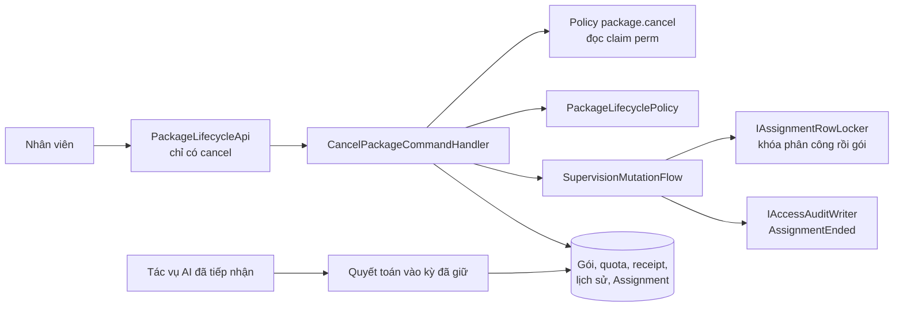
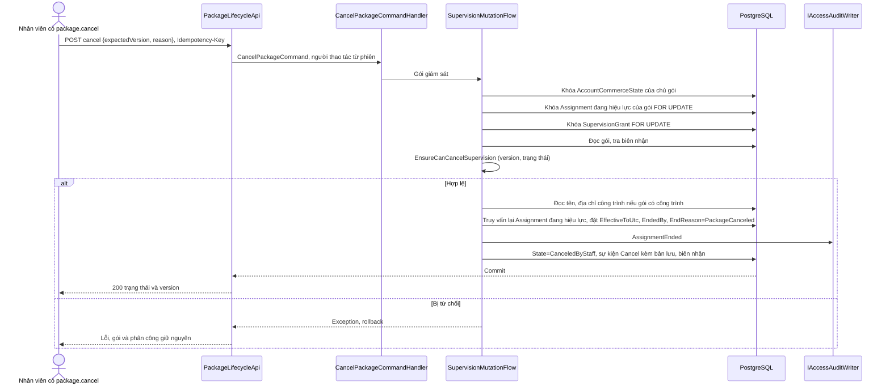
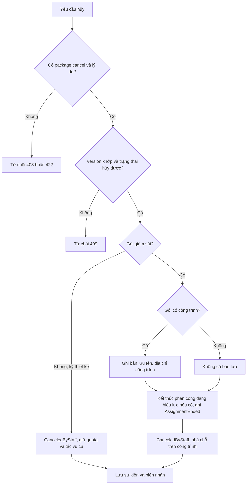
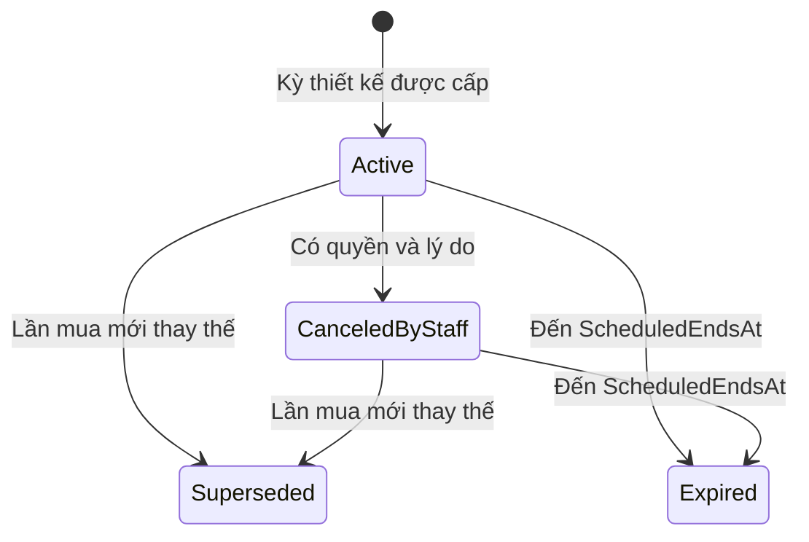
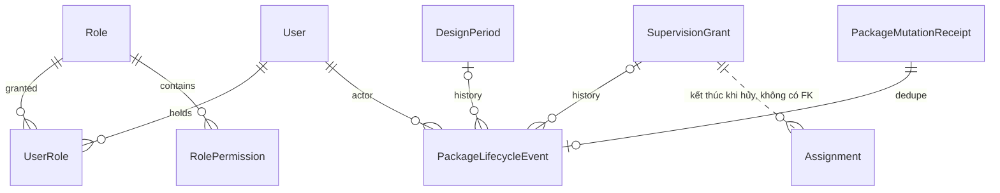

<!-- HƯỚNG DẪN CHO AI KHI ĐIỀN HOẶC CHỈNH SỬA MẪU
- Đọc toàn bộ mẫu, các comment hướng dẫn và tài liệu nguồn được cung cấp trước khi viết. Tuân thủ các quy tắc nghiệp vụ, điều kiện, ngoại lệ và giới hạn đã được xác nhận.
- Không bịa, tự chế hoặc suy đoán thành sự thật: yêu cầu, quy tắc, số liệu, API, schema, mã lỗi, nguồn tham khảo, người phụ trách và kết quả kiểm thử phải có căn cứ. Nội dung ví dụ trong mẫu không phải dữ kiện của dự án.
- Khi thiếu thông tin hoặc các nguồn mâu thuẫn, hỏi người dùng để làm rõ; giữ nguyên placeholder ở phần chưa xác định. Không tự chọn đáp án, lấp chỗ trống hay tuyên bố tài liệu đã hoàn tất.
- Chỉ thay nội dung cần điền hoặc được yêu cầu sửa. Không tự mở rộng phạm vi, sửa nghĩa quy tắc, bỏ điều kiện/ngoại lệ, xoá hay ghi đè nội dung hợp lệ đã có.
- Giữ nguyên tên, cấp và thứ tự heading, nhãn in đậm, tiền tố bullet, cấu trúc danh sách, tên/thứ tự/số cột bảng và cú pháp code fence. Không dịch, đổi tên, gộp hoặc thêm mục ngoài cấu trúc mẫu.
- Chỉ lặp khối luồng, AC hoặc API theo đúng khuôn khi có căn cứ; chỉ bỏ phần tuỳ chọn khi hướng dẫn riêng của mẫu cho phép và đã xác định không áp dụng.
- Mã tham chiếu và section phải trỏ tới tài liệu có thật đã được cung cấp hoặc kiểm chứng. Không giữ mã ví dụ như tham chiếu thật và không tự tạo tài liệu liên quan để hợp thức hoá liên kết.
- Giữ các comment hướng dẫn trong file. Xuất Markdown UTF-8, mỗi file một tài liệu; không bọc toàn bộ file trong code fence, không chèn lời dẫn hay giải thích ngoài mẫu.
- Trước khi bàn giao, đối chiếu nội dung với nguồn, kiểm tra cấu trúc, giá trị cho phép, giới hạn độ dài và tính nhất quán của mã/tham chiếu. Báo rõ phần chưa đủ thông tin; không tuyên bố đã chạy test hoặc import khi chưa thực hiện.
-->

<!-- Thay mã TDD-001 và nội dung ví dụ; giữ nguyên heading và nhãn in đậm.
Sơ đồ dùng mermaid, plantuml hoặc URL. Giữ heading Architecture, Sequence Diagram, Activity Diagram, State Diagram, Data Model.
Ví dụ API phải có heading trùng METHOD /path trong Endpoints. Xoá phần API/sơ đồ không dùng.
Version, Updated At và Change Log do lịch sử phiên bản quản lý, để trống khi nhập mới.
Author/Reviewer là tên hiển thị; gán tài khoản, phê duyệt, giả định và câu hỏi mở trên giao diện sau import.
Thiết kế phải truy vết về Story và Business Rule được cung cấp. Phân biệt thiết kế đề xuất với implementation đã kiểm chứng; không mô tả API/schema/sơ đồ ví dụ như hệ thống thật hoặc tự quyết định nghiệp vụ còn thiếu.
BẮT BUỘC KHI HOÀN THIỆN MẪU: phải có cả Reviewer và Approver, mỗi tên 1–200 ký tự sau khi bỏ khoảng trắng đầu/cuối. Không xoá hai dòng metadata, để trống, dùng tên bịa hoặc giữ placeholder rồi coi là hoàn tất.
Nếu chưa biết người review hoặc người phê duyệt, phải hỏi người dùng và báo tài liệu chưa đủ thông tin; không tự lấy Author/Owner làm người thay thế. Tên trong file không tự gán tài khoản hoặc xác nhận đã duyệt; gán thành viên trên giao diện sau import.
Đây là yêu cầu hoàn thiện mẫu; backend hiện vẫn nhận file cũ thiếu hai trường để tương thích.

VALIDATION CHO FILE NHẬP (đối chiếu ImportSnapshotValidator, MarkdownParser và ImportService):
- Mỗi file .md UTF-8 không rỗng chỉ có một heading cấp 1 chứa mã tài liệu dài 1–100 ký tự. Mã không được trùng trong cùng lần nhập hoặc thuộc loại tài liệu khác đã tồn tại.
- Không dùng tên README.md hoặc sitemap.md vì importer bỏ qua. Giao diện nhận .md/.zip, tối đa 2.000 file, tổng file tải lên 31 MiB; API giới hạn request 32 MiB và tổng nội dung đọc/giải nén 64 MiB.
- Chỉ nhập đè tài liệu cùng loại đang Draft, chưa có phiên bản và chưa lưu trữ. Import thay toàn bộ nội dung bản nháp, vì vậy phải giữ lại nội dung hợp lệ ngoài phần được yêu cầu sửa.
- Không dùng Status trong Markdown hoặc tên Approver để tự xác nhận phê duyệt; import không cấp quyền hay gán tài khoản từ tên. Chạy Kiểm tra file và xử lý lỗi/cảnh báo trước khi nhập.
- Giới hạn độ dài bên dưới tính theo string.Length của .NET (đơn vị UTF-16); không tự cắt ngắn dữ kiện quan trọng để vượt validation, hãy viết lại có căn cứ hoặc hỏi người dùng.
- Feature tối đa 300 ký tự và được dùng làm tiêu đề tài liệu. Status được parser nhận: Draft / In Review / Approved / Deprecated; tài liệu nhập mới vẫn có trạng thái phê duyệt Draft.
- Endpoint: đường dẫn tối đa 500 ký tự; tên/mô tả endpoint được lưu trong Name tối đa 300. HTTP method: GET / POST / PUT / PATCH / DELETE / HEAD / OPTIONS.
- Error Codes: mã tối đa 100 ký tự, không trùng trong tài liệu; giữ dạng - **CODE** (400): mô tả. HTTP status trong Error Codes và Response phải là số nguyên đọc được bằng Int32; không tự đặt status khác hợp đồng API.
- URL sơ đồ tối đa 1.000 ký tự. Mục sơ đồ được sử dụng phải có khối mermaid/plantuml hoặc URL theo mẫu; không để một mục sơ đồ rỗng. Nhãn mục được tách từ bullet như tên External API Fields tối đa 300 ký tự.
- Heading Examples phải khớp METHOD /path ở Endpoints. Giữ các nhãn Request:, Response 200: (thay mã theo contract) và Error Response: để parser tách đúng dữ liệu.
- Tham chiếu dạng DOC-KEY/section: ghi chú: mã đích tối đa 100 ký tự, section tối đa 100, ghi chú tối đa 1.000. Không trùng bộ mã đích + section + loại liên kết trong cùng tài liệu.
ĐỐI CHIẾU FORM TDD (src/features/tdds/validations.ts; form có thể chặt hơn import):
- Điền Feature, Author, Reviewer, Problem và ít nhất một Goal; các Goal/Non-goal/Notes đã thêm không được rỗng. API đã khai báo phải có endpoint và mô tả/mục đích; Fields phải có tên và ý nghĩa; Error Codes phải có mã, HTTP status và điều kiện.
- Form còn kiểm tra Version, Updated At và nội dung Change Log khi khai báo; với file nhập mới, giữ các trường lịch sử này trống theo hợp đồng import, không tự tạo dữ liệu lịch sử.
-->

# TDD-SUB-005

## Document Info

- **Feature**: Hủy gói với quyền riêng, lịch sử và kiểm soát đồng thời; không có khôi phục
- **Author**: Codex
- **Reviewer**: Tân Trần
- **Approver**: Tân Trần
- **Status**: Draft
- **Version**:
- **Updated At**:

## Context & Goals

### Problem

STORY-SUB-005 cho nhân viên có quyền riêng hủy gói thiết kế hoặc gói giám sát, bắt buộc nhập lý do và không thực hiện hoàn tiền. Thiết kế cũ chỉ có đóng kỳ khi đổi gói hoặc hoàn thành giám sát, không thể dùng các trạng thái đó thay cho hủy thủ công.

**Cập nhật ngày 25/09/2026.** Người dùng bỏ thao tác khôi phục cho cả hai loại gói; [BR-SUB-025](../businessrule/BR-SUB-025.md) chuyển sang đã bỏ. Hủy trở thành thao tác cuối cùng: nếu hủy nhầm, nhân viên xử lý tiền với khách bên ngoài hệ thống và khách mua gói mới khi còn nhu cầu ([BR-SUB-024](../businessrule/BR-SUB-024.md) khoản 8). Cùng ngày, người dùng chốt thêm ba điểm làm đổi thiết kế:

- Hủy gói giám sát **kết thúc phân công** đang hiệu lực của gói và ghi nhật ký phân công (BR-SUB-024 khoản 7, [BR-RBAC-013](../businessrule/BR-RBAC-013.md) khoản 9). Bản trước thiết kế ngược lại: hủy không đụng tới `Assignment`.
- Gói đã hủy không khóa việc sửa hoặc xóa công trình ([BR-SITE-002](../businessrule/BR-SITE-002.md)). Khi khách xóa công trình, gói đã hủy mất liên kết tới công trình theo [TDD-SITE-001](TDD-SITE-001.md). Vì vậy sự kiện hủy phải **lưu lại tên và địa chỉ công trình tại lúc hủy**, để khách và nhân viên tra cứu vẫn thấy gói từng thuộc công trình nào (BR-SUB-024 khoản 3 và 9).
- Trước khi hủy, giao diện hiện hộp xác nhận nói rõ hủy không hoàn tác được (BR-SUB-024 khoản 10). Đây là việc của giao diện; API vẫn bắt lý do như cũ.

Nguồn quyền nhân viên do [TDD-RBAC-001](TDD-RBAC-001.md) cung cấp theo mô hình RBAC chuẩn `User` → `UserRole` → `Role` → `RolePermission` → `Permission`. Mã quyền của tính năng này là `package.cancel`; `package.restore` bỏ ngày 25/09/2026 cùng thao tác khôi phục, `supervision.reassign` bỏ cùng ngày theo BR-SUB-009. Tư cách nhân viên xác định bằng `User.AccountKind = 'Staff'`, không suy ra từ việc tài khoản có vai trò khác Khách hàng.

**Hiện trạng code đối chiếu ngày 28/09/2026:** thiết kế dưới đây đã có trên `develop` của `bmt-be`. Commit `5689f4d` bỏ khôi phục gói, thêm `Unassign` và bản lưu công trình trong `PackageLifecycleEvent` (CHECK `CK_PackageLifecycleEvent_SiteSnapshot`). Commit `a53faeb` chuyển khóa sang dòng `AccountCommerceState`. Bảng dưới đây mô tả code cũ tại commit `1ffdfbf`, giữ lại để tra cứu lịch sử.

**Hiện trạng code cũ** (`bmt-be` nhánh `develop`, commit `1ffdfbf`), khác với thiết kế dưới đây, **chưa đổi theo cập nhật ngày 25/09/2026**:

| Thành phần trong code | Hiện trạng | Thiết kế mới |
| --- | --- | --- |
| `CancelPackageCommandHandler`, `SupervisionMutationFlow` | Hủy gói giám sát chỉ khóa dòng `User` của chủ gói rồi đổi `State`; không đọc hay ghi `Assignment`; không lưu thông tin công trình vào sự kiện. | Khóa thêm dòng phân công và dòng gói, kết thúc phân công, ghi bản lưu công trình. |
| `RestorePackageCommandHandler`, route `POST /api/v1/admin/packages/{kind}/{packageId}/restore` trong `PackageLifecycleApi` | Có, gắn policy `package.restore`. | Bỏ hẳn. |
| `IPackageLifecyclePolicy.EnsureCanRestore`, `EnsureCanRestoreSupervision` | Có. | Bỏ; chỉ còn `EnsureCanCancel` và `EnsureCanCancelSupervision`. |
| `PermissionNames.PackageRestore`, `PackageOperations.RestorePackage` | Có. | Bỏ; migration gỡ mã quyền theo [TDD-RBAC-001](TDD-RBAC-001.md). |
| `PackageLifecycleEvent` | Chưa có ba cột bản lưu công trình; CHECK `Action` gồm `Cancel`, `Restore`, `Complete`, `Reopen`. | Thêm ba cột, thêm `Unassign` ([TDD-SUB-007](TDD-SUB-007.md)), thêm CHECK `CK_PackageLifecycleEvent_SiteSnapshot`. |

Code theo thiết kế mới được viết trên nhánh `feature/supervision-unassign` của `bmt-be` ngày 25/09/2026, nay đã merge vào `develop` ở commit `5689f4d`.

Các thao tác khóa dòng `AccountCommerceState` của chủ gói qua `LockAccountAsync`, thay cho dòng `User`. Thay đổi này có từ commit `a53faeb` trên nhánh `feature/account-commerce-state` của `bmt-be`, nay đã có trên `develop`.

### Goals

- Quyền hủy độc lập với quyền xem; bắt buộc lý do và lưu lịch sử cùng thay đổi trong một transaction. Quyền `package.cancel` không gắn phân công (BR-RBAC-010 khoản 4).
- Hủy là thao tác cuối cùng cho cả gói thiết kế và gói giám sát: không có endpoint, handler hay mã quyền khôi phục (BR-SUB-024 khoản 8).
- Hủy gói giám sát kết thúc phân công đang hiệu lực của gói ngay trong transaction hủy và ghi nhật ký `AssignmentEnded`, kể cả khi việc giao hoặc chuyển giao chạy song song (BR-SUB-024 khoản 7, BR-RBAC-013 khoản 9).
- Sự kiện hủy gói giám sát đang có công trình lưu tên và địa chỉ công trình tại lúc hủy, để vẫn hiển thị được sau khi khách xóa công trình (BR-SUB-024 khoản 3 và 9).
- Tác vụ AI đã tiếp nhận trước lúc hủy tiếp tục theo kỳ cũ; chỉ chặn tác vụ mới (BR-SUB-024/Except).

### Non-goals

- Chuyển tiền, xác nhận đã hoàn tiền, cấp gói thủ công; khôi phục gói đã hủy hoặc kỳ đã bị lần mua khác thay thế.
- Hộp xác nhận trước khi hủy: thuộc giao diện. Giao diện quản trị cấp quyền nhân viên đầy đủ; không tự gán quyền cho toàn bộ Admin/nhân viên khi thêm schema.
- Hoàn thành và mở lại gói giám sát ([TDD-SUB-006](TDD-SUB-006.md)); gỡ gói khỏi công trình ([TDD-SUB-007](TDD-SUB-007.md)); xóa công trình và gỡ liên kết của gói đã hủy ([TDD-SITE-001](TDD-SITE-001.md)); thay đổi chủ sở hữu công trình; hủy tác vụ AI đã bắt đầu hợp lệ.

## Architecture

**Các kỹ thuật bảo vệ thao tác hủy**

| Kỹ thuật | Cách dùng và mục đích | Ví dụ / giới hạn |
| --- | --- | --- |
| Phân quyền theo thao tác | Endpoint hủy gắn policy `package.cancel`; bộ quyền đọc từ claim `perm` trong access token theo [TDD-RBAC-001](TDD-RBAC-001.md#architecture). | Có `commerce.read` chưa đủ để hủy. Không có claim tương ứng thì 403; không suy quyền từ tên người dùng hay từ vai trò Admin. |
| Thu hồi quyền có độ trễ, cắt phiên thì tức thì | Thu hồi vai trò chỉ tác động tới phiên đang mở khi access token hết hạn, chậm nhất theo `AccessTokenExpireMin`. Muốn cắt ngay thì buộc đăng xuất hoặc khóa tài khoản; hai thao tác này đổi dấu phiên nên token cũ hỏng lập tức. | Thu hồi quyền hủy lúc 10:00 mà token còn hạn tới 10:07 thì trong 7 phút đó nhân viên vẫn hủy được. Đây là hành vi đã chốt ở [BR-RBAC-009](../businessrule/BR-RBAC-009.md). Không hứa thu hồi sẽ hoàn tác một lần hủy đã commit. |
| Version và khóa chống xử lý lặp | `expectedVersion` phát hiện màn hình đã cũ; `RequestKey` và hash nhận diện việc gửi lại cùng thao tác. | Hai lần hủy chủ động là hai yêu cầu khác nhau; gửi lại do mất phản hồi giữ key cũ. Kiểm quyền trước cả khi trả kết quả đã lưu. |
| Lịch sử cùng transaction | Trạng thái gói, sự kiện hủy, biên nhận, việc kết thúc phân công và dòng nhật ký phân công được lưu trong cùng một lần commit. | Ghi lịch sử lỗi thì hủy cũng không thành công, và phân công không bị kết thúc lẻ. Lịch sử không chứng minh đã hoàn tiền ngoài hệ thống. |
| Giữ liên kết lượt đã tiếp nhận | `UsageOperation` giữ kỳ, quyền và lượt của tác vụ lúc được chấp nhận. | J1 hoàn tất vào bộ đếm của kỳ P1 dù P1 đã bị hủy; tác vụ mới phải kiểm lại hiệu lực. Hủy không hoàn tác lượt J1 đã dùng. |
| Lưu trạng thái hiện tại và lịch sử riêng | Kỳ hoặc gói giữ trạng thái hiện tại; `PackageLifecycleEvent` giữ từng lần thay đổi. | Gói `CanceledByStaff` cho biết hiện trạng; muốn biết ai hủy, lúc nào, vì sao và trên công trình nào thì đọc sự kiện mà `CancelEventId` trỏ tới. |
| Bản lưu công trình trong sự kiện hủy | Khi hủy gói giám sát đang có công trình, handler đọc `Id`, `Name`, `Address` của công trình và ghi vào ba cột `ConstructionSiteId`, `ConstructionSiteName`, `ConstructionSiteAddress` của dòng sự kiện `Cancel`. | Khách hủy G1 trên "Nhà phố Quận 7", sau đó xóa công trình: `SupervisionGrant.ConstructionSiteId` thành NULL theo TDD-SITE-001, nhưng dòng sự kiện vẫn có tên và địa chỉ. Giới hạn: bản lưu là giá trị tại lúc hủy; nếu khách đổi tên công trình sau đó, màn hình dùng tên hiện tại khi công trình còn, và chỉ dùng bản lưu khi công trình đã bị xóa. |
| Khóa theo thứ tự khi kết thúc phân công | Hủy gói giám sát khóa dòng tài khoản chủ gói, rồi dòng `Assignment` đang hiệu lực của gói (`FOR UPDATE`), rồi dòng `SupervisionGrant` (`FOR UPDATE`), sau đó mới truy vấn lại phân công đang hiệu lực và kết thúc nó. | Thứ tự này theo nguyên tắc 1 của [TDD-RBAC-003](TDD-RBAC-003.md#architecture): luồng nào cần cả phân công lẫn gói thì khóa phân công trước, nên không chờ vòng với chuyển giao. Xem chi tiết và trường hợp biên ở Notes. |

| Thành phần | Trách nhiệm |
| --- | --- |
| `PackageLifecycleApi` | Chỉ còn endpoint hủy cho kind `Design`/`Supervision`; người thao tác luôn lấy từ phiên. Route `restore` bị bỏ. |
| `CancelPackageCommandHandler` | Với kỳ thiết kế: khóa tài khoản chủ gói rồi kỳ, kiểm version và chống gửi lặp, gọi policy, ghi lịch sử. Với gói giám sát: gọi `SupervisionMutationFlow`. |
| `SupervisionMutationFlow` (sửa) | Phần chung của hủy, hoàn thành, mở lại và gỡ gói giám sát. Thêm hai bước cho hủy và gỡ ([TDD-SUB-007](TDD-SUB-007.md)): khóa phân công và gói theo thứ tự ở trên, và sau khi đổi trạng thái thì kết thúc phân công đang hiệu lực. Ghi bản lưu công trình vào sự kiện khi gói có công trình. |
| `PackageLifecyclePolicy` | `EnsureCanCancel` (kỳ thiết kế) và `EnsureCanCancelSupervision` (gói giám sát). Bỏ `EnsureCanRestore` và `EnsureCanRestoreSupervision`. Không gọi chuyển tiền. |
| `IAssignmentRowLocker` (thêm hàm) | `LockActiveByResourceForUpdateAsync(resourceType, resourceId)` khóa dòng phân công đang hiệu lực của gói và trả mã dòng hoặc NULL; `LockSupervisionGrantForUpdateAsync(grantId)` khóa dòng gói. Định nghĩa dùng chung với TDD-SUB-007 và TDD-RBAC-003. |
| `IAccessAuditWriter` | Ghi `AssignmentEnded` khi hủy kết thúc phân công, theo [TDD-RBAC-003](TDD-RBAC-003.md). |
| Policy `package.cancel` | Gắn ở endpoint, kiểm claim `perm` do server phát hành. Định nghĩa policy thuộc [TDD-RBAC-001](TDD-RBAC-001.md#internal-api). |
| `PackageMutationReceipt` | Ghi kết quả thao tác theo key và hash để yêu cầu lặp không hủy lần nữa. |
| `PackageLifecycleEvent` | Lịch sử người thao tác, thời điểm, lý do, trạng thái trước/sau, version và bản lưu công trình. |
| `ConstraintViolationPipelineBehavior` (sửa) | Ánh xạ lỗi chờ vòng `40P01` của `CancelPackageCommand` thành 409 `PackageVersionConflict`. |



**Notes**:

- Default session policy phải gồm phiên đã xác minh và không phải token đặt lại mật khẩu, như `JwtExtensions` hiện tại. Policy theo mã quyền thêm yêu cầu nghiệp vụ, không thay default bằng policy vai trò yếu hơn. Admin xem được theo BR-PAY-005; với thao tác hủy vẫn phải có `package.cancel` trong danh sách quyền, không có đường tắt theo vai trò.
- Tư cách nhân viên xác định bằng `User.AccountKind = 'Staff'` và `User.Status = 'Active'`; quyền xác định bằng các vai trò trong `UserRole` theo [TDD-RBAC-001](TDD-RBAC-001.md#data-model). Quyền được nhúng vào access token lúc phát hành, nên handler không truy vấn lại; đổi lại phải chấp nhận độ trễ của BR-RBAC-009. Cấp và thu hồi vai trò thuộc [TDD-RBAC-002](TDD-RBAC-002.md).
- **Thứ tự khóa khi hủy kỳ thiết kế**: tài khoản chủ gói → kỳ/subscription → biên nhận. Không đụng `Assignment`.
- **Thứ tự khóa khi hủy gói giám sát** (có trong code ở nhánh `feature/supervision-unassign`):
  1. Khóa dòng `AccountCommerceState` của chủ gói (`FOR UPDATE`, tạo dòng trước nếu chưa có). Hủy, gán, hoàn thành, mở lại và gỡ gói của cùng khách xếp hàng tại đây.
  2. `LockActiveByResourceForUpdateAsync('SupervisionGrant', grantId)`: khóa dòng phân công đang hiệu lực của gói, nếu có. Nếu một chuyển giao đang chạy giữ dòng này, việc hủy chờ chuyển giao commit; sau đó dòng cũ đã có `EffectiveToUtc` nên câu khóa không còn khớp.
  3. `LockSupervisionGrantForUpdateAsync(grantId)`: khóa dòng gói. Khóa này xung đột với `FOR SHARE` mà luồng giao phân công giữ khi đọc trạng thái gói, nên giao và hủy trên cùng gói không chạy xen.
  4. Đọc gói có theo dõi thay đổi, tra biên nhận (gửi lặp thì trả kết quả cũ), gọi `EnsureCanCancelSupervision`.
  5. Nếu gói có `ConstructionSiteId`, đọc tên và địa chỉ công trình để ghi bản lưu.
  6. Truy vấn lại phân công đang hiệu lực của gói **sau** bước 3, rồi đặt `EffectiveToUtc = now`, `EndedBy = nhân viên hủy`, `EndReason = PackageCanceled` và ghi `AccessAuditLog` `AssignmentEnded`.
  7. Ghi trạng thái gói, sự kiện và biên nhận; commit một lần.
- **Vì sao phải truy vấn lại ở bước 6**: nếu lúc bước 2 gói chưa có phân công nhưng có một yêu cầu giao đang chạy, yêu cầu giao đang giữ `FOR SHARE` trên gói. Bước 3 chờ nó commit. Ở mức cô lập `READ COMMITTED`, câu lệnh chạy sau bước 3 thấy dòng phân công vừa được tạo và kết thúc được nó; không có gói đã hủy nào còn người phụ trách.
- **Trường hợp biên chờ vòng**: trong khe giữa lúc giao commit và bước 6, nếu có một chuyển giao khóa đúng dòng phân công mới, chuyển giao sẽ chờ khóa gói mà việc hủy đang giữ, còn việc hủy chờ dòng phân công mà chuyển giao đang giữ. PostgreSQL phát hiện chờ vòng và hủy một bên với lỗi `40P01`. `ConstraintViolationPipelineBehavior` ánh xạ lỗi này của `CancelPackageCommand` thành 409 `PackageVersionConflict`, để client tải lại gói và gửi lại. Khe này rất hẹp vì cần ba thao tác quản trị trên cùng một gói trong vài mili giây.
- Không khóa dòng `ConstructionSite`. Hủy không đổi `ConstructionSiteId`. Xóa công trình theo TDD-SITE-001 khóa dòng công trình rồi mới đọc trạng thái gói: nếu việc hủy chưa commit, việc xóa thấy gói còn giữ chỗ và trả 409; nếu đã commit, việc xóa gỡ liên kết của gói đã hủy rồi xóa công trình.
- Kiểm quyền và sở hữu trước khi trả kết quả đã lưu. Cùng `Idempotency-Key` và cùng nội dung trả kết quả thao tác cũ, không hủy lại; khác nội dung trả 409 `IdempotencyConflict`. Mất phản hồi rồi gửi lại cùng key không tạo sự kiện thứ hai.

**Hủy kỳ thiết kế**:

1. Chỉ kỳ đang hiệu lực, không phải kỳ `Superseded` hay đã hết hạn. Kiểm version và lý do sau khi bỏ khoảng trắng không rỗng.
2. Ghi `LifecycleState = CanceledByStaff` và `CancelEventId`, giữ `StartsAt`/`ScheduledEndsAt`; không dùng `ClosedAtUtc` (cột dành cho đóng vì lần mua mới thay thế). `CanceledByStaff` là trạng thái cuối: không có đường trở về `Active`. Mọi yêu cầu mới phải kiểm `LifecycleState = Active` và thời hạn, không chỉ kiểm con trỏ `CurrentPeriodId`.
3. Không sửa `Used`, `Reserved`, `UsageOperation` hay revision. Tác vụ đã tiếp nhận trước lúc hủy tiếp tục theo quota đã giữ; hoàn tất, lỗi hay timeout đều quyết toán vào chính kỳ đó, không làm kỳ sống lại hoặc chuyển lượt sang kỳ khác. Quy tắc timeout và kết quả muộn ở TDD-SUB-002 vẫn giữ.
4. Lưu lịch sử và biên nhận cùng transaction. Ghi lịch sử lỗi thì rollback trạng thái; không có kỳ bị hủy mà thiếu lý do.

**Hủy gói giám sát**: cho `Unassigned`, `Assigned` hoặc `Completed` (BR-SUB-024 khoản 2); gói đang `CanceledByStaff` trả 409 `PackageStateConflict`. Ghi `CanceledByStaff`, giữ `ConstructionSiteId`, `FirstAssignedAtUtc` và `AssignedAtUtc` ([TDD-SUB-004](TDD-SUB-004.md#data-model)). Partial unique index giữ chỗ chỉ xét `Assigned`/`Completed`, nên gói vừa hủy nhả chỗ và công trình nhận được gói khác ngay sau commit. Ví dụ G1 `Completed` trên CS1 bị hủy thì khách gán được G2 vào CS1 ngay sau đó. Phân công đang hiệu lực của G1 kết thúc trong cùng transaction; G2 là gói khác nên cần phân công riêng theo [TDD-RBAC-003](TDD-RBAC-003.md). Gói chưa gán không có công trình và không có phân công, nên sự kiện hủy không có bản lưu công trình và không có dòng phân công nào bị kết thúc. Gói chưa gán đã quá hạn vẫn hủy được; việc hủy không làm nó dùng lại được.

**Không có khôi phục**: bỏ route `restore`, `RestorePackageCommand` cùng handler và validator, hai hàm kiểm khôi phục của policy, hằng `PackageOperations.RestorePackage` và mã quyền `package.restore`. Yêu cầu gửi tới route cũ nhận 404 của routing (STORY-SUB-005/AC-017, EXC-08). Dòng `PackageLifecycleEvent` có `Action = Restore` và biên nhận `RestorePackage` cũ, nếu có trong dữ liệu dev/test, vẫn được giữ để tra lịch sử; không còn đường ghi mới. Hủy nhầm thì khách mua gói mới theo STORY-PAY-001 (STORY-SUB-005/ALT-03); gói mới có hạn và quyền lợi theo lần mua mới.

**Ánh xạ và ranh giới test**: BR-SUB-024 khoản 1–2 ở `PackageLifecyclePolicy` và validator; khoản 3, 7, 9 ở `SupervisionMutationFlow` (nhả chỗ, kết thúc phân công, bản lưu công trình); khoản 4–6 và khoản 8 bằng việc không có đường ghi nào chuyển tiền, tự quay về gói cũ hay khôi phục; khoản 10 ở giao diện. System Test hiện hành: ST-PAY-034–037, ST-PAY-061, ST-PAY-073 (hủy kết thúc phân công), ST-PAY-085 (hộp xác nhận), ST-PAY-086 (không có khôi phục), ST-PAY-087 (khách thấy gói đã hủy, công trình chỉ còn gói đã hủy sửa, xóa được), ST-PAY-088 (hủy nhầm, khách mua lại), ST-SUB-127. ST-PAY-038–046 kiểm khôi phục và đã bỏ. Các test PostgreSQL phải chứng minh: hủy chạy song song với giao hoặc chuyển giao không để lại phân công trên gói đã hủy; rollback lịch sử; quyết toán quota qua mốc hủy; CHECK bản lưu công trình.

## Sequence Diagram

Hủy một gói giám sát đang có người phụ trách.



## Activity Diagram



## State Diagram



Đây là hiệu lực của kỳ thiết kế. `CanceledByStaff` không có đường trở về `Active`: không còn khôi phục. `Expired` là trạng thái hiệu lực tính từ thời gian. Vòng đời gói giám sát, gồm hủy từ `Unassigned`, `Assigned`, `Completed` và gỡ gói, ở [TDD-SUB-004](TDD-SUB-004.md#state-diagram), [TDD-SUB-006](TDD-SUB-006.md#state-diagram) và [TDD-SUB-007](TDD-SUB-007.md#state-diagram); gói giám sát `CanceledByStaff` cũng là trạng thái cuối.

## Data Model

**Tương thích hồ sơ SITE mở rộng ngày 01/10/2026, backend đã triển khai:** [TDD-SITE-003](TDD-SITE-003.md#data-model) đổi địa chỉ gộp ConstructionSite.Address sang text. Cột snapshot PackageLifecycleEvent.ConstructionSiteAddress cũng đổi từ varchar(500) sang text NULL, giữ CHECK/NULL và dữ liệu lịch sử; không cắt địa chỉ ba phần. Giới hạn 500 áp riêng số nhà–đường. Không đổi luồng hay quyền hủy/gỡ gói.

**Ý nghĩa các bảng**

| Bảng | Một dòng đại diện cho gì? | Khi ghi và liên kết |
| --- | --- | --- |
| UserRole | Một lần một người đang giữ một vai trò. | Bảng dùng lại, định nghĩa ở [TDD-RBAC-001](TDD-RBAC-001.md#data-model). Tư cách nhân viên đọc ở `User.AccountKind` và `User.Status`, còn quyền đọc qua các vai trò trong bảng này. |
| RolePermission | Một mã quyền được gắn vào một vai trò. | Bảng dùng lại, định nghĩa ở [TDD-RBAC-001](TDD-RBAC-001.md#data-model). Quyền xem không kéo theo quyền hủy, vì `commerce.read` và `package.cancel` là hai mã khác nhau. |
| DesignPeriod | Một kỳ thiết kế đã cấp, gồm hạn và trạng thái hiệu lực. | Hủy đổi `LifecycleState` và `Version` của kỳ; không tạo kỳ mới và không quay lại `Active`. |
| SupervisionGrant | Một gói giám sát đã cấp, cùng công trình và các mốc gán. | Hủy đổi `State` và `Version`, đặt `CancelEventId`; giữ `ConstructionSiteId`, `FirstAssignedAtUtc`, `AssignedAtUtc`. Chỉ luồng xóa công trình của TDD-SITE-001 được đặt `ConstructionSiteId = NULL` cho gói đã hủy. |
| PackageLifecycleEvent | Một lần nhân viên thay đổi vòng đời gói: hủy, hoàn thành, mở lại ([TDD-SUB-006](TDD-SUB-006.md)) hoặc gỡ gói khỏi công trình ([TDD-SUB-007](TDD-SUB-007.md)). Dòng `Restore` chỉ còn ở dữ liệu cũ. | Chỉ ghi thêm, không sửa dòng cũ. Tài liệu này là định nghĩa gốc của bảng. Với hủy và gỡ gói giám sát có công trình, dòng mang bản lưu tên, địa chỉ công trình. |
| PackageMutationReceipt | Kết quả của một thao tác đã hoàn tất, dùng khi client gửi lại. | Giữ `RequestKey`, hash và `ResultVersion`/`ResultBody`. Không phải giao dịch ngân hàng hay bằng chứng đã hoàn tiền. |
| Assignment | Một khoảng thời gian một nhân viên phụ trách một gói giám sát. | Bảng dùng lại, định nghĩa ở [TDD-RBAC-003](TDD-RBAC-003.md#data-model). Hủy gói giám sát đặt `EffectiveToUtc`, `EndedBy` và `EndReason = PackageCanceled` cho dòng đang hiệu lực của gói; không xóa dòng. |
| AccessAuditLog | Một dòng nhật ký thay đổi quyền và phân công. | Bảng dùng lại, định nghĩa ở TDD-RBAC-001. Hủy gói giám sát có người phụ trách ghi một dòng `AssignmentEnded`. |
| PeriodQuota / UsageOperation | Bộ đếm của một quyền trong kỳ và một lần sử dụng đã được tiếp nhận. | Dùng lại TDD-SUB-002. Tác vụ tiếp tục quyết toán vào kỳ đã giữ lượt, dù kỳ đã bị hủy. |

**Dữ liệu lưu trữ minh họa 1 — hủy kỳ thiết kế khi tác vụ AI đang chạy**

Dữ liệu giả định, trích cột để giải thích quan hệ; NV1, U1, R1, P1, L1, M1 là bí danh UUID. Hash và nội dung kết quả được lược bớt, không phải giá trị hợp lệ để nhập DB. NV1 có quyền hủy; P1 thuộc U1, đang trong hạn và chưa bị gói khác thay thế.

| Bảng / thời điểm | Giá trị lưu minh họa | Cách đọc |
| --- | --- | --- |
| User | Id=NV1; AccountKind=Staff; Status=Active; SecurityStamp=S1 | Tài khoản nhân viên đang hoạt động. Chưa kích hoạt hoặc đang bị khóa thì mọi yêu cầu bị từ chối trước bước kiểm quyền. |
| UserRole | (NV1, R1) với GrantedAtUtc và GrantedBy | NV1 giữ vai trò R1. Quyền của NV1 là hợp quyền các vai trò đang giữ. |
| RolePermission | (R1, package.cancel) | R1 có quyền hủy. Không còn mã `package.restore` để gắn. |
| Access token của NV1 | Claim `perm` gồm package.cancel; claim `stamp`=S1 | Ảnh chụp quyền lúc phát hành. Handler đọc claim này, không truy vấn lại `UserRole`. |
| DesignPeriod, trước hủy | Id=P1; LifecycleState=Active; Version=1; CancelEventId=NULL; ClosedAtUtc=NULL | Kỳ còn hiệu lực. |
| PeriodQuota, trước hủy | Bộ đếm tạo thiết kế của P1: Used=2; Reserved=1 | Đã dùng 2 lượt; tác vụ J1 đang giữ 1 lượt ở P1. |
| DesignPeriod, sau hủy | Id=P1; LifecycleState=CanceledByStaff; Version=2; CancelEventId=L1; ClosedAtUtc=NULL | Chặn tác vụ mới. Hủy không trả lại lượt J1 đang giữ và không có đường quay lại `Active`. |
| PackageLifecycleEvent | Id=L1; AccountId=U1; PackageKind=Design; DesignPeriodId=P1; SupervisionGrantId=NULL; Action=Cancel; FromState=Active; ToState=CanceledByStaff; ActorId=NV1; Reason=Hủy theo yêu cầu khách; PackageVersion=2; ReceiptId=M1; ConstructionSiteId=NULL; ConstructionSiteName=NULL; ConstructionSiteAddress=NULL | Kỳ thiết kế không có công trình nên ba cột bản lưu đều NULL. L1 và M1 ghi chung transaction với trạng thái hủy. |
| PackageMutationReceipt | Id=M1; ActorId=NV1; Operation=CancelPackage; TargetId=P1; RequestKey=cancel-p1-1; ResultVersion=2 | Gửi lại key này trả kết quả thao tác cũ, không hủy thêm lần nữa. |
| PeriodQuota, J1 hoàn tất hợp lệ | Bộ đếm của P1: Used=3; Reserved=0 | Chuyển 1 lượt đang giữ sang đã dùng. P1 vẫn bị hủy, không tự `Active` vì J1 thành công. |

Nếu khách vẫn cần thiết kế, khách mua gói mới theo STORY-PAY-001; lần mua đó tạo kỳ mới với hạn và hạn mức mới, không đụng tới P1.

**Dữ liệu lưu trữ minh họa 2 — hủy gói giám sát đang có người phụ trách**

Dữ liệu giả định. U1 là khách; NV1 có `package.cancel`; NV2 đang phụ trách G1; G1, CS1, A1, L5, M5, AL1 là bí danh UUID. Mọi giờ lưu là UTC. G1 nối tiếp dữ liệu mẫu của [TDD-SUB-004](TDD-SUB-004.md#data-model).

| Bảng / thời điểm | Giá trị lưu minh họa | Cách đọc |
| --- | --- | --- |
| ConstructionSite | Id=CS1; OwnerUserId=U1; Name=Nhà phố Quận 7; Address=12 Nguyễn Thị Thập, Quận 7, TP.HCM | Công trình mà G1 đang giữ chỗ. |
| SupervisionGrant, trước hủy | Id=G1; AccountId=U1; State=Assigned; ConstructionSiteId=CS1; FirstAssignedAtUtc=2026-10-01T02:00:00Z; AssignedAtUtc=2026-10-01T02:00:00Z; Version=2; CancelEventId=NULL | Gói đang phục vụ CS1. |
| Assignment, trước hủy | Id=A1; StaffUserId=NV2; ResourceType=SupervisionGrant; ResourceId=G1; EffectiveFromUtc=2026-10-02T01:00:00Z; EffectiveToUtc=NULL; EndedBy=NULL; EndReason=NULL | NV2 đang phụ trách G1. |
| SupervisionGrant, sau hủy | Id=G1; State=CanceledByStaff; ConstructionSiteId=CS1; FirstAssignedAtUtc và AssignedAtUtc giữ nguyên; Version=3; CancelEventId=L5 | G1 nhả chỗ trên CS1 vì index giữ chỗ chỉ xét `Assigned`/`Completed`, nhưng vẫn trỏ CS1. |
| PackageLifecycleEvent L5 | AccountId=U1; PackageKind=Supervision; DesignPeriodId=NULL; SupervisionGrantId=G1; Action=Cancel; FromState=Assigned; ToState=CanceledByStaff; ActorId=NV1; AtUtc=2026-11-15T03:00:00Z; Reason=Công trình không phù hợp, đã hoàn tiền qua điện thoại; PackageVersion=3; ReceiptId=M5; ConstructionSiteId=CS1; ConstructionSiteName=Nhà phố Quận 7; ConstructionSiteAddress=12 Nguyễn Thị Thập, Quận 7, TP.HCM | Ba cột cuối là bản lưu công trình tại lúc hủy. `ConstructionSiteId` ở đây không có khóa ngoại, nên dòng vẫn đứng được khi CS1 bị xóa. |
| Assignment A1, sau hủy | EffectiveToUtc=2026-11-15T03:00:00Z; EndedBy=NV1; EndReason=PackageCanceled | Phân công kết thúc cùng lúc với hủy. NV2 không còn hoàn thành được G1 và không còn xem CS1 qua G1. G1 không vào danh sách cần chia lại vì không ở `Assigned`. |
| AccessAuditLog AL1 | ActorUserId=NV1; Action=AssignmentEnded; TargetType=Assignment; TargetId=A1; TargetLabel=Gói giám sát · Nhà phố Quận 7; BeforeJson={"staffUserId":"NV2","endReason":"PackageCanceled"} | Nhật ký phân công ghi người hủy là người kết thúc phân công. |
| PackageMutationReceipt M5 | ActorId=NV1; Operation=CancelPackage; TargetId=G1; RequestKey=cancel-g1-1; ResultVersion=3 | Gửi lại cùng key trả kết quả cũ, không tạo L5 hay AL1 thứ hai. |

Sau đó khách xóa CS1 theo TDD-SITE-001: G1 có `ConstructionSiteId = NULL`, dòng CS1 biến mất, còn L5 giữ nguyên. Danh sách gói của khách hiện "G1 – đã hủy – Nhà phố Quận 7", lấy tên từ L5 qua `CancelEventId` (BR-SUB-024 khoản 9, ST-PAY-087).

Nhánh gói chưa gán: G6 có `State = Unassigned`, `ConstructionSiteId = NULL`, không có phân công. Hủy G6 tạo dòng sự kiện với ba cột bản lưu NULL; không có dòng `Assignment` hay `AccessAuditLog` nào.

Nhánh gửi tới route khôi phục cũ: không có route, yêu cầu nhận 404 của routing; G1 và L5 không đổi.

**Schema**

| Bảng/thay đổi | Trường và ràng buộc |
| --- | --- |
| UserRole, RolePermission, Permission | Dùng lại nguyên schema ở [TDD-RBAC-001](TDD-RBAC-001.md#data-model). Mã quyền của tính năng hủy là `package.cancel`, `RequiresAssignment = false`. Việc gỡ `package.restore` khỏi danh mục nằm trong migration của TDD-RBAC-001. |
| User, các cột liên quan | `AccountKind` và `Status` quyết định tài khoản có phải nhân viên đang hoạt động không; `SecurityStamp` phục vụ cắt phiên. Định nghĩa ở [TDD-RBAC-001](TDD-RBAC-001.md#data-model). |
| DesignPeriod bổ sung | LifecycleState varchar(24) NN=Active/CanceledByStaff/Superseded; Version bigint NN; CancelEventId uuid NULL. Giữ `ClosedAtUtc` chỉ cho đóng vì thay thế. `CanceledByStaff` chỉ còn đi tiếp sang `Superseded` hoặc hết hạn. |
| SupervisionGrant bổ sung | CancelEventId uuid NULL; State/Version và `AssignedAtUtc` như [TDD-SUB-004](TDD-SUB-004.md#data-model). Không xóa `ConstructionSiteId`/`FirstAssignedAtUtc`/`AssignedAtUtc` khi hủy. |
| PackageLifecycleEvent | Id uuid PK; AccountId uuid NN; PackageKind varchar(16) NN CHECK=Design/Supervision; DesignPeriodId uuid NULL; SupervisionGrantId uuid NULL; Action varchar(16) NN CHECK=Cancel/Restore/Complete/Reopen/Unassign (`Restore` chỉ còn ở dòng cũ, không có đường ghi mới); FromState varchar(24) NN; ToState varchar(24) NN; ActorId uuid NN FK User; AtUtc timestamptz NN; Reason text NULL, CHECK `CK_PackageLifecycleEvent_Reason` (chỉ `Complete` được NULL; các action khác phải có ký tự khác khoảng trắng); PackageVersion bigint NN CHECK>=1; ReceiptId uuid NN UNIQUE FK PackageMutationReceipt; **ConstructionSiteId uuid NULL, không có khóa ngoại; ConstructionSiteName varchar(200) NULL; ConstructionSiteAddress text NULL**. CHECK `CK_PackageLifecycleEvent_ExactlyOneTarget` (đúng một target, khớp kind); `CK_PackageLifecycleEvent_SupervisionOnlyActions` (`Complete`, `Reopen`, `Unassign` chỉ với `Supervision`); **`CK_PackageLifecycleEvent_SiteSnapshot`**: ba cột bản lưu cùng NULL hoặc cùng NOT NULL; nếu NOT NULL thì `PackageKind = 'Supervision'` và `Action IN ('Cancel','Unassign')`; `Action = 'Unassign'` đòi NOT NULL. FK ghép target+AccountId; UNIQUE target+PackageVersion qua hai partial index. |
| PackageMutationReceipt | Id uuid PK; ActorId uuid NN FK User; Operation varchar(32) NN; TargetId uuid NN; RequestKey varchar(100) NN; RequestHash char(64) NN; ResultVersion bigint NN; ResultBody jsonb NN; AtUtc timestamptz NN. UNIQUE(ActorId,Operation,TargetId,RequestKey). Giá trị `Operation` đang ghi: `CancelPackage`, `Assign`, `CompleteSupervision`, `ReopenSupervision`, `UnassignSupervision` ([TDD-SUB-007](TDD-SUB-007.md)); `RestorePackage` chỉ còn ở dòng cũ. Danh sách chưa được chốt thành CHECK; khi chốt phải giới hạn đúng tập đó. `TargetId` không phải khóa ngoại, lý do xem đoạn dưới bảng. |
| Assignment | Dùng lại [TDD-RBAC-003](TDD-RBAC-003.md#data-model); `EndReason` thêm `PackageCanceled`. |

**Vì sao bản lưu công trình nằm ở `PackageLifecycleEvent`, không ở `SupervisionGrant`**: bản lưu mô tả công trình **tại một thời điểm** (lúc hủy, lúc gỡ), đúng bản chất của một dòng lịch sử. Một gói có thể bị gỡ nhiều lần rồi mới bị hủy, mỗi lần một công trình khác; một cột trên gói chỉ giữ được một giá trị. Cột `ConstructionSiteId` của sự kiện cố ý không có khóa ngoại: công trình bị xóa cứng theo TDD-SITE-001, và khóa ngoại sẽ hoặc chặn việc xóa, hoặc xóa luôn lịch sử. Đây là dư thừa có chủ đích: tên, địa chỉ lặp lại dữ liệu của `ConstructionSite` tại một thời điểm, không phải bản sao phải đồng bộ. Khách đổi tên công trình sau lúc hủy thì bản lưu không đổi theo; màn hình dùng tên hiện tại khi công trình còn và chỉ dùng bản lưu khi công trình đã bị xóa.

**Vì sao `PackageLifecycleEvent` và `PackageMutationReceipt` xử lý target khác nhau**: cả hai đều trỏ tới một kỳ thiết kế hoặc một gói giám sát, nhưng ràng buộc khác nhau vì mục đích khác nhau.

`PackageLifecycleEvent` là lịch sử, chỉ cần trỏ đúng. Nó dùng hai cột nullable `DesignPeriodId` và `SupervisionGrantId`, kèm CHECK đúng một cột có giá trị và khóa ngoại thật cho từng cột. Database vì vậy tự chặn được sự kiện trỏ tới bản ghi không tồn tại.

`PackageMutationReceipt` cần một khóa chống trùng duy nhất `UNIQUE(ActorId,Operation,TargetId,RequestKey)` dùng chung cho mọi loại thao tác. Nếu tách target thành hai cột, khóa duy nhất phải tách theo và không còn một khóa chung để tra khi client gửi lại. Vì vậy `TargetId` giữ một cột và không có khóa ngoại. Đánh đổi là database không kiểm được target có thật; handler phải kiểm trong cùng transaction ghi kết quả, dựa vào `Operation` để biết cần tra bảng nào.



**Notes**:

- [TDD-SUB-006](TDD-SUB-006.md#data-model) dùng lại `PackageLifecycleEvent` cho hoàn thành và mở lại (`Reason` NULL riêng với `Complete`); [TDD-SUB-007](TDD-SUB-007.md#data-model) dùng cho gỡ gói (`Action = Unassign`, luôn có bản lưu công trình).
- Tất cả FK lịch sử RESTRICT; ba khóa ngoại của kỳ thiết kế (`DesignSubscription → User`, `DesignPeriod → DesignSubscription`, `PeriodQuota → DesignPeriod`) đã đổi sang RESTRICT ở migration `PackageHistoryRestrict`. Index `(AccountId,AtUtc DESC,Id)` và theo từng target phục vụ tra cứu. `CancelEventId` tham chiếu sự kiện `Cancel` đúng target bằng kiểm tra trong transaction; lưu sự kiện trước rồi đặt con trỏ, không mở transaction lồng. Gói đã hủy là trạng thái cuối nên `CancelEventId` không còn bị đặt lại.
- `LifecycleState = Superseded` cần `ClosedAtUtc NOT NULL`; `Active`/`CanceledByStaff` không có `ClosedAtUtc`. CHECK `CK_DesignPeriod_SupersededClosedAt` đã có ở migration `PackageHistoryRestrict` (commit `72e7327`).
- Kỳ chỉ dùng khi đúng `CurrentPeriodId`, `LifecycleState = Active` và trong [StartsAt, ScheduledEndsAt). Khi migrate kỳ cũ, phân loại `ClosedAt` theo nguồn mua thay thế; không có bằng chứng lý do thì không tạo sự kiện hủy giả.
- Bộ đếm có thể thay đổi hợp lệ do tác vụ đang chạy qua mốc hủy; hủy không hoàn tác các lần sử dụng đó.
- **Phần của tài liệu này trong migration gộp `SupervisionUnassignWithoutRestore`** (thứ tự đầy đủ ở [TDD-SUB-007](TDD-SUB-007.md#data-model)); database hiện chỉ có dữ liệu dev/test (người dùng xác nhận ngày 25/09/2026):
  1. `PackageLifecycleEvent`: thêm ba cột bản lưu; backfill cho dòng `Cancel` của gói giám sát cũ bằng `UPDATE ... FROM "SupervisionGrant" g JOIN "ConstructionSite" s ON s."Id" = g."ConstructionSiteId"`. Giới hạn: bản backfill lấy tên, địa chỉ **hiện tại** của công trình, không phải tên lúc hủy, vì dữ liệu cũ không lưu; chấp nhận với dữ liệu dev/test. Cập nhật `CK_PackageLifecycleEvent_Action`, `CK_PackageLifecycleEvent_SupervisionOnlyActions`; thêm `CK_PackageLifecycleEvent_SiteSnapshot` sau bước backfill.
  2. `Assignment`: kết thúc các phân công đang hiệu lực của gói `CanceledByStaff` (dữ liệu tạo trước khi hủy kết thúc phân công): `EffectiveToUtc = now()`, `EndedBy = ActorId` của sự kiện mà `CancelEventId` trỏ tới, `EndReason = 'PackageCanceled'`. Không ghi `AccessAuditLog`, vì đây là thay đổi do hệ thống làm khi triển khai.
  3. Gỡ `package.restore` khỏi `RolePermission` và `Permission` theo [TDD-RBAC-001](TDD-RBAC-001.md#data-model).
  Kiểm sau migration: không còn dòng `Assignment` đang hiệu lực nào trỏ tới gói `CanceledByStaff`; mọi dòng `Cancel` giám sát có gói còn công trình đều có bản lưu.

## Internal API

### Endpoints

- **POST** `/api/v1/admin/packages/{kind}/{packageId}/cancel` — kind Design/Supervision; nhân viên đã xác minh có `package.cancel`; body `{expectedVersion,reason}` và header `Idempotency-Key`. Hủy gói giám sát kết thúc phân công và ghi bản lưu công trình như Architecture.

Không còn route `POST /api/v1/admin/packages/{kind}/{packageId}/restore`. Quyền `commerce.read` không bắt buộc để handler hủy xác minh quyền riêng; giao diện có thể cần quyền đọc để chọn gói. Không cho client truyền `actorId` hoặc thời điểm hủy. Lý do sau khi bỏ khoảng trắng không rỗng, tối đa 2.000 ký tự; key tối đa 100; không tự cắt dữ liệu. Request dùng cookie được kiểm Origin theo [TDD-AUTH-001](TDD-AUTH-001.md); sai thì trả 403 `CsrfInvalid`. Hộp xác nhận "hủy không hoàn tác được" do giao diện hiện trước khi gửi yêu cầu; server không có bước xác nhận riêng.

### Examples

#### POST /api/v1/admin/packages/{kind}/{packageId}/cancel

```
Request:
Idempotency-Key: 6fe67749-4144-4b89-93d3-00be1fd49505
{"expectedVersion":2,"reason":"Công trình không phù hợp, đã hoàn tiền qua điện thoại"}

Response 200:
{"value":{"packageId":"44444444-4444-4444-4444-444444444444","packageKind":"Supervision","lifecycleState":"CanceledByStaff","version":3,"eventId":"77777777-7777-7777-7777-777777777777","wasAlreadyApplied":false},"isSuccess":true,"isFailure":false,"error":{"code":"","message":""}}

Error Response:
{"title":"Forbidden","code":"Forbidden","status":403,"detail":"Không có quyền hủy gói.","messageCode":"AccessForbidden","errors":null}
```

Phản hồi theo dạng `PackageMutated` đang có trong code. Không trả "đã hoàn tiền" từ cancel.

### Error Codes

- **Unauthorized** (401): phiên không hợp lệ.
- **AccessForbidden** (403): thiếu claim `package.cancel`; do policy ở route trả.
- **PermissionNotHeldByActor** (403): có claim nhưng không phải tài khoản nhân viên đang hoạt động; do `PackageMutationFlow.EnsureActorIsActiveStaffAsync` trả.
- **PackageNotFound** (404): gói không tồn tại trong phạm vi được phép.
- **PackageVersionConflict** (409): version cũ, hoặc PostgreSQL hủy transaction vì chờ vòng (`40P01`) khi hủy chạy xen với giao, chuyển giao phân công; client tải lại gói rồi gửi lại.
- **PackageStateConflict** (409): kỳ thiết kế không ở `Active`, hoặc gói giám sát đã ở `CanceledByStaff`.
- **PackageExpired** (409): kỳ thiết kế đã hết hạn nên không còn gì để hủy.
- **PackageSuperseded** (409): kỳ thiết kế đã bị lần mua mới thay thế.
- **IdempotencyConflict** (409): cùng key khác nội dung.
- **PackageMutationInvalid** (422): kind, version, key hoặc lý do không hợp lệ. Lỗi này do bước kiểm đầu vào trả, nên thân lỗi là ProblemDetails và mã nằm ở `errors[].messageCode`; xem ví dụ ở [TDD-SUB-006](TDD-SUB-006.md#examples).

`AnotherPackageActive` không còn thuộc thao tác nào của tài liệu này; mở lại gói giám sát ở TDD-SUB-006 vẫn dùng mã đó.

## References

### User Stories

- STORY-SUB-005
- STORY-SUB-005/AC-015
- STORY-SUB-005/AC-016
- STORY-SUB-005/AC-017
- STORY-SUB-005/AC-018
- STORY-SUB-003/AC-019

### Business Rules

- BR-SUB-024/Then
- BR-SUB-024/Except
- BR-SUB-006/Then
- BR-SUB-003/Then
- BR-SUB-016/Then
- BR-RBAC-010/Then
- BR-RBAC-013/Then
- BR-SITE-002/Then

### Use Cases

- STORY-SUB-005/Main Flow
- STORY-SUB-005/ALT-03
- STORY-SUB-005/ALT-04
- STORY-SUB-005/EXC-08
- STORY-SUB-003/ALT-05
- STORY-RBAC-003/ALT-08

### Others

- [Kỳ và thao tác sử dụng](TDD-SUB-002.md), [gán gói giám sát](TDD-SUB-004.md), [hoàn thành và mở lại](TDD-SUB-006.md), [gỡ gói khỏi công trình](TDD-SUB-007.md), [công trình](TDD-SITE-001.md), [thanh toán](TDD-PAY-001.md), [tra cứu quản trị](TDD-PAY-002.md).
- Mô hình vai trò và quyền: [TDD-RBAC-001](TDD-RBAC-001.md); cấp, thu hồi vai trò và khóa tài khoản: [TDD-RBAC-002](TDD-RBAC-002.md); phân công và nhật ký phân công: [TDD-RBAC-003](TDD-RBAC-003.md).
- [BR-SUB-025](../businessrule/BR-SUB-025.md) đã bỏ ngày 25/09/2026, chỉ giữ để tra lịch sử; không còn là căn cứ thiết kế. STORY-SUB-005 ALT-02, EXC-02 đến EXC-07, AC-005 đến AC-013 và STORY-SUB-003 ALT-04, EXC-09, AC-014, AC-015 được ghi "Không nghiệm thu" nên không còn trong tham chiếu.
- Hiện trạng mã nguồn: [PermissionNames](../../bmt-be/src/bmt-be.contract/constants/PermissionNames.cs), [RoleCodes](../../bmt-be/src/bmt-be.contract/constants/RoleCodes.cs), [JwtExtensions](../../bmt-be/src/bmt-be.api/dependencyInjection/extensions/JwtExtensions.cs), [DbContext](../../bmt-be/src/bmt-be.persistence/ApplicationDbContext.cs).
- [Bảng truy vết kiểm thử](../discovery/payment-technical-design.md). Không có External API: thao tác hủy không gọi ngân hàng hoặc SePay.
- Đặc tả Unit Test hiện hành: UT-PAY-049 đến UT-PAY-052, UT-PAY-059, UT-PAY-061, UT-PAY-062 (UT-PAY-049, 052, 061 đã sửa ở lần 3); UT-PAY-078 viết lại (hủy gói giám sát kết thúc phân công); UT-PAY-102 (bản lưu công trình), UT-PAY-103 (thứ tự khóa), UT-PAY-104 (truy vấn lại phân công sau khi khóa gói), UT-PAY-105 (hủy kỳ thiết kế: không đụng phân công, `PackageExpired`, `PackageSuperseded`), UT-PAY-106 (ánh xạ `40P01`), UT-PAY-109 và UT-PAY-110 (migration). Đã đánh dấu ĐÃ BỎ vì bỏ khôi phục: UT-PAY-053 đến UT-PAY-058, UT-PAY-060, UT-PAY-079. Mã test hủy ở `test/bmt-be.application.tests/usecases/subscription/PackageLifecycleTests.cs` đã bỏ phần khôi phục và viết lại ca phân công; ánh xạ `40P01` ở `test/bmt-be.application.tests/behaviors/ConstraintViolationPipelineBehaviorTests.cs`; UT-PAY-109, UT-PAY-110 và ca hủy trên PostgreSQL thật ở `test/bmt-be.integration.tests/SupervisionUnassignConstraintTests.cs`. Kết quả chạy ngày 25/09/2026 trên nhánh đó: unit test 465/465 (năm project test) và integration test 170/170 trên PostgreSQL 15 (Testcontainers) đạt; chưa chạy System Test và chưa áp dụng migration lên môi trường dev dùng chung hay production.

## Change Log

- 2026-09-28 (đối chiếu code): Ghi rằng thiết kế đã có trên `develop` của `bmt-be` (commit `5689f4d` và `a53faeb`); bảng hiện trạng tại `1ffdfbf` đổi thành bảng lịch sử. Không đổi thiết kế.
- 2026-09-26 (CSRF): Chống CSRF dẫn tới [TDD-AUTH-001](TDD-AUTH-001.md).
- 2026-09-26 (đồng bộ code): Khóa tài khoản chủ gói trong code là dòng `AccountCommerceState` từ commit `a53faeb`, không còn dòng `User`; sửa Context, thứ tự khóa khi hủy gói giám sát và Sequence Diagram. Bảng hiện trạng của `develop` trước lần 3 giữ nguyên để đối chiếu.
- 2026-09-25 (lần 3): Theo quyết định người dùng ngày 25/09/2026: bỏ khôi phục cho cả hai loại gói (BR-SUB-025 đã bỏ) — gỡ endpoint, handler, policy, mã quyền `package.restore` và dữ liệu mẫu khôi phục; kỳ thiết kế `CanceledByStaff` là trạng thái cuối. Hủy gói giám sát kết thúc phân công (`EndReason = PackageCanceled`, nhật ký `AssignmentEnded`) theo thứ tự khóa tài khoản → `Assignment` → `SupervisionGrant`, có truy vấn lại phân công sau khi khóa gói và ánh xạ `40P01` thành 409 `PackageVersionConflict`. `PackageLifecycleEvent` thêm `Unassign` (TDD-SUB-007) và ba cột bản lưu công trình với CHECK `CK_PackageLifecycleEvent_SiteSnapshot`, ghi khi hủy gói giám sát có công trình. Ghi hộp xác nhận là việc của giao diện. Thêm phần migration và cập nhật truy vết ST-PAY-073, ST-PAY-085–088, ST-SUB-127; ST-PAY-038–046 đã bỏ. Thiết kế chưa có trong code.
- 2026-09-25 (đồng bộ code lần 2): Ghi rõ dạng thân lỗi 422 `PackageMutationInvalid`. Ghi rõ migration `PackageHistoryRestrict` ở commit `72e7327` đã thêm CHECK `CK_DesignPeriod_SupersededClosedAt` và đổi ba khóa ngoại kỳ thiết kế sang RESTRICT.
- 2026-09-25 (đồng bộ code): Đồng bộ với code đã triển khai ở commit `182e2a8`: cột `ConstructionSiteId` và ánh xạ vi phạm index giữ chỗ khi khôi phục thành `AnotherPackageActive`. Ví dụ lỗi ghi mã nghiệp vụ ở `messageCode`.
- 2026-09-25 (lần 2): Bỏ `supervision.reassign` và thao tác đổi công trình khỏi mô tả quyền (BR-SUB-009). Ghi rõ hủy và khôi phục gói giám sát không đụng tới `Assignment` (BR-SUB-024/025 khoản 7), gói mới trên cùng công trình cần phân công riêng; bỏ bước khóa công trình khỏi thứ tự khóa vì khóa ngoại và index đã bảo vệ. Thêm ST-PAY-073; sửa liên kết mã nguồn `RoleNames` đã bị xóa.
- 2026-09-25: Cập nhật theo nghiệp vụ đã chốt ngày 25/09/2026. Cho hủy gói giám sát `Completed`; partial unique index và kiểm xung đột khi khôi phục tính tập giữ chỗ `Assigned`/`Completed`; phản hồi khôi phục giám sát có thể trả `Completed`. Đổi "dự án"/`ProjectId` sang công trình (`ConstructionSite`). Hoàn thành/mở lại không còn là "luồng lịch sử" mà thuộc TDD-SUB-006. Bỏ bước khóa "profile quyền" khỏi Sequence Diagram cho khớp thứ tự khóa AccountCommerceState. Ghi hiện trạng code. Bổ sung tham chiếu STORY-SUB-003/AC-014, AC-015, ALT-04, EXC-09 và BR-RBAC-010.
- 2026-09-20: Thay mô hình quyền `StaffAccessProfile` và `StaffPermission` bằng mô hình RBAC chuẩn ở [TDD-RBAC-001](TDD-RBAC-001.md). Giữ nguyên bốn mã quyền và toàn bộ nghiệp vụ hủy, khôi phục, audit và chống xử lý lặp. Bỏ khóa `FOR SHARE`/`FOR UPDATE` trên bản ghi quyền; việc chặn tức thì nay do dấu phiên và buộc đăng xuất đảm nhiệm, còn thu hồi vai trò có độ trễ theo [BR-RBAC-009](../businessrule/BR-RBAC-009.md).
