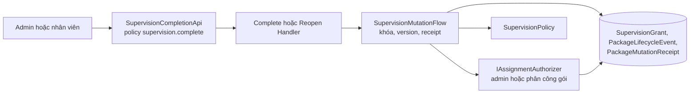
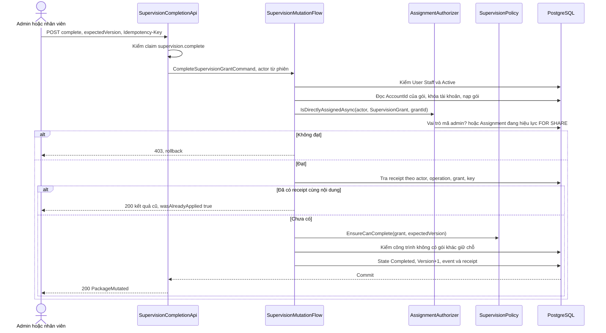
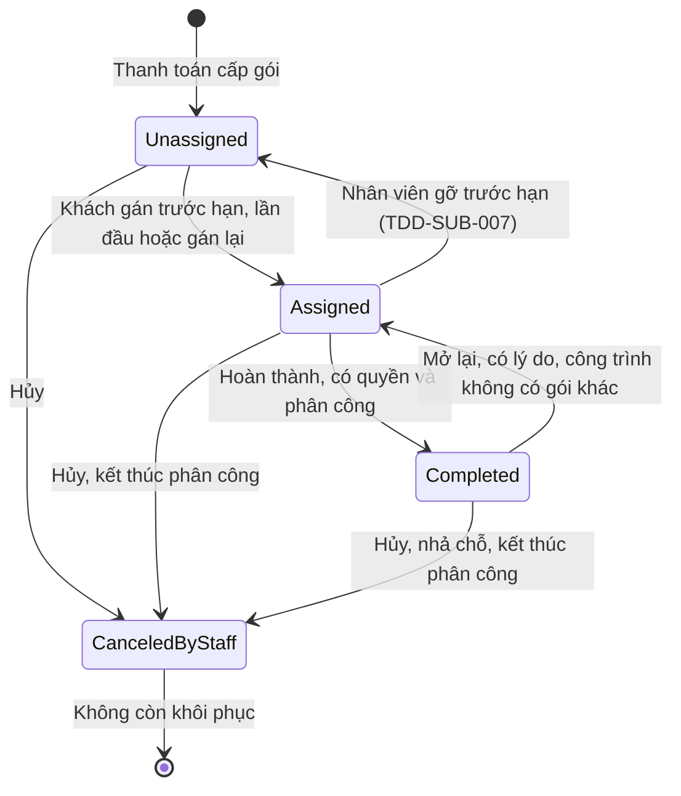
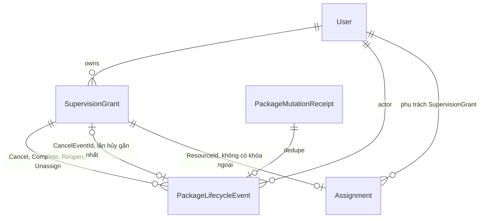

<!-- HƯỚNG DẪN CHO AI KHI ĐIỀN HOẶC CHỈNH SỬA MẪU
- Đọc toàn bộ mẫu, các comment hướng dẫn và tài liệu nguồn được cung cấp trước khi viết. Tuân thủ các quy tắc nghiệp vụ, điều kiện, ngoại lệ và giới hạn đã được xác nhận.
- Không bịa, tự chế hoặc suy đoán thành sự thật: yêu cầu, quy tắc, số liệu, API, schema, mã lỗi, nguồn tham khảo, người phụ trách và kết quả kiểm thử phải có căn cứ. Nội dung ví dụ trong mẫu không phải dữ kiện của dự án.
- Khi thiếu thông tin hoặc các nguồn mâu thuẫn, hỏi người dùng để làm rõ; giữ nguyên placeholder ở phần chưa xác định. Không tự chọn đáp án, lấp chỗ trống hay tuyên bố tài liệu đã hoàn tất.
- Chỉ thay nội dung cần điền hoặc được yêu cầu sửa. Không tự mở rộng phạm vi, sửa nghĩa quy tắc, bỏ điều kiện/ngoại lệ, xoá hay ghi đè nội dung hợp lệ đã có.
- Giữ nguyên tên, cấp và thứ tự heading, nhãn in đậm, tiền tố bullet, cấu trúc danh sách, tên/thứ tự/số cột bảng và cú pháp code fence. Không dịch, đổi tên, gộp hoặc thêm mục ngoài cấu trúc mẫu.
- Chỉ lặp khối luồng, AC hoặc API theo đúng khuôn khi có căn cứ; chỉ bỏ phần tuỳ chọn khi hướng dẫn riêng của mẫu cho phép và đã xác định không áp dụng.
- Mã tham chiếu và section phải trỏ tới tài liệu có thật đã được cung cấp hoặc kiểm chứng. Không giữ mã ví dụ như tham chiếu thật và không tự tạo tài liệu liên quan để hợp thức hoá liên kết.
- Giữ các comment hướng dẫn trong file. Xuất Markdown UTF-8, mỗi file một tài liệu; không bọc toàn bộ file trong code fence, không chèn lời dẫn hay giải thích ngoài mẫu.
- Trước khi bàn giao, đối chiếu nội dung với nguồn, kiểm tra cấu trúc, giá trị cho phép, giới hạn độ dài và tính nhất quán của mã/tham chiếu. Báo rõ phần chưa đủ thông tin; không tuyên bố đã chạy test hoặc import khi chưa thực hiện.
-->

<!-- Thay mã TDD-001 và nội dung ví dụ; giữ nguyên heading và nhãn in đậm.
Sơ đồ dùng mermaid, plantuml hoặc URL. Giữ heading Architecture, Sequence Diagram, Activity Diagram, State Diagram, Data Model.
Ví dụ API phải có heading trùng METHOD /path trong Endpoints. Xoá phần API/sơ đồ không dùng.
Version, Updated At và Change Log do lịch sử phiên bản quản lý, để trống khi nhập mới.
Author/Reviewer là tên hiển thị; gán tài khoản, phê duyệt, giả định và câu hỏi mở trên giao diện sau import.
Thiết kế phải truy vết về Story và Business Rule được cung cấp. Phân biệt thiết kế đề xuất với implementation đã kiểm chứng; không mô tả API/schema/sơ đồ ví dụ như hệ thống thật hoặc tự quyết định nghiệp vụ còn thiếu.
BẮT BUỘC KHI HOÀN THIỆN MẪU: phải có cả Reviewer và Approver, mỗi tên 1–200 ký tự sau khi bỏ khoảng trắng đầu/cuối. Không xoá hai dòng metadata, để trống, dùng tên bịa hoặc giữ placeholder rồi coi là hoàn tất.
Nếu chưa biết người review hoặc người phê duyệt, phải hỏi người dùng và báo tài liệu chưa đủ thông tin; không tự lấy Author/Owner làm người thay thế. Tên trong file không tự gán tài khoản hoặc xác nhận đã duyệt; gán thành viên trên giao diện sau import.
Đây là yêu cầu hoàn thiện mẫu; backend hiện vẫn nhận file cũ thiếu hai trường để tương thích.

VALIDATION CHO FILE NHẬP (đối chiếu ImportSnapshotValidator, MarkdownParser và ImportService):
- Mỗi file .md UTF-8 không rỗng chỉ có một heading cấp 1 chứa mã tài liệu dài 1–100 ký tự. Mã không được trùng trong cùng lần nhập hoặc thuộc loại tài liệu khác đã tồn tại.
- Không dùng tên README.md hoặc sitemap.md vì importer bỏ qua. Giao diện nhận .md/.zip, tối đa 2.000 file, tổng file tải lên 31 MiB; API giới hạn request 32 MiB và tổng nội dung đọc/giải nén 64 MiB.
- Chỉ nhập đè tài liệu cùng loại đang Draft, chưa có phiên bản và chưa lưu trữ. Import thay toàn bộ nội dung bản nháp, vì vậy phải giữ lại nội dung hợp lệ ngoài phần được yêu cầu sửa.
- Không dùng Status trong Markdown hoặc tên Approver để tự xác nhận phê duyệt; import không cấp quyền hay gán tài khoản từ tên. Chạy Kiểm tra file và xử lý lỗi/cảnh báo trước khi nhập.
- Giới hạn độ dài bên dưới tính theo string.Length của .NET (đơn vị UTF-16); không tự cắt ngắn dữ kiện quan trọng để vượt validation, hãy viết lại có căn cứ hoặc hỏi người dùng.
- Feature tối đa 300 ký tự và được dùng làm tiêu đề tài liệu. Status được parser nhận: Draft / In Review / Approved / Deprecated; tài liệu nhập mới vẫn có trạng thái phê duyệt Draft.
- Endpoint: đường dẫn tối đa 500 ký tự; tên/mô tả endpoint được lưu trong Name tối đa 300. HTTP method: GET / POST / PUT / PATCH / DELETE / HEAD / OPTIONS.
- Error Codes: mã tối đa 100 ký tự, không trùng trong tài liệu; giữ dạng - **CODE** (400): mô tả. HTTP status trong Error Codes và Response phải là số nguyên đọc được bằng Int32; không tự đặt status khác hợp đồng API.
- URL sơ đồ tối đa 1.000 ký tự. Mục sơ đồ được sử dụng phải có khối mermaid/plantuml hoặc URL theo mẫu; không để một mục sơ đồ rỗng. Nhãn mục được tách từ bullet như tên External API Fields tối đa 300 ký tự.
- Heading Examples phải khớp METHOD /path ở Endpoints. Giữ các nhãn Request:, Response 200: (thay mã theo contract) và Error Response: để parser tách đúng dữ liệu.
- Tham chiếu dạng DOC-KEY/section: ghi chú: mã đích tối đa 100 ký tự, section tối đa 100, ghi chú tối đa 1.000. Không trùng bộ mã đích + section + loại liên kết trong cùng tài liệu.
ĐỐI CHIẾU FORM TDD (src/features/tdds/validations.ts; form có thể chặt hơn import):
- Điền Feature, Author, Reviewer, Problem và ít nhất một Goal; các Goal/Non-goal/Notes đã thêm không được rỗng. API đã khai báo phải có endpoint và mô tả/mục đích; Fields phải có tên và ý nghĩa; Error Codes phải có mã, HTTP status và điều kiện.
- Form còn kiểm tra Version, Updated At và nội dung Change Log khi khai báo; với file nhập mới, giữ các trường lịch sử này trống theo hợp đồng import, không tự tạo dữ liệu lịch sử.
-->

# TDD-SUB-006

## Document Info

- **Feature**: Hoàn thành và mở lại gói giám sát trên vòng đời gán công trình
- **Author**: Claude
- **Reviewer**: Tân Trần
- **Approver**: Tân Trần
- **Status**: Draft
- **Version**:
- **Updated At**:

## Context & Goals

### Problem

STORY-SUB-003 cần hai thao tác nhân viên: **Hoàn thành** gói giám sát khi công trình xong, và **Mở lại** gói đã hoàn thành khi bấm nhầm. [TDD-SUB-003](TDD-SUB-003.md) từng thiết kế hai thao tác này trên vòng đời cũ, khi gói luôn gắn công trình lúc cấp và chỉ có hai trạng thái `InProgress`/`Completed`. Vòng đời hiện tại lại theo [TDD-SUB-004](TDD-SUB-004.md) (`Unassigned`/`Assigned`) và [TDD-SUB-005](TDD-SUB-005.md) (`CanceledByStaff`), nên bản cũ không dùng được nữa.

Người dùng đã chốt nghiệp vụ ngày 24/09/2026, ghi trong STORY-SUB-003 và BR-SUB-006/011/012/024/025, BR-RBAC-013. Tài liệu này thay toàn bộ phần hoàn thành/mở lại của TDD-SUB-003.

**Cập nhật 25/09/2026 theo nghiệp vụ đã chốt:**
- Gói giám sát gắn cố định với một công trình (`ConstructionSite`, [TDD-SITE-001](TDD-SITE-001.md)); gói đã gắn thì không đổi công trình, kể cả nhân viên và Admin (BR-SUB-009). BR-SUB-023 và `supervision.reassign` đã bỏ.
- Nhân viên được phân công **theo từng gói giám sát**, không theo công trình hay khách hàng; mỗi gói một người phụ trách, người nhận phải có `supervision.complete` (BR-RBAC-013). Gói mới gắn vào cùng công trình cần phân công riêng (STORY-SUB-003/AC-018). STORY-SUB-003 EXC-08 và AC-016 về phân công mức khách hàng đã rút.
- Người hoàn thành/mở lại phải có `supervision.complete`. Sau đó, người giữ vai trò hệ thống có mã `admin` được miễn phân công; đây là ngoại lệ duy nhất theo vai trò. Người khác phải đang được phân công chính gói đó.

Hiện trạng code trước đợt thay đổi ngày 25/09/2026 (thiết kế trong tài liệu này đã được triển khai với tên cũ):
- `SupervisionStates` có `Completed` và tập giữ chỗ `HoldingProject` (`Assigned`, `Completed`); migration `SupervisionGrantCompleted` đã đổi CHECK và tạo index `UX_SupervisionGrant_ProjectHolder`.
- Route `complete`/`reopen` trong `SupervisionGrantApi`, `CompleteSupervisionGrantCommandHandler`, `ReopenSupervisionGrantCommandHandler` và `SupervisionCompletionAccess` đã có.
- `AssignmentAuthorizer.IsDirectlyAssignedAsync` nhận diện Admin bằng `Role.Code == RoleCodes.Admin` trong database, rồi mới đọc dòng phân công bằng `FOR SHARE`. `SupervisionCompletionAccess` đang gọi hàm này với `ResourceTypes.Project` và `grant.ProjectId`, lỗi `ProjectNotAssignedToActor`.
- `LockAccountAsync` vẫn khóa dòng `User`. `AssignmentAuthorizer.IsAssignedAsync` còn nhánh kế thừa từ khách hàng; nhánh này không được dùng cho hoàn thành/mở lại và thuộc phạm vi TDD-RBAC-003.

Các thay đổi của lần cập nhật này đã có trong code ở commit `182e2a8` trên nhánh `feature/construction-site` của `bmt-be`, trừ việc khóa `AccountCommerceState`: `SupervisionCompletionAccess` gọi `IsDirectlyAssignedAsync(actor, ResourceTypes.SupervisionGrant, grant.Id)` thay cho `ResourceTypes.Project` và `grant.ProjectId`; mã lỗi `ProjectNotAssignedToActor` thành `SupervisionGrantNotAssignedToActor`; cột `ProjectId` thành `ConstructionSiteId` theo TDD-SUB-004. Khóa `AccountCommerceState` thay dòng `User` chưa làm, vì bảng đó thuộc TDD-PAY-001 và chưa có. Tên loại tài nguyên `SupervisionGrant` theo [TDD-RBAC-003](TDD-RBAC-003.md).

**Cập nhật 25/09/2026 (lần 3) — đã có trong code ở nhánh `feature/supervision-unassign` của `bmt-be`, chưa merge vào `develop`.** Người dùng chốt thêm ba điểm ảnh hưởng tới tài liệu này:
- Bỏ khôi phục gói đã hủy (BR-SUB-025 đã bỏ, BR-SUB-024 khoản 8). Gói `Completed` bị hủy dừng hẳn ở `CanceledByStaff`; thiết kế hủy ở [TDD-SUB-005](TDD-SUB-005.md).
- Hủy gói giám sát kết thúc phân công của gói (BR-SUB-024 khoản 7, BR-RBAC-013 khoản 9), nên không còn nhân viên phụ trách một gói đã hủy.
- Nhân viên có `supervision.unassign` gỡ được gói đang `Assigned` về `Unassigned` (STORY-SUB-006, BR-SUB-026), thiết kế ở [TDD-SUB-007](TDD-SUB-007.md). Gói `Completed` không gỡ trực tiếp được; gói mở lại về `Assigned` thì gỡ được.

Luồng hoàn thành và mở lại không đổi. Code hiện ở `bmt-be` nhánh `develop`, commit `1ffdfbf`, chưa có các thay đổi của lần 3.

### Goals

- Thêm trạng thái lưu `Completed`. Chỉ gói `Assigned` mới được hoàn thành; mở lại đưa gói `Completed` về `Assigned` trên đúng công trình cũ.
- Gói `Completed` vẫn giữ chỗ trên công trình: database chặn công trình có hai gói `Assigned`/`Completed` cùng lúc.
- Chỉ người có claim `supervision.complete` mới gọi được. Sau khi đạt mã quyền, người giữ vai trò hệ thống mã `admin` được miễn phân công; nhân viên khác phải đang được phân công chính gói đó.
- Hủy gói `Completed` thì nhả chỗ và kết thúc phân công; gói đã hủy không khôi phục được ([TDD-SUB-005](TDD-SUB-005.md)).
- Mở lại đưa gói về đúng công trình cũ; không thao tác nào đổi công trình của gói. Mọi thao tác ghi lịch sử và biên nhận chống gửi lặp trong cùng transaction.

### Non-goals

- Lịch, lượt kiểm tra, điều phối kỹ sư và tự hoàn thành theo thời gian hay theo sự kiện khác.
- Tạo và quản lý công trình ([TDD-SITE-001](TDD-SITE-001.md)). Luồng hoàn thành/mở lại không cần đọc bảng công trình, vì phân công gắn thẳng với gói.
- Thông báo cho khách, thêm cột thời điểm hoàn thành trên gói, hay màn hình quản trị.

## Architecture

| Thành phần | Trạng thái | Trách nhiệm |
| --- | --- | --- |
| `SupervisionCompletionApi` trong `presentation/apis/subscription/SupervisionGrantApi.cs` | Mới | Hai route `complete` và `reopen`, gắn policy `supervision.complete`, đọc `Idempotency-Key`. |
| `CompleteSupervisionGrantCommandHandler`, `ReopenSupervisionGrantCommandHandler` | Mới | Gọi `SupervisionMutationFlow` với hàm quyết định trạng thái riêng. |
| `SupervisionMutationFlow` | Sửa | Nhận `reason` nullable và một bước kiểm phân công tùy chọn chạy sau khi khóa và trước replay. |
| `IAssignmentAuthorizer.IsDirectlyAssignedAsync` | Thêm hàm | Chỉ chạy sau khi đã đạt `supervision.complete`. Người giữ vai trò mã `admin` đạt ngay; người khác chỉ đạt khi có dòng `Assignment` đang hiệu lực với `ResourceType = SupervisionGrant` và `ResourceId` đúng mã gói, đọc bằng `FOR SHARE`. |
| `IAssignmentRowLocker.LockActiveForShareAsync` | Thêm hàm | Câu SQL `SELECT … FOR SHARE` trên phân công đang hiệu lực. |
| `ISupervisionPolicy.EnsureCanComplete/EnsureCanReopen` | Thêm hàm | Hàm thuần kiểm version, trạng thái và lý do. |
| `IPackageLifecyclePolicy.EnsureCanRestoreSupervision` | Bỏ ở lần 3 | Từng nhận trạng thái trước khi hủy để khôi phục về `Completed`. Bỏ cùng thao tác khôi phục theo TDD-SUB-005. |
| `SupervisionAssignmentFlow` | Sửa | Khi kiểm công trình đã có gói hay chưa, tính cả `Completed`. `RestorePackageCommandHandler` từng dùng cùng phép kiểm; handler này bỏ ở lần 3. |

Cột Trạng thái ghi loại thay đổi so với lúc thiết kế ban đầu. Các thành phần "Mới", "Thêm hàm", "Sửa" đã có trong code; phần đổi sang phân công theo gói và cột công trình có từ commit `182e2a8` ngày 25/09/2026. Dòng "Bỏ ở lần 3" là thiết kế, chưa làm trong code.



**1. Kiểm quyền ba chặng.** Mỗi chặng chặn một kiểu truy cập sai khác nhau.

1. Policy `supervision.complete` ở endpoint đọc claim `perm` trong access token. Thiếu claim thì trả 403 trước khi vào handler. Chặng này chặn cả người giữ vai trò `admin` nếu vai trò đó bị thiếu mã quyền (BR-SUB-011/Then khoản 6: người thao tác phải có `supervision.complete`).
2. `PackageMutationFlow.EnsureActorIsActiveStaffAsync` kiểm `AccountKind = Staff` và `Status = Active` trong database. Tài khoản khách bị gán nhầm vai trò có quyền vẫn bị chặn ở đây. Tài khoản giữ vai trò `admin` là tài khoản Staff nên vẫn qua được.
3. `IsDirectlyAssignedAsync` kiểm phân công. Người giữ vai trò hệ thống có mã `admin` (`RoleCodes.Admin`) đạt ngay, theo phần Except của BR-RBAC-013 và BR-SUB-011/Then khoản 6. Hàm nhận diện theo **mã** vai trò đọc từ database, không theo tên hiển thị của vai trò, và đây là ngoại lệ duy nhất theo vai trò. Người khác phải có dòng `Assignment` đang hiệu lực với `ResourceType = SupervisionGrant` và `ResourceId` bằng mã gói (BR-RBAC-013/Then khoản 3). Hàm chỉ khớp đúng gói; không suy từ công trình hay khách hàng, không gọi `IResourceHierarchyReader`.

Ví dụ: Lan có quyền `supervision.complete` và đang được phân công gói G1 trên công trình CS1; Mai cũng có quyền này nhưng không được phân công G1. Lan hoàn thành được G1; Mai nhận 403 `SupervisionGrantNotAssignedToActor`. Nếu G1 bị hủy, phân công của Lan trên G1 kết thúc theo TDD-SUB-005; khách gắn gói G2 vào CS1 thì Lan không hoàn thành được G2 cho tới khi được phân công G2 (STORY-SUB-003/AC-018, ST-SUB-126). Tài khoản giữ vai trò `admin` hoàn thành được gói dù không có dòng phân công nào. Một vai trò tự tạo có tên hiển thị "Admin" nhưng mã khác `admin` không được miễn phân công.

**2. Khóa đọc chung (`FOR SHARE`) trên dòng phân công.** Việc gỡ phân công (`EndAssignmentCommandHandler`, `TransferAssignmentCommandHandler`) khóa dòng `Assignment` bằng `FOR UPDATE`. Chặng 3 đọc chính dòng đó bằng `SELECT … WHERE EffectiveToUtc IS NULL FOR SHARE`, nên hai thao tác xếp hàng với nhau:

- Nếu việc gỡ phân công đã commit trước, câu `FOR SHARE` chờ xong rồi đọc lại dòng. Lúc này dòng không còn khớp `EffectiveToUtc IS NULL`, nên nhân viên bị từ chối (ST-SUB-116).
- Nếu handler giữ `FOR SHARE` trước, việc gỡ phân công phải chờ handler commit xong.

Thay cho khóa bản ghi công trình của TDD-SUB-003: phân công gắn với gói nên khóa đúng dòng phân công là đủ, không cần khóa công trình. Giới hạn: khóa chỉ có tác dụng trong transaction của handler, do `TransactionPipelineBehavior` mở. Người giữ vai trò `admin` không đọc dòng phân công nên không bị khóa này ảnh hưởng.

**3. Thứ tự khóa và bảo vệ đồng thời.** Dùng lại thứ tự trong `SupervisionMutationFlow`:

1. Kiểm tư cách nhân viên.
2. Đọc `AccountId` của gói (không tracking).
3. `LockAccountAsync` khóa `AccountCommerceState` của chủ gói (TDD-PAY-001). Hiện trạng code còn khóa dòng `User`; đổi cùng lúc với các luồng quota theo TDD-SUB-002.
4. Nạp gói có tracking.
5. Kiểm phân công bằng `FOR SHARE`.
6. Tra biên nhận để replay.
7. Gọi policy, rồi ghi.

Không khóa bản ghi quyền của người thao tác, vì quyền đọc từ claim. Hoàn thành, mở lại, hủy, gỡ gói và gán trên cùng khách đều khóa tài khoản ở bước 3, nên không chạy xen nhau (ST-SUB-115). Từ lần 3, hủy và gỡ gói còn khóa dòng phân công `FOR UPDATE` sau bước khóa tài khoản ([TDD-RBAC-003](TDD-RBAC-003.md)); vì đã xếp hàng ở khóa tài khoản trước, chúng không tranh khóa phân công với hoàn thành hay mở lại. Việc gỡ phân công của người quản trị không lấy khóa tài khoản, nên hai chuỗi khóa không tạo vòng chờ.

**4. Optimistic concurrency bằng `Version`.** Client gửi `expectedVersion` đã đọc. Policy so với `SupervisionGrant.Version` sau khi đã khóa. Không khớp thì trả 409 `PackageVersionConflict`, không ghi gì. Khớp thì tăng `Version`, và dòng lịch sử lưu `PackageVersion` mới.

**5. Chống gửi lặp bằng `PackageMutationReceipt`.** Khóa là `(ActorId, Operation, TargetId, RequestKey)`, với `Operation` là `CompleteSupervision` hoặc `ReopenSupervision`. `RequestHash` băm `(kind, grantId, expectedVersion, reason)`:
- Cùng key, cùng nội dung: trả lại `ResultBody` đã lưu, đặt `wasAlreadyApplied = true`, không ghi thêm dòng nào.
- Cùng key, khác nội dung: 409 `IdempotencyConflict`.

Kiểm quyền (chặng 2, 3) chạy **trước** replay: nhân viên đã bị gỡ phân công thì không nhận lại được kết quả cũ (TDD-SUB-005/Architecture).

**6. Transaction.** Command kết thúc bằng `Command` nên `TransactionPipelineBehavior` bọc transaction. Ba việc cùng commit hoặc cùng rollback: cập nhật `SupervisionGrant`, thêm `PackageLifecycleEvent`, thêm `PackageMutationReceipt`. Lỗi sau khi đã sửa entity phải ném exception, không trả `Result.Failure`.

**Notes**:

- Thực hiện từng BR:
  - BR-SUB-011/Then 1 (chỉ `Assigned`, không bắt lý do) và BR-SUB-012/Then 2–3 (lý do, về `Assigned`) nằm ở `SupervisionPolicy` và validator.
  - BR-SUB-011/Then 5–6, BR-SUB-012/Then 1 và BR-RBAC-013/Then 3 (quyền, miễn phân công cho vai trò mã `admin`, phân công theo gói) nằm ở policy endpoint, `EnsureActorIsActiveStaffAsync` và `IsDirectlyAssignedAsync`.
  - BR-RBAC-010/Then 3–4 (`supervision.complete` là quyền gắn phân công; `package.cancel`, `supervision.unassign` thì không) nằm ở việc chỉ hai route `complete`/`reopen` gọi bước kiểm phân công.
  - BR-RBAC-013/Then 9 (từ lần 3: hủy hoặc gỡ gói kết thúc phân công): hoàn thành/mở lại không đọc hay ghi trạng thái phân công ngoài bước kiểm. Vì hủy đã kết thúc phân công, nhân viên không phải `admin` gửi hoàn thành hay mở lại gói đã hủy nhận 403 `SupervisionGrantNotAssignedToActor` ở bước kiểm phân công; chỉ người giữ vai trò `admin` đi tới policy và nhận 409 `PackageStateConflict`. ST-PAY-073 nay kiểm việc hủy kết thúc phân công.
  - BR-SUB-006 (giữ chỗ) nằm ở kiểm tra trong handler và partial unique index.
  - BR-SUB-009/Except (không đổi thẳng công trình của gói, kể cả gói `Completed` hay vừa mở lại): mở lại chỉ đổi `State`, không nhận công trình trong request; code không còn thao tác đổi công trình theo TDD-SUB-004. Gói đã hoàn thành không gỡ được; gói mở lại về `Assigned` thì nhân viên gỡ được theo [TDD-SUB-007](TDD-SUB-007.md) (BR-SUB-011 khoản 7, BR-SUB-026 khoản 3).
  - BR-SUB-024/Then 2 (hủy `Completed`) đã có sẵn nhờ `EnsureCanCancelSupervision` nhận mọi trạng thái trừ `CanceledByStaff`. Lần 3 thêm kết thúc phân công khi hủy (BR-SUB-024 khoản 7), thiết kế ở TDD-SUB-005.
  - BR-SUB-025 đã bỏ ngày 25/09/2026; `EnsureCanRestoreSupervision` bỏ theo TDD-SUB-005.
- Chọn dùng lại `PackageLifecycleEvent` thay vì tạo bảng lịch sử mới. Hoàn thành/mở lại có cùng hình dạng với hủy (trạng thái trước/sau, người thao tác, version, biên nhận). Gộp chung còn giúp đọc lịch sử vòng đời của một gói theo đúng thứ tự `PackageVersion` trong một bảng. Đánh đổi: phải nới ràng buộc `Reason` cho riêng `Complete`.
- Không thêm cột `CompletedAtUtc` vào `SupervisionGrant`. Thời điểm hoàn thành đọc từ dòng `Complete` mới nhất của gói. Nghiệp vụ hiện chỉ cần hiển thị trạng thái (AC-017).
- Mở lại khi công trình đã có gói khác giữ chỗ (BR-SUB-012/Except) vẫn được kiểm trong handler, dù theo quy tắc mới trạng thái này chỉ xuất hiện khi dữ liệu sai. Database cũng chặn nó bằng index (ST-SUB-032).

## Sequence Diagram

Luồng Hoàn thành. Luồng Mở lại giống hệt, chỉ khác lệnh gửi lên có `reason` và policy gọi là `EnsureCanReopen`.



## Activity Diagram


Gói chưa gán công trình không thể có phân công (BR-RBAC-013 khoản 8), nên người không giữ vai trò mã `admin` nhận 403 thay vì 409. Như vậy nhân viên không phụ trách không dò được trạng thái của gói qua mã lỗi. Từ lần 3, gói đã hủy cũng không còn phân công, vì hủy kết thúc phân công (TDD-SUB-005). Vì vậy nhân viên không phải `admin` gửi hoàn thành hay mở lại gói đã hủy cũng nhận 403; chỉ người giữ vai trò `admin` đi tới policy và nhận 409 `PackageStateConflict`. Trước lần 3, người vẫn phụ trách gói đang bị hủy nhận 409; UT-SUB-081 đã được viết lại theo hành vi mới.

## State Diagram

Vòng đời lưu trong database sau thay đổi. `ExpiredUnassigned` vẫn là trạng thái hiệu lực tính khi đọc theo TDD-SUB-004, không vẽ ở đây.



Không mũi tên nào đổi thẳng công trình của gói, và không có `Unassigned → Completed`. Gói `Completed` không gỡ trực tiếp được; phải mở lại về `Assigned` rồi mới gỡ theo TDD-SUB-007. `CanceledByStaff` là trạng thái cuối vì không còn khôi phục. Thời gian trôi qua không tạo chuyển trạng thái nào (STORY-SUB-003/AC-007).

## Data Model

**Ý nghĩa các bảng bị thay đổi**

Không có bảng mới. Hai bảng dưới đây được sửa ràng buộc; bảng biên nhận chỉ thêm giá trị mới cho cột có sẵn.

| Bảng | Một dòng đại diện cho gì? | Thay đổi trong TDD này |
| --- | --- | --- |
| `SupervisionGrant` | Một gói giám sát khách đã mua, định nghĩa ở [TDD-SUB-004](TDD-SUB-004.md#data-model). | Thêm giá trị `Completed` cho `State`. Gói `Completed` bắt buộc có `ConstructionSiteId` và `FirstAssignedAtUtc` (từ lần 3 thêm `AssignedAtUtc`), và giữ chỗ trên công trình như gói `Assigned`. |
| `PackageLifecycleEvent` | Một lần thay đổi vòng đời gói do nhân viên thực hiện, định nghĩa ở [TDD-SUB-005](TDD-SUB-005.md#data-model). | Thêm `Action = Complete` và `Reopen`, chỉ dùng cho `PackageKind = Supervision`. `Reason` được NULL khi và chỉ khi `Action = Complete`. Lần 3 thêm `Action = Unassign` theo [TDD-SUB-007](TDD-SUB-007.md#data-model). |
| `PackageMutationReceipt` | Kết quả của một yêu cầu đã xử lý, dùng khi client gửi lại, định nghĩa ở TDD-SUB-005. | Không đổi schema. Thêm hai giá trị `Operation`: `CompleteSupervision`, `ReopenSupervision`. |

**Bỏ ở lần 3:** bản trước thiết kế khôi phục gói về `Completed` bằng cách đọc `FromState` của dòng `Cancel` mà `SupervisionGrant.CancelEventId` trỏ tới. BR-SUB-025 đã bỏ nên phần này không còn áp dụng. `CancelEventId` vẫn trỏ tới dòng `Cancel` gần nhất; từ lần 3, dòng đó còn lưu tên và địa chỉ công trình tại lúc hủy ([TDD-SUB-005](TDD-SUB-005.md#data-model)), dùng để hiển thị khi khách đã xóa công trình.

**Dữ liệu lưu trữ minh họa: hoàn thành, mở lại, và nhánh hủy gói đã hoàn thành**

Dữ liệu dưới đây là giả định và chỉ trích các cột cần giải thích. G1, U1, CS1, NV2, A1, L1–L4, M3–M6 là bí danh UUID. Mọi giờ đều là UTC. Tình huống nối tiếp ví dụ ở TDD-SUB-004, ngay sau lần gán đầu: G1 của U1 đã gán công trình CS1 ở `Version = 2`. NV2 có quyền `supervision.complete` và `package.cancel`, không giữ vai trò `admin`, và đang được phân công G1 qua dòng `Assignment` A1 (`StaffUserId=NV2`, `ResourceType=SupervisionGrant`, `ResourceId=G1`, `EffectiveToUtc=NULL`; schema bảng theo TDD-RBAC-003).

| Bảng / thời điểm | Các giá trị lưu | Ý nghĩa |
| --- | --- | --- |
| SupervisionGrant, trước | Id=G1; AccountId=U1; ConstructionSiteId=CS1; State=Assigned; FirstAssignedAtUtc=2026-10-01T02:00:00Z; AssignedAtUtc=2026-10-01T02:00:00Z; Version=2; CancelEventId=NULL | Gói đang gắn CS1. `AssignedAtUtc` là cột thêm ở lần 3 theo TDD-SUB-004. |
| SupervisionGrant, sau hoàn thành | State=Completed; Version=3 | CS1 vẫn có G1 giữ chỗ. `ConstructionSiteId`, hai mốc gán và hạn gán không đổi. Bước kiểm phân công đọc A1 bằng `FOR SHARE`; A1 không đổi. |
| PackageLifecycleEvent L1 | Action=Complete; SupervisionGrantId=G1; FromState=Assigned; ToState=Completed; ActorId=NV2; AtUtc=2027-03-01T03:00:00Z; Reason=NULL; PackageVersion=3; ReceiptId=M3 | Hoàn thành không bắt lý do nên `Reason` NULL. |
| PackageMutationReceipt M3 | ActorId=NV2; Operation=CompleteSupervision; TargetId=G1; RequestKey=complete-g1-1; ResultVersion=3 | Gửi lại cùng key thì trả kết quả này, không tạo L1 thứ hai. |
| SupervisionGrant, sau mở lại | State=Assigned; Version=4 | Vẫn trên CS1, vì mở lại không đổi công trình. Hạn gán, `FirstAssignedAtUtc` và `AssignedAtUtc` không đổi. Từ đây nhân viên có `supervision.unassign` gỡ được G1 theo TDD-SUB-007. |
| PackageLifecycleEvent L2 | Action=Reopen; FromState=Completed; ToState=Assigned; Reason=Bấm hoàn thành nhầm; PackageVersion=4; ReceiptId=M4 | Mở lại bắt buộc có lý do. |

Đọc bảng `PackageLifecycleEvent` theo `PackageVersion` của G1 sẽ thấy chuỗi 3→4: hoàn thành, mở lại. Lần gán đầu (version 2) đọc từ hai mốc gán của gói và biên nhận `Assign`; TDD-SUB-004 đã bỏ bảng `SupervisionAssignmentEvent`. Bản trước của mẫu này có thêm bước khôi phục (dòng `Restore`); bước đó bỏ ở lần 3.

**Nhánh hủy gói đã hoàn thành (lần 3).** Thay vì mở lại, NV2 hủy G1 khi G1 đang `Completed` ở version 3, lúc `2027-03-05T02:00:00Z`. Cách ghi theo [TDD-SUB-005](TDD-SUB-005.md#data-model).

| Bảng / thời điểm | Các giá trị lưu | Ý nghĩa |
| --- | --- | --- |
| SupervisionGrant, sau hủy | State=CanceledByStaff; Version=4; CancelEventId=L5; ConstructionSiteId=CS1 | CS1 được nhả chỗ vì index chỉ tính `Assigned`/`Completed`. G1 là trạng thái cuối, không khôi phục được. |
| PackageLifecycleEvent L5 | Action=Cancel; FromState=Completed; ToState=CanceledByStaff; Reason=Khách tạm dừng; ConstructionSiteId=CS1; ConstructionSiteName=Nhà phố Quận 7; ConstructionSiteAddress=12 Nguyễn Thị Thập, Quận 7, TP.HCM; AtUtc=2027-03-05T02:00:00Z; PackageVersion=4; ReceiptId=M5 | Bản lưu công trình dùng khi khách xóa CS1 sau này. |
| Assignment A1, sau hủy | EffectiveToUtc=2027-03-05T02:00:00Z; EndedBy=NV2; EndReason=PackageCanceled | Hủy kết thúc phân công trong cùng transaction ([TDD-RBAC-003](TDD-RBAC-003.md)). NV2 không còn phụ trách G1. |

Sau đó khách gán gói G2 vào CS1. G2 chưa có dòng `Assignment` nào; NV2 gửi hoàn thành G2 nhận 403 `SupervisionGrantNotAssignedToActor` cho tới khi được phân công G2 (STORY-SUB-003/AC-018, AC-019). NV2 gửi hoàn thành hay mở lại G1 cũng nhận 403, vì A1 đã kết thúc.

Nhánh không được phân công: nếu người gửi yêu cầu hoàn thành ở version 2 là nhân viên NV3 có `supervision.complete` nhưng không có dòng `Assignment` đang hiệu lực trên G1, handler trả 403 `SupervisionGrantNotAssignedToActor` trước bước replay. Không có L1, M3; G1 vẫn `Assigned`, version 2. Nếu người gửi giữ vai trò mã `admin` thì qua được bước này dù không có dòng phân công.

**Thay đổi ràng buộc**

| Bảng | Ràng buộc | Trước | Sau |
| --- | --- | --- | --- |
| SupervisionGrant | `CK_SupervisionGrant_State` | `Unassigned`, `Assigned`, `CanceledByStaff` | Thêm `Completed` |
| SupervisionGrant | `CK_SupervisionGrant_AssignedColumns` | `Assigned` bắt buộc có `ProjectId` và `FirstAssignedAtUtc` | `Assigned` hoặc `Completed` bắt buộc có cả hai |
| SupervisionGrant | Partial unique index trên `ProjectId` | `UX_SupervisionGrant_AssignedProject WHERE State = 'Assigned'` | Đổi tên thành `UX_SupervisionGrant_ProjectHolder`, điều kiện `WHERE State IN ('Assigned','Completed')` |
| PackageLifecycleEvent | `CK_PackageLifecycleEvent_Action` | `Cancel`, `Restore` | Thêm `Complete`, `Reopen` |
| PackageLifecycleEvent | Mới: `CK_PackageLifecycleEvent_SupervisionOnlyActions` | — | `Action NOT IN ('Complete','Reopen') OR PackageKind = 'Supervision'` |

Lần 3 đổi tiếp ba ràng buộc trong bảng trên, không thuộc migration của tài liệu này: `CK_SupervisionGrant_AssignedColumns` thêm `AssignedAtUtc` và cho gói `Unassigned` giữ `FirstAssignedAtUtc` ([TDD-SUB-004](TDD-SUB-004.md#data-model)); `CK_PackageLifecycleEvent_Action` và `CK_PackageLifecycleEvent_SupervisionOnlyActions` thêm `Unassign` ([TDD-SUB-007](TDD-SUB-007.md#data-model)). Giá trị `Restore` vẫn nằm trong `CK_PackageLifecycleEvent_Action` để đọc được dòng cũ, nhưng không còn đường ghi.
| PackageLifecycleEvent | `CK_PackageLifecycleEvent_Reason`; cột `Reason` | `Reason` NOT NULL, phải có ký tự không phải khoảng trắng | Cột được NULL. CHECK: `(Action = 'Complete' AND Reason IS NULL) OR (Reason IS NOT NULL AND Reason ~ '[^[:space:]]')`. Phải có `IS NOT NULL`, vì với `Reason` NULL phép so khớp trả NULL, và CHECK coi NULL là đạt |

Các thay đổi ràng buộc trong bảng trên đã chạy ở migration `SupervisionGrantCompleted` với tên cột cũ `ProjectId`. Migration `20260925074152_ConstructionSiteAndPackageAssignment` đổi tên cột và index sang công trình theo [TDD-SUB-004, Data Model](TDD-SUB-004.md#data-model); index giữ chỗ nay mang tên `UX_SupervisionGrant_ConstructionSiteHolder`, điều kiện không đổi.



**Notes**:

- **Partial unique index giữ chỗ.** Index chỉ áp tính duy nhất cho các dòng thỏa điều kiện lọc. Với `WHERE State IN ('Assigned','Completed')`, một công trình có thể có nhiều gói `CanceledByStaff` hoặc gói cũ khác trong lịch sử, nhưng chỉ một gói đang giữ chỗ. Kiểm tra trong handler trả mã lỗi dễ đọc; index là lớp bảo vệ cuối khi hai giao dịch lọt qua cùng lúc hoặc khi có đường ghi khác (ST-SUB-032). Các chỗ kiểm trong code dùng cùng tập trạng thái:
  - `SupervisionAssignmentFlow.EnsureProjectHasNoOtherGrantAsync`;
  - kiểm tra khi mở lại.

  Truy vấn `projectTaken` của `RestorePackageCommandHandler` bỏ cùng thao tác khôi phục ở lần 3.

  Tập này là hằng `SupervisionStates.HoldingConstructionSite` dùng chung, đổi tên từ `HoldingProject` cùng lúc với cột.
- **Migration** (dùng `database-migration-planner` khi triển khai). Thứ tự: nới cột `Reason` → thay các CHECK → drop index cũ → tạo index mới. Migration `SupervisionGrantCompleted` đã có trong code theo đúng thứ tự này.
  - Khi viết migration này chưa có dòng `Completed` nào, vì CHECK cũ cấm. Vì vậy việc mở rộng tập trạng thái và tạo lại index không đụng dữ liệu cũ. Database hiện chỉ có dữ liệu dev/test.
  - Trước khi tạo index trên môi trường có dữ liệu, vẫn chạy `SELECT "ProjectId", count(*) FROM "SupervisionGrant" WHERE "State" IN ('Assigned','Completed') GROUP BY 1 HAVING count(*) > 1;`. Kết quả phải rỗng.
  - Rollback: xóa hoặc chuyển các dòng `Completed` và các sự kiện `Complete`/`Reopen` trước, rồi mới trả lại ràng buộc cũ. Nếu đã có dữ liệu thật thì cần quyết định nghiệp vụ; không tự rollback.
- Chưa thêm CHECK giới hạn `PackageMutationReceipt.Operation`, giữ đúng hiện trạng đã ghi ở `PackageOperations`.
- Các ràng buộc database cần integration test trên PostgreSQL thật. EF InMemory không thực thi CHECK, partial index hay `FOR SHARE`.

## Internal API

### Endpoints

- **POST** `/api/v1/admin/supervision-grants/{grantId}/complete` — Hoàn thành gói `Assigned`. Cần phiên hợp lệ, claim `supervision.complete`, tài khoản Staff đang hoạt động, và giữ vai trò mã `admin` hoặc đang được phân công gói. Body `{expectedVersion}`, header `Idempotency-Key` (1–100 ký tự). Không nhận lý do.
- **POST** `/api/v1/admin/supervision-grants/{grantId}/reopen` — Mở lại gói `Completed` về `Assigned`. Cùng điều kiện quyền. Body `{expectedVersion, reason}`; `reason` sau khi bỏ khoảng trắng đầu/cuối phải dài 1–2.000 ký tự.
- Không đổi hợp đồng của `GET /api/v1/me/supervision-grants` và `GET /api/v1/me/supervision-grants/{grantId}` trong tài liệu này. Hai route này trả thêm giá trị `Completed` ở `state` và `effectiveState` (AC-017). Client đang dùng phải chấp nhận giá trị mới này. Trường `assignedAtUtc` thêm ở lần 3 thuộc [TDD-SUB-004](TDD-SUB-004.md#internal-api).

### Examples

#### POST /api/v1/admin/supervision-grants/{grantId}/complete

```
Request:
Idempotency-Key: 3f0a8f7e-2b61-4c55-9d2e-5c1f0f6b7a11
{"expectedVersion":2}

Response 200:
{"value":{"packageId":"44444444-4444-4444-4444-444444444444","packageKind":"Supervision","lifecycleState":"Completed","version":3,"eventId":"99999999-9999-9999-9999-999999999999","wasAlreadyApplied":false},"isSuccess":true,"isFailure":false,"error":{"code":"","message":""}}

Error Response:
{"title":"Forbidden","code":"Forbidden","status":403,"detail":"Bạn không được phân công gói giám sát này.","messageCode":"SupervisionGrantNotAssignedToActor","errors":null}
```

#### POST /api/v1/admin/supervision-grants/{grantId}/reopen

```
Request:
Idempotency-Key: 0c9d6c55-7a1e-4f3b-8b0c-1d2e3f4a5b6c
{"expectedVersion":5,"reason":"Bấm hoàn thành nhầm"}

Response 200:
{"value":{"packageId":"44444444-4444-4444-4444-444444444444","packageKind":"Supervision","lifecycleState":"Assigned","version":6,"eventId":"aaaaaaaa-aaaa-aaaa-aaaa-aaaaaaaaaaaa","wasAlreadyApplied":false},"isSuccess":true,"isFailure":false,"error":{"code":"","message":""}}

Error Response (thiếu lý do):
{"type":"Validation Error","title":"Validation Error","status":422,"detail":"A validation error occured","errors":[{"code":"Reason","message":"Phải ghi lý do.","messageCode":"PackageMutationInvalid"}]}
```

Lỗi đầu vào bị chặn ở bước kiểm đầu vào (validator) trước khi vào handler, nên thân lỗi 422 có dạng ProblemDetails như trên: mã nghiệp vụ nằm trong từng phần tử `errors[].messageCode`, không nằm ở trường `messageCode` cấp ngoài như các lỗi 403, 404, 409.

### Error Codes

- **Unauthorized** (401): phiên không hợp lệ.
- **AccessForbidden** (403): thiếu claim `supervision.complete`, bị chặn ở policy endpoint.
- **PermissionNotHeldByActor** (403): tài khoản không phải Staff đang hoạt động.
- **SupervisionGrantNotAssignedToActor** (403): không giữ vai trò mã `admin` và không có phân công đang hiệu lực trên gói, kể cả khi gói chưa gán công trình. Thay mã `ProjectNotAssignedToActor` trước đây; mã cũ đã bỏ khỏi `SubscriptionErrorCodes`.
- **PackageNotFound** (404): không có gói giám sát với mã này.
- **PackageVersionConflict** (409): `expectedVersion` không khớp.
- **PackageStateConflict** (409): hoàn thành gói không ở `Assigned`, hoặc mở lại gói không ở `Completed`, gồm gói đã hủy khi người gửi giữ vai trò `admin`. Từ lần 3, nhân viên khác gửi yêu cầu cho gói đã hủy nhận 403 `SupervisionGrantNotAssignedToActor`, vì hủy đã kết thúc phân công.
- **AnotherPackageActive** (409): mở lại khi công trình đã có gói khác giữ chỗ.
- **IdempotencyConflict** (409): cùng `Idempotency-Key` nhưng khác nội dung.
- **PackageMutationInvalid** (422): thiếu hoặc sai `expectedVersion`, `Idempotency-Key`, hoặc lý do mở lại không có nội dung hay quá 2.000 ký tự.

## References

### User Stories

- STORY-SUB-003/AC-006
- STORY-SUB-003/AC-007
- STORY-SUB-003/AC-008
- STORY-SUB-003/AC-009
- STORY-SUB-003/AC-010
- STORY-SUB-003/AC-011
- STORY-SUB-003/AC-012
- STORY-SUB-003/AC-013
- STORY-SUB-003/AC-017
- STORY-SUB-003/AC-018
- STORY-SUB-003/AC-019

### Business Rules

- BR-SUB-006/Statement
- BR-SUB-011/Then
- BR-SUB-012/Then
- BR-SUB-012/Except
- BR-SUB-009/Except
- BR-SUB-024/Then
- BR-SUB-026/Then
- BR-RBAC-013/Then
- BR-RBAC-013/Except
- BR-RBAC-010/Then

### Use Cases

- STORY-SUB-003/Main Flow
- STORY-SUB-003/ALT-03
- STORY-SUB-003/ALT-05

### Others

- Thay phần hoàn thành/mở lại của [TDD-SUB-003](TDD-SUB-003.md). Vòng đời gán theo [TDD-SUB-004](TDD-SUB-004.md); hủy (không còn khôi phục) và biên nhận theo [TDD-SUB-005](TDD-SUB-005.md); gỡ gói theo [TDD-SUB-007](TDD-SUB-007.md); phân công theo [TDD-RBAC-003](TDD-RBAC-003.md).
- STORY-SUB-003 AC-014, AC-015, ALT-04 và EXC-09 về khôi phục được ghi "Không nghiệm thu" ngày 25/09/2026 nên không còn trong tham chiếu; BR-SUB-025 đã bỏ.
- EXC-08 và AC-016 của STORY-SUB-003 về phân công mức khách hàng đã rút ngày 25/09/2026, nên không còn trong tham chiếu. UT-SUB-061 và ST-SUB-122 kiểm nhân viên chỉ phụ trách gói khác của cùng khách bị từ chối (cả hai đã sửa sang phân công theo gói); UT-SUB-074 kiểm vai trò tự tạo tên "Admin" nhưng mã khác `admin` không được miễn phân công.
- System Test: ST-SUB-026 đến ST-SUB-032, ST-SUB-115 đến ST-SUB-119, ST-SUB-122, ST-SUB-123, ST-SUB-126 (gói mới cần phân công riêng), ST-SUB-127 (hủy gói đã hoàn thành, kết thúc phân công), ST-PAY-073 (hủy gói kết thúc phân công). ST-SUB-120 và ST-SUB-121 kiểm khôi phục và đã đánh dấu bỏ.
- Đặc tả Unit Test: UT-SUB-051 đến UT-SUB-066, UT-SUB-069, UT-SUB-071 đến UT-SUB-074, UT-SUB-080 (gói mới cùng công trình không kế thừa phân công), UT-SUB-081 (viết lại ở lần 3: nhân viên từng phụ trách gói đã hủy nhận 403, Admin nhận 409), UT-SUB-093 (hoàn thành và mở lại giữ mốc gán), UT-SUB-094 (hủy gói đã hoàn thành kết thúc phân công). UT-SUB-071 sửa ở lần 3 (bản lưu công trình, không còn bước khôi phục). Đã đánh dấu ĐÃ BỎ: UT-SUB-067, UT-SUB-068 (khôi phục), UT-SUB-070 (đổi công trình). Mã test ở `test/bmt-be.application.tests/usecases/subscription/` (`SupervisionCompletionTests.cs`, `SupervisionPolicyTests.cs`, `SupervisionCommandHandlerTests.cs`) đã cập nhật theo lần 3; UT-SUB-071, UT-SUB-081, UT-SUB-093 và UT-SUB-094 nằm trong `SupervisionCompletionTests.cs`. Kết quả chạy ngày 25/09/2026 trên nhánh đó: unit test 465/465 (năm project test) và integration test 170/170 trên PostgreSQL 15 (Testcontainers) đạt; chưa chạy System Test và chưa áp dụng migration lên môi trường dev dùng chung hay production.
- Hiện trạng mã nguồn: [SupervisionMutationFlow](../../bmt-be/src/bmt-be.application/usecases/commands/subscription/SupervisionMutationFlow.cs), [AssignmentAuthorizer](../../bmt-be/src/bmt-be.application/services/AssignmentAuthorizer.cs), [AssignmentRowLocker](../../bmt-be/src/bmt-be.persistence/repositories/AssignmentRowLocker.cs), [SupervisionGrantConfiguration](../../bmt-be/src/bmt-be.persistence/configurations/SupervisionGrantConfiguration.cs), [PackageLifecycleEventConfiguration](../../bmt-be/src/bmt-be.persistence/configurations/PackageLifecycleEventConfiguration.cs).

## Change Log

- 2026-09-25 (lần 3): Theo BR-SUB-024 cập nhật và BR-SUB-025 đã bỏ (không còn khôi phục, hủy kết thúc phân công), STORY-SUB-006 và BR-SUB-026 (nhân viên gỡ gói đang `Assigned`), STORY-SUB-003/AC-019, ALT-05. Bỏ mọi nội dung khôi phục: mục tiêu, dòng `EnsureCanRestoreSupervision`, mũi tên khôi phục ở State Diagram, đoạn đọc `FromState` để khôi phục, dòng mẫu `Restore` và nhánh khôi phục bị chặn. Thêm nhánh mẫu hủy gói `Completed` kèm bản lưu công trình và kết thúc phân công; State Diagram thêm `Assigned → Unassigned` do nhân viên gỡ; ghi rõ nhân viên không còn phụ trách gói đã hủy (nhận 403), UT-SUB-081 cần xem lại. Chưa có trong code.
- 2026-09-25 (đồng bộ code lần 2): Sửa ví dụ lỗi 422 của mở lại gói theo dạng phản hồi thật (ProblemDetails, mã ở `errors[].messageCode`).
- 2026-09-25 (đồng bộ code): Đồng bộ với code đã triển khai ở commit `182e2a8`: kiểm phân công theo gói, mã `SupervisionGrantNotAssignedToActor`, cột và hằng tập giữ chỗ theo công trình đã có; khóa `AccountCommerceState` vẫn chưa làm.
- 2026-09-25 (lần 2): Phân công theo từng gói giám sát thay cho theo công trình: bước kiểm dùng `ResourceType = SupervisionGrant` và mã gói, mã lỗi đổi thành `SupervisionGrantNotAssignedToActor`; gói mới trên cùng công trình cần phân công riêng (AC-018, ST-SUB-126); người phụ trách gói bị hủy nhận 409 thay vì 403 (ST-PAY-073). Bỏ mọi mô tả đổi công trình và BR-SUB-023 (BR-SUB-009 gắn cố định), bỏ mũi tên `Assigned → Assigned` ở State Diagram.
- 2026-09-25: Cập nhật theo nghiệp vụ đã chốt ngày 25/09/2026. Gói giám sát gắn với công trình (`ConstructionSite`): đổi "dự án"/`Project`/`ProjectId` trong luồng giám sát, `ResourceType` phân công và mã lỗi sang tên công trình dự kiến. Miễn phân công chỉ cho người giữ vai trò hệ thống mã `admin` sau khi đã có `supervision.complete`, nhận diện theo mã chứ không theo tên hiển thị. Bỏ ví dụ phân công mức khách hàng, nhánh kế thừa của `IsAssignedAsync` và tham chiếu STORY-SUB-003/AC-016 (đã rút); dẫn BR-RBAC-013/Then khoản 3, BR-SUB-011/Then khoản 6 và BR-RBAC-010. Thứ tự khóa dùng `AccountCommerceState`, không khóa bản ghi quyền. Cập nhật hiện trạng code (thiết kế đã được triển khai với tên cũ) và ghi UT-SUB-061, ST-SUB-122 cần cập nhật.
