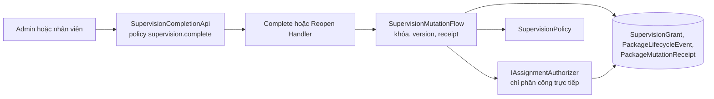
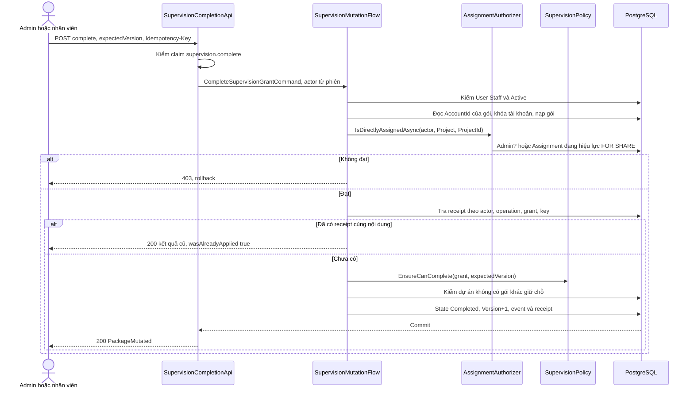
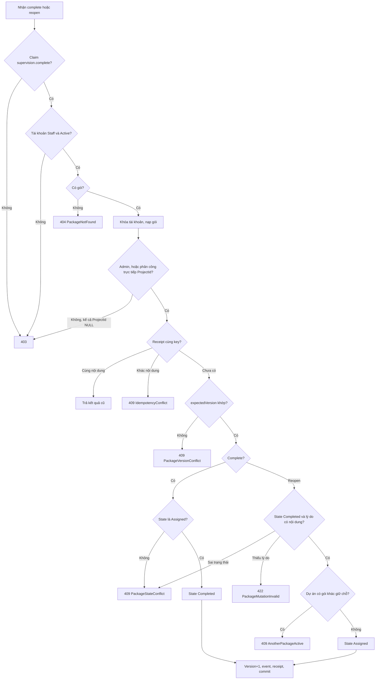
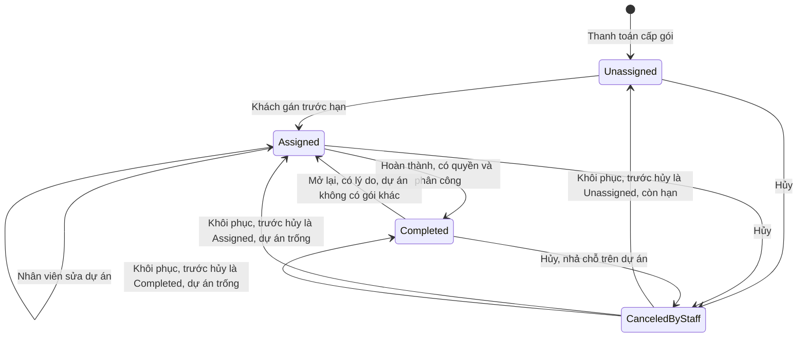
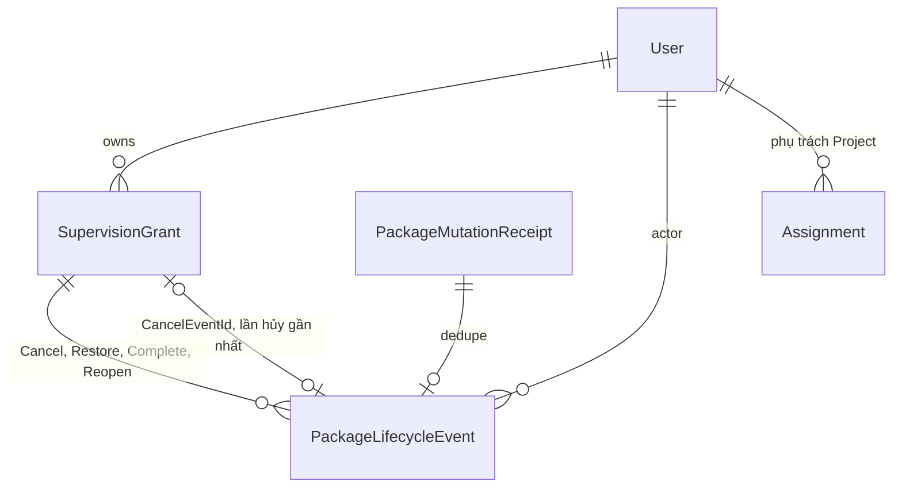

<!-- HƯỚNG DẪN CHO AI KHI ĐIỀN HOẶC CHỈNH SỬA MẪU
- Đọc toàn bộ mẫu, các comment hướng dẫn và tài liệu nguồn được cung cấp trước khi viết. Tuân thủ các quy tắc nghiệp vụ, điều kiện, ngoại lệ và giới hạn đã được xác nhận.
- Không bịa, tự chế hoặc suy đoán thành sự thật: yêu cầu, quy tắc, số liệu, API, schema, mã lỗi, nguồn tham khảo, người phụ trách và kết quả kiểm thử phải có căn cứ. Nội dung ví dụ trong mẫu không phải dữ kiện của dự án.
- Khi thiếu thông tin hoặc các nguồn mâu thuẫn, hỏi người dùng để làm rõ; giữ nguyên placeholder ở phần chưa xác định. Không tự chọn đáp án, lấp chỗ trống hay tuyên bố tài liệu đã hoàn tất.
- Chỉ thay nội dung cần điền hoặc được yêu cầu sửa. Không tự mở rộng phạm vi, sửa nghĩa quy tắc, bỏ điều kiện/ngoại lệ, xoá hay ghi đè nội dung hợp lệ đã có.
- Giữ nguyên tên, cấp và thứ tự heading, nhãn in đậm, tiền tố bullet, cấu trúc danh sách, tên/thứ tự/số cột bảng và cú pháp code fence. Không dịch, đổi tên, gộp hoặc thêm mục ngoài cấu trúc mẫu.
- Chỉ lặp khối luồng, AC hoặc API theo đúng khuôn khi có căn cứ; chỉ bỏ phần tuỳ chọn khi hướng dẫn riêng của mẫu cho phép và đã xác định không áp dụng.
- Mã tham chiếu và section phải trỏ tới tài liệu có thật đã được cung cấp hoặc kiểm chứng. Không giữ mã ví dụ như tham chiếu thật và không tự tạo tài liệu liên quan để hợp thức hoá liên kết.
- Giữ các comment hướng dẫn trong file. Xuất Markdown UTF-8, mỗi file một tài liệu; không bọc toàn bộ file trong code fence, không chèn lời dẫn hay giải thích ngoài mẫu.
- Trước khi bàn giao, đối chiếu nội dung với nguồn, kiểm tra cấu trúc, giá trị cho phép, giới hạn độ dài và tính nhất quán của mã/tham chiếu. Báo rõ phần chưa đủ thông tin; không tuyên bố đã chạy test hoặc import khi chưa thực hiện.
-->

<!-- Thay mã TDD-001 và nội dung ví dụ; giữ nguyên heading và nhãn in đậm.
Sơ đồ dùng mermaid, plantuml hoặc URL. Giữ heading Architecture, Sequence Diagram, Activity Diagram, State Diagram, Data Model.
Ví dụ API phải có heading trùng METHOD /path trong Endpoints. Xoá phần API/sơ đồ không dùng.
Version, Updated At và Change Log do lịch sử phiên bản quản lý, để trống khi nhập mới.
Author/Reviewer là tên hiển thị; gán tài khoản, phê duyệt, giả định và câu hỏi mở trên giao diện sau import.
Thiết kế phải truy vết về Story và Business Rule được cung cấp. Phân biệt thiết kế đề xuất với implementation đã kiểm chứng; không mô tả API/schema/sơ đồ ví dụ như hệ thống thật hoặc tự quyết định nghiệp vụ còn thiếu.
BẮT BUỘC KHI HOÀN THIỆN MẪU: phải có cả Reviewer và Approver, mỗi tên 1–200 ký tự sau khi bỏ khoảng trắng đầu/cuối. Không xoá hai dòng metadata, để trống, dùng tên bịa hoặc giữ placeholder rồi coi là hoàn tất.
Nếu chưa biết người review hoặc người phê duyệt, phải hỏi người dùng và báo tài liệu chưa đủ thông tin; không tự lấy Author/Owner làm người thay thế. Tên trong file không tự gán tài khoản hoặc xác nhận đã duyệt; gán thành viên trên giao diện sau import.
Đây là yêu cầu hoàn thiện mẫu; backend hiện vẫn nhận file cũ thiếu hai trường để tương thích.

VALIDATION CHO FILE NHẬP (đối chiếu ImportSnapshotValidator, MarkdownParser và ImportService):
- Mỗi file .md UTF-8 không rỗng chỉ có một heading cấp 1 chứa mã tài liệu dài 1–100 ký tự. Mã không được trùng trong cùng lần nhập hoặc thuộc loại tài liệu khác đã tồn tại.
- Không dùng tên README.md hoặc sitemap.md vì importer bỏ qua. Giao diện nhận .md/.zip, tối đa 2.000 file, tổng file tải lên 31 MiB; API giới hạn request 32 MiB và tổng nội dung đọc/giải nén 64 MiB.
- Chỉ nhập đè tài liệu cùng loại đang Draft, chưa có phiên bản và chưa lưu trữ. Import thay toàn bộ nội dung bản nháp, vì vậy phải giữ lại nội dung hợp lệ ngoài phần được yêu cầu sửa.
- Không dùng Status trong Markdown hoặc tên Approver để tự xác nhận phê duyệt; import không cấp quyền hay gán tài khoản từ tên. Chạy Kiểm tra file và xử lý lỗi/cảnh báo trước khi nhập.
- Giới hạn độ dài bên dưới tính theo string.Length của .NET (đơn vị UTF-16); không tự cắt ngắn dữ kiện quan trọng để vượt validation, hãy viết lại có căn cứ hoặc hỏi người dùng.
- Feature tối đa 300 ký tự và được dùng làm tiêu đề tài liệu. Status được parser nhận: Draft / In Review / Approved / Deprecated; tài liệu nhập mới vẫn có trạng thái phê duyệt Draft.
- Endpoint: đường dẫn tối đa 500 ký tự; tên/mô tả endpoint được lưu trong Name tối đa 300. HTTP method: GET / POST / PUT / PATCH / DELETE / HEAD / OPTIONS.
- Error Codes: mã tối đa 100 ký tự, không trùng trong tài liệu; giữ dạng - **CODE** (400): mô tả. HTTP status trong Error Codes và Response phải là số nguyên đọc được bằng Int32; không tự đặt status khác hợp đồng API.
- URL sơ đồ tối đa 1.000 ký tự. Mục sơ đồ được sử dụng phải có khối mermaid/plantuml hoặc URL theo mẫu; không để một mục sơ đồ rỗng. Nhãn mục được tách từ bullet như tên External API Fields tối đa 300 ký tự.
- Heading Examples phải khớp METHOD /path ở Endpoints. Giữ các nhãn Request:, Response 200: (thay mã theo contract) và Error Response: để parser tách đúng dữ liệu.
- Tham chiếu dạng DOC-KEY/section: ghi chú: mã đích tối đa 100 ký tự, section tối đa 100, ghi chú tối đa 1.000. Không trùng bộ mã đích + section + loại liên kết trong cùng tài liệu.
ĐỐI CHIẾU FORM TDD (src/features/tdds/validations.ts; form có thể chặt hơn import):
- Điền Feature, Author, Reviewer, Problem và ít nhất một Goal; các Goal/Non-goal/Notes đã thêm không được rỗng. API đã khai báo phải có endpoint và mô tả/mục đích; Fields phải có tên và ý nghĩa; Error Codes phải có mã, HTTP status và điều kiện.
- Form còn kiểm tra Version, Updated At và nội dung Change Log khi khai báo; với file nhập mới, giữ các trường lịch sử này trống theo hợp đồng import, không tự tạo dữ liệu lịch sử.
-->

# TDD-SUB-006

## Document Info

- **Feature**: Hoàn thành và mở lại gói giám sát trên vòng đời gán dự án
- **Author**: Claude
- **Reviewer**: Tân Trần
- **Approver**: Tân Trần
- **Status**: Draft
- **Version**:
- **Updated At**:

## Context & Goals

### Problem

STORY-SUB-003 cần hai thao tác nhân viên: **Hoàn thành** gói giám sát khi dự án xong, và **Mở lại** gói đã hoàn thành khi bấm nhầm. [TDD-SUB-003](TDD-SUB-003.md) từng thiết kế hai thao tác này trên vòng đời cũ, khi gói luôn gắn dự án lúc cấp và chỉ có hai trạng thái `InProgress`/`Completed`. Vòng đời hiện tại lại theo [TDD-SUB-004](TDD-SUB-004.md) (`Unassigned`/`Assigned`) và [TDD-SUB-005](TDD-SUB-005.md) (`CanceledByStaff`), nên bản cũ không dùng được nữa.

Người dùng đã chốt nghiệp vụ ngày 24/09/2026, ghi trong STORY-SUB-003 và BR-SUB-006/011/012/023/024/025, BR-RBAC-013. Tài liệu này thay toàn bộ phần hoàn thành/mở lại của TDD-SUB-003.

Hiện trạng đã kiểm tra trong code:
- `SupervisionStates` chỉ có ba giá trị.
- Quyền `supervision.complete` đã được seed nhưng chưa endpoint nào kiểm.
- `AssignmentAuthorizer` luôn tính cả phân công kế thừa từ khách hàng xuống dự án.
- Luồng hủy/khôi phục gói giám sát (`SupervisionMutationFlow`) đã có đủ khóa tài khoản, `expectedVersion`, `Idempotency-Key` và biên nhận.

### Goals

- Thêm trạng thái lưu `Completed`. Chỉ gói `Assigned` mới được hoàn thành; mở lại đưa gói `Completed` về `Assigned` trên đúng dự án cũ.
- Gói `Completed` vẫn giữ chỗ trên dự án: database chặn dự án có hai gói `Assigned`/`Completed` cùng lúc.
- Chỉ người có claim `supervision.complete` mới gọi được. Admin không cần phân công; nhân viên phải đang được phân công **trực tiếp** dự án, không tính phân công mức khách hàng.
- Hủy gói `Completed` thì nhả chỗ; khôi phục thì về lại `Completed`, trừ khi dự án đã có gói khác giữ chỗ.
- Sửa dự án của gói `Completed` bị từ chối. Mọi thao tác ghi lịch sử và biên nhận chống gửi lặp trong cùng transaction.

### Non-goals

- Lịch, lượt kiểm tra, điều phối kỹ sư và tự hoàn thành theo thời gian hay theo sự kiện khác.
- Module công trình. Không cần tra dự án thuộc khách nào, vì không dùng phân công kế thừa.
- Thông báo cho khách, thêm cột thời điểm hoàn thành trên gói, hay màn hình quản trị.

## Architecture

| Thành phần | Trạng thái | Trách nhiệm |
| --- | --- | --- |
| `SupervisionCompletionApi` trong `presentation/apis/subscription/SupervisionGrantApi.cs` | Mới | Hai route `complete` và `reopen`, gắn policy `supervision.complete`, đọc `Idempotency-Key`. |
| `CompleteSupervisionGrantCommandHandler`, `ReopenSupervisionGrantCommandHandler` | Mới | Gọi `SupervisionMutationFlow` với hàm quyết định trạng thái riêng. |
| `SupervisionMutationFlow` | Sửa | Nhận `reason` nullable và một bước kiểm phân công tùy chọn chạy sau khi khóa và trước replay. |
| `IAssignmentAuthorizer.IsDirectlyAssignedAsync` | Thêm hàm | Admin đạt ngay; nhân viên chỉ đạt khi có dòng `Assignment` đang hiệu lực đúng `Project` đó, đọc bằng `FOR SHARE`. |
| `IAssignmentRowLocker.LockActiveForShareAsync` | Thêm hàm | Câu SQL `SELECT … FOR SHARE` trên phân công đang hiệu lực. |
| `ISupervisionPolicy.EnsureCanComplete/EnsureCanReopen` | Thêm hàm | Hàm thuần kiểm version, trạng thái và lý do. |
| `IPackageLifecyclePolicy.EnsureCanRestoreSupervision` | Sửa | Nhận trạng thái trước khi hủy; trả `Completed` khi gói đã hoàn thành lúc bị hủy. |
| `SupervisionAssignmentFlow`, `RestorePackageCommandHandler` | Sửa | Khi kiểm dự án đã có gói hay chưa, tính cả `Completed`. |



**1. Kiểm quyền ba chặng.** Mỗi chặng chặn một kiểu truy cập sai khác nhau.

1. Policy `supervision.complete` ở endpoint đọc claim `perm` trong access token. Thiếu claim thì trả 403 trước khi vào handler. Chặng này chặn cả Admin thiếu mã quyền (STORY-SUB-003/AC-008).
2. `PackageMutationFlow.EnsureActorIsActiveStaffAsync` kiểm `AccountKind = Staff` và `Status = Active` trong database. Tài khoản khách bị gán nhầm vai trò có quyền vẫn bị chặn ở đây. Admin là tài khoản Staff nên vẫn qua được.
3. `IsDirectlyAssignedAsync` kiểm phân công. Người giữ vai trò `admin` đạt ngay, theo phần Except của BR-RBAC-013. Người khác phải có dòng `Assignment` đang hiệu lực với `ResourceType = Project` và `ResourceId = ProjectId` của gói. Hàm cố ý **không** gọi `IResourceHierarchyReader`, nên nhân viên chỉ phụ trách khách hàng K bị từ chối (BR-SUB-011/Then 6, STORY-SUB-003/AC-016). Nhờ vậy hàm cũng không đụng tới `UnavailableResourceHierarchyReader`, bản tạm đang ném `NotImplementedException`.

Ví dụ: Mai có quyền `supervision.complete` và được phân công khách hàng K, còn Lan được phân công dự án A của K. Lan hoàn thành được gói trên A; Mai nhận 403 `ProjectNotAssignedToActor`. Hàm `IsAssignedAsync` hiện có vẫn giữ nhánh kế thừa cho các tính năng khác.

**2. Khóa đọc chung (`FOR SHARE`) trên dòng phân công.** Việc gỡ phân công (`EndAssignmentCommandHandler`, `TransferAssignmentCommandHandler`) khóa dòng `Assignment` bằng `FOR UPDATE`. Chặng 3 đọc chính dòng đó bằng `SELECT … WHERE EffectiveToUtc IS NULL FOR SHARE`, nên hai thao tác xếp hàng với nhau:

- Nếu việc gỡ phân công đã commit trước, câu `FOR SHARE` chờ xong rồi đọc lại dòng. Lúc này dòng không còn khớp `EffectiveToUtc IS NULL`, nên nhân viên bị từ chối (ST-SUB-116).
- Nếu handler giữ `FOR SHARE` trước, việc gỡ phân công phải chờ handler commit xong.

Thay cho khóa bản ghi công trình của TDD-SUB-003: bảng công trình chưa tồn tại, còn dòng phân công thì có thật. Giới hạn: khóa chỉ có tác dụng trong transaction của handler, do `TransactionPipelineBehavior` mở. Admin không đọc dòng phân công nên không bị khóa này ảnh hưởng.

**3. Thứ tự khóa và bảo vệ đồng thời.** Dùng lại thứ tự trong `SupervisionMutationFlow`:

1. Kiểm tư cách nhân viên.
2. Đọc `AccountId` của gói (không tracking).
3. `LockAccountAsync` khóa trạng thái thương mại của chủ gói.
4. Nạp gói có tracking.
5. Kiểm phân công bằng `FOR SHARE`.
6. Tra biên nhận để replay.
7. Gọi policy, rồi ghi.

Hoàn thành, hủy, khôi phục, gán và sửa dự án trên cùng khách đều khóa tài khoản ở bước 3, nên không chạy xen nhau (ST-SUB-115). Việc gỡ phân công không lấy khóa tài khoản, nên hai chuỗi khóa không tạo vòng chờ.

**4. Optimistic concurrency bằng `Version`.** Client gửi `expectedVersion` đã đọc. Policy so với `SupervisionGrant.Version` sau khi đã khóa. Không khớp thì trả 409 `PackageVersionConflict`, không ghi gì. Khớp thì tăng `Version`, và dòng lịch sử lưu `PackageVersion` mới.

**5. Chống gửi lặp bằng `PackageMutationReceipt`.** Khóa là `(ActorId, Operation, TargetId, RequestKey)`, với `Operation` là `CompleteSupervision` hoặc `ReopenSupervision`. `RequestHash` băm `(kind, grantId, expectedVersion, reason)`:
- Cùng key, cùng nội dung: trả lại `ResultBody` đã lưu, đặt `wasAlreadyApplied = true`, không ghi thêm dòng nào.
- Cùng key, khác nội dung: 409 `IdempotencyConflict`.

Kiểm quyền (chặng 2, 3) chạy **trước** replay: nhân viên đã bị gỡ phân công thì không nhận lại được kết quả cũ (TDD-SUB-005/Architecture).

**6. Transaction.** Command kết thúc bằng `Command` nên `TransactionPipelineBehavior` bọc transaction. Ba việc cùng commit hoặc cùng rollback: cập nhật `SupervisionGrant`, thêm `PackageLifecycleEvent`, thêm `PackageMutationReceipt`. Lỗi sau khi đã sửa entity phải ném exception, không trả `Result.Failure`.

**Notes**:

- Thực hiện từng BR:
  - BR-SUB-011/Then 1 (chỉ `Assigned`, không bắt lý do) và BR-SUB-012/Then 2–3 (lý do, về `Assigned`) nằm ở `SupervisionPolicy` và validator.
  - BR-SUB-011/Then 5–6 và BR-SUB-012/Then 1 (quyền, phân công trực tiếp) nằm ở policy endpoint, `EnsureActorIsActiveStaffAsync` và `IsDirectlyAssignedAsync`.
  - BR-SUB-006 (giữ chỗ) nằm ở kiểm tra trong handler và partial unique index.
  - BR-SUB-023/Except (không sửa dự án gói `Completed`) đã có sẵn nhờ `EnsureCanReassign` chỉ nhận `Assigned`.
  - BR-SUB-024/Then 2 (hủy `Completed`) đã có sẵn nhờ `EnsureCanCancelSupervision` nhận mọi trạng thái trừ `CanceledByStaff`.
  - BR-SUB-025/Then 5 nằm ở `EnsureCanRestoreSupervision`, xem Data Model.
- Chọn dùng lại `PackageLifecycleEvent` thay vì tạo bảng lịch sử mới. Hoàn thành/mở lại có cùng hình dạng với hủy/khôi phục (trạng thái trước/sau, người thao tác, version, biên nhận). Gộp chung còn giúp đọc lịch sử vòng đời của một gói theo đúng thứ tự `PackageVersion` trong một bảng. Đánh đổi: phải nới ràng buộc `Reason` cho riêng `Complete`.
- Không thêm cột `CompletedAtUtc` vào `SupervisionGrant`. Thời điểm hoàn thành đọc từ dòng `Complete` mới nhất của gói. Nghiệp vụ hiện chỉ cần hiển thị trạng thái (AC-017).
- Mở lại khi dự án đã có gói khác giữ chỗ (BR-SUB-012/Except) vẫn được kiểm trong handler, dù theo quy tắc mới trạng thái này chỉ xuất hiện khi dữ liệu sai. Database cũng chặn nó bằng index (ST-SUB-032).

## Sequence Diagram

Luồng Hoàn thành. Luồng Mở lại giống hệt, chỉ khác lệnh gửi lên có `reason` và policy gọi là `EnsureCanReopen`.



## Activity Diagram



Khi `ProjectId` là NULL (gói chưa gán), người không phải Admin nhận 403 thay vì 409. Như vậy nhân viên không phụ trách không dò được trạng thái của gói qua mã lỗi.

## State Diagram

Vòng đời lưu trong database sau thay đổi. `ExpiredUnassigned` vẫn là trạng thái hiệu lực tính khi đọc theo TDD-SUB-004, không vẽ ở đây.



Không có mũi tên `Completed → Assigned` qua sửa dự án, và không có `Unassigned → Completed`. Thời gian trôi qua không tạo chuyển trạng thái nào (STORY-SUB-003/AC-007).

## Data Model

**Ý nghĩa các bảng bị thay đổi**

Không có bảng mới. Hai bảng dưới đây được sửa ràng buộc; bảng biên nhận chỉ thêm giá trị mới cho cột có sẵn.

| Bảng | Một dòng đại diện cho gì? | Thay đổi trong TDD này |
| --- | --- | --- |
| `SupervisionGrant` | Một gói giám sát khách đã mua, định nghĩa ở [TDD-SUB-004](TDD-SUB-004.md#data-model). | Thêm giá trị `Completed` cho `State`. Gói `Completed` bắt buộc có `ProjectId` và `FirstAssignedAtUtc`, và giữ chỗ trên dự án như gói `Assigned`. |
| `PackageLifecycleEvent` | Một lần thay đổi vòng đời gói do nhân viên thực hiện, định nghĩa ở [TDD-SUB-005](TDD-SUB-005.md#data-model). | Thêm `Action = Complete` và `Reopen`, chỉ dùng cho `PackageKind = Supervision`. `Reason` được NULL khi và chỉ khi `Action = Complete`. |
| `PackageMutationReceipt` | Kết quả của một yêu cầu đã xử lý, dùng khi client gửi lại, định nghĩa ở TDD-SUB-005. | Không đổi schema. Thêm hai giá trị `Operation`: `CompleteSupervision`, `ReopenSupervision`. |

Khôi phục biết đưa gói về trạng thái nào mà **không cần cột mới**. `SupervisionGrant.CancelEventId` trỏ tới dòng `Cancel` gần nhất, và dòng đó đã lưu `FromState`. Handler khôi phục đọc `FromState` này:
- `Unassigned`: giữ luật cũ (còn hạn gán mới khôi phục được).
- `Assigned` hoặc `Completed`: trả về đúng giá trị đó, nếu dự án chưa có gói khác giữ chỗ.

Dòng `Cancel` cũ đều có `FromState` là `Unassigned` hoặc `Assigned`, nên dữ liệu hiện có vẫn khôi phục đúng như trước.

**Dữ liệu lưu trữ minh họa: hoàn thành, hủy, khôi phục, mở lại**

Dữ liệu dưới đây là giả định và chỉ trích các cột cần giải thích. G1, U1, PR1, NV2, L1–L4, M3–M6 là bí danh UUID. Mọi giờ đều là UTC. Tình huống nối tiếp ví dụ ở TDD-SUB-004: G1 của U1 đã gán PR1 ở `Version = 2`. NV2 có quyền `supervision.complete`, `package.cancel`, `package.restore` và đang được phân công trực tiếp PR1.

| Bảng / thời điểm | Các giá trị lưu | Ý nghĩa |
| --- | --- | --- |
| SupervisionGrant, trước | Id=G1; AccountId=U1; ProjectId=PR1; State=Assigned; FirstAssignedAtUtc=2026-10-01T02:00:00Z; Version=2; CancelEventId=NULL | Gói đang gắn PR1. |
| SupervisionGrant, sau hoàn thành | State=Completed; Version=3 | PR1 vẫn có G1 giữ chỗ. `ProjectId`, `FirstAssignedAtUtc` và hạn gán không đổi. |
| PackageLifecycleEvent L1 | Action=Complete; SupervisionGrantId=G1; FromState=Assigned; ToState=Completed; ActorId=NV2; AtUtc=2027-03-01T03:00:00Z; Reason=NULL; PackageVersion=3; ReceiptId=M3 | Hoàn thành không bắt lý do nên `Reason` NULL. |
| PackageMutationReceipt M3 | ActorId=NV2; Operation=CompleteSupervision; TargetId=G1; RequestKey=complete-g1-1; ResultVersion=3 | Gửi lại cùng key thì trả kết quả này, không tạo L1 thứ hai. |
| SupervisionGrant, sau hủy | State=CanceledByStaff; Version=4; CancelEventId=L2 | PR1 được nhả chỗ vì index chỉ tính `Assigned`/`Completed`. |
| PackageLifecycleEvent L2 | Action=Cancel; FromState=Completed; ToState=CanceledByStaff; Reason=Khách tạm dừng; PackageVersion=4; ReceiptId=M4 | `FromState=Completed` là dữ kiện mà bước khôi phục sẽ đọc. |
| SupervisionGrant, sau khôi phục | State=Completed; Version=5; CancelEventId=NULL | Khôi phục đọc L2.FromState, nên gói về `Completed` chứ không về `Assigned`. |
| PackageLifecycleEvent L3 | Action=Restore; FromState=CanceledByStaff; ToState=Completed; Reason=Khách tiếp tục; PackageVersion=5; ReceiptId=M5 | |
| SupervisionGrant, sau mở lại | State=Assigned; Version=6 | Về lại PR1. Hạn gán và mốc gán đầu không đổi. |
| PackageLifecycleEvent L4 | Action=Reopen; FromState=Completed; ToState=Assigned; Reason=Bấm hoàn thành nhầm; PackageVersion=6; ReceiptId=M6 | Mở lại bắt buộc có lý do. |

Đọc bảng `PackageLifecycleEvent` theo `PackageVersion` của G1 sẽ thấy đủ chuỗi 3→6: hoàn thành, hủy, khôi phục, mở lại. Lần gán đầu (version 2) nằm ở `SupervisionAssignmentEvent` của TDD-SUB-004.

Nhánh bị chặn: nếu trong lúc G1 bị hủy (version 4), khách gán gói G2 vào PR1, thì bước khôi phục G1 trả 409 `AnotherPackageActive`. Khi đó không có L3, G1 vẫn ở version 4.

**Thay đổi ràng buộc**

| Bảng | Ràng buộc | Trước | Sau |
| --- | --- | --- | --- |
| SupervisionGrant | `CK_SupervisionGrant_State` | `Unassigned`, `Assigned`, `CanceledByStaff` | Thêm `Completed` |
| SupervisionGrant | `CK_SupervisionGrant_AssignedColumns` | `Assigned` bắt buộc có `ProjectId` và `FirstAssignedAtUtc` | `Assigned` hoặc `Completed` bắt buộc có cả hai |
| SupervisionGrant | Partial unique index trên `ProjectId` | `UX_SupervisionGrant_AssignedProject WHERE State = 'Assigned'` | Đổi tên thành `UX_SupervisionGrant_ProjectHolder`, điều kiện `WHERE State IN ('Assigned','Completed')` |
| PackageLifecycleEvent | `CK_PackageLifecycleEvent_Action` | `Cancel`, `Restore` | Thêm `Complete`, `Reopen` |
| PackageLifecycleEvent | Mới: `CK_PackageLifecycleEvent_SupervisionOnlyActions` | — | `Action NOT IN ('Complete','Reopen') OR PackageKind = 'Supervision'` |
| PackageLifecycleEvent | `CK_PackageLifecycleEvent_Reason`; cột `Reason` | `Reason` NOT NULL, phải có ký tự không phải khoảng trắng | Cột được NULL. CHECK: `(Action = 'Complete' AND Reason IS NULL) OR (Reason IS NOT NULL AND Reason ~ '[^[:space:]]')`. Phải có `IS NOT NULL`, vì với `Reason` NULL phép so khớp trả NULL, và CHECK coi NULL là đạt |



**Notes**:

- **Partial unique index giữ chỗ.** Index chỉ áp tính duy nhất cho các dòng thỏa điều kiện lọc. Với `WHERE State IN ('Assigned','Completed')`, một dự án có thể có nhiều gói `CanceledByStaff` hoặc gói cũ khác trong lịch sử, nhưng chỉ một gói đang giữ chỗ. Kiểm tra trong handler trả mã lỗi dễ đọc; index là lớp bảo vệ cuối khi hai giao dịch lọt qua cùng lúc hoặc khi có đường ghi khác (ST-SUB-032). Phải đổi cả ba chỗ kiểm trong code sang cùng tập trạng thái:
  - `SupervisionAssignmentFlow.EnsureProjectHasNoOtherGrantAsync`;
  - truy vấn `projectTaken` của `RestorePackageCommandHandler`;
  - kiểm tra mới khi mở lại.

  Nên gom tập trạng thái này thành hằng `SupervisionStates.HoldingProject` dùng chung, để ba chỗ không lệch nhau.
- **Migration** (dùng `database-migration-planner` khi triển khai). Thứ tự: nới cột `Reason` → thay các CHECK → drop index cũ → tạo index mới.
  - Chưa có dòng `Completed` nào, vì CHECK hiện tại cấm. Vì vậy việc mở rộng tập trạng thái và tạo lại index không đụng dữ liệu cũ.
  - Trước khi tạo index trên môi trường có dữ liệu, vẫn chạy `SELECT "ProjectId", count(*) FROM "SupervisionGrant" WHERE "State" IN ('Assigned','Completed') GROUP BY 1 HAVING count(*) > 1;`. Kết quả phải rỗng.
  - Rollback: xóa hoặc chuyển các dòng `Completed` và các sự kiện `Complete`/`Reopen` trước, rồi mới trả lại ràng buộc cũ. Nếu đã có dữ liệu thật thì cần quyết định nghiệp vụ; không tự rollback.
- Chưa thêm CHECK giới hạn `PackageMutationReceipt.Operation`, giữ đúng hiện trạng đã ghi ở `PackageOperations`.
- Các ràng buộc database cần integration test trên PostgreSQL thật. EF InMemory không thực thi CHECK, partial index hay `FOR SHARE`.

## Internal API

### Endpoints

- **POST** `/api/v1/admin/supervision-grants/{grantId}/complete` — Hoàn thành gói `Assigned`. Cần phiên hợp lệ, claim `supervision.complete`, tài khoản Staff đang hoạt động, và là Admin hoặc được phân công trực tiếp dự án của gói. Body `{expectedVersion}`, header `Idempotency-Key` (1–100 ký tự). Không nhận lý do.
- **POST** `/api/v1/admin/supervision-grants/{grantId}/reopen` — Mở lại gói `Completed` về `Assigned`. Cùng điều kiện quyền. Body `{expectedVersion, reason}`; `reason` sau khi bỏ khoảng trắng đầu/cuối phải dài 1–2.000 ký tự.
- Không đổi hợp đồng của `GET /api/v1/me/supervision-grants` và `GET /api/v1/me/supervision-grants/{grantId}`. Hai route này sẽ trả thêm giá trị `Completed` ở `state` và `effectiveState` (AC-017). Client đang dùng phải chấp nhận giá trị mới này.

### Examples

#### POST /api/v1/admin/supervision-grants/{grantId}/complete

```
Request:
Idempotency-Key: 3f0a8f7e-2b61-4c55-9d2e-5c1f0f6b7a11
{"expectedVersion":2}

Response 200:
{"value":{"packageId":"44444444-4444-4444-4444-444444444444","packageKind":"Supervision","lifecycleState":"Completed","version":3,"eventId":"99999999-9999-9999-9999-999999999999","wasAlreadyApplied":false},"isSuccess":true,"isFailure":false,"error":{"code":"","message":""}}

Error Response:
{"title":"Forbidden","code":"ProjectNotAssignedToActor","status":403,"detail":"Bạn không được phân công dự án của gói này.","messageCode":"ProjectNotAssignedToActor","errors":null}
```

#### POST /api/v1/admin/supervision-grants/{grantId}/reopen

```
Request:
Idempotency-Key: 0c9d6c55-7a1e-4f3b-8b0c-1d2e3f4a5b6c
{"expectedVersion":5,"reason":"Bấm hoàn thành nhầm"}

Response 200:
{"value":{"packageId":"44444444-4444-4444-4444-444444444444","packageKind":"Supervision","lifecycleState":"Assigned","version":6,"eventId":"aaaaaaaa-aaaa-aaaa-aaaa-aaaaaaaaaaaa","wasAlreadyApplied":false},"isSuccess":true,"isFailure":false,"error":{"code":"","message":""}}

Error Response:
{"title":"Unprocessable Entity","code":"PackageMutationInvalid","status":422,"detail":"Phải ghi lý do mở lại.","messageCode":"PackageMutationInvalid","errors":null}
```

### Error Codes

- **Unauthorized** (401): phiên không hợp lệ.
- **AccessForbidden** (403): thiếu claim `supervision.complete`, bị chặn ở policy endpoint.
- **PermissionNotHeldByActor** (403): tài khoản không phải Staff đang hoạt động.
- **ProjectNotAssignedToActor** (403): không phải Admin và không có phân công trực tiếp đang hiệu lực trên dự án của gói, kể cả khi gói chưa gán dự án. Mã mới trong `SubscriptionErrorCodes`.
- **PackageNotFound** (404): không có gói giám sát với mã này.
- **PackageVersionConflict** (409): `expectedVersion` không khớp.
- **PackageStateConflict** (409): hoàn thành gói không ở `Assigned`, hoặc mở lại gói không ở `Completed`.
- **AnotherPackageActive** (409): mở lại khi dự án đã có gói khác giữ chỗ.
- **IdempotencyConflict** (409): cùng `Idempotency-Key` nhưng khác nội dung.
- **PackageMutationInvalid** (422): thiếu hoặc sai `expectedVersion`, `Idempotency-Key`, hoặc lý do mở lại không có nội dung hay quá 2.000 ký tự.

## References

### User Stories

- STORY-SUB-003/AC-006
- STORY-SUB-003/AC-007
- STORY-SUB-003/AC-008
- STORY-SUB-003/AC-009
- STORY-SUB-003/AC-010
- STORY-SUB-003/AC-011
- STORY-SUB-003/AC-012
- STORY-SUB-003/AC-013
- STORY-SUB-003/AC-014
- STORY-SUB-003/AC-015
- STORY-SUB-003/AC-016
- STORY-SUB-003/AC-017

### Business Rules

- BR-SUB-006/Statement
- BR-SUB-011/Then
- BR-SUB-012/Then
- BR-SUB-012/Except
- BR-SUB-023/Except
- BR-SUB-024/Then
- BR-SUB-025/Then
- BR-RBAC-013/Except

### Use Cases

- STORY-SUB-003/Main Flow

### Others

- Thay phần hoàn thành/mở lại của [TDD-SUB-003](TDD-SUB-003.md). Vòng đời gán theo [TDD-SUB-004](TDD-SUB-004.md); hủy, khôi phục và biên nhận theo [TDD-SUB-005](TDD-SUB-005.md); phân công theo [TDD-RBAC-003](TDD-RBAC-003.md).
- System Test: ST-SUB-026 đến ST-SUB-032, ST-SUB-115 đến ST-SUB-123.
- Đặc tả Unit Test: UT-SUB-051 đến UT-SUB-073.
- Hiện trạng mã nguồn: [SupervisionMutationFlow](../../bmt-be/src/bmt-be.application/usecases/commands/subscription/SupervisionMutationFlow.cs), [AssignmentAuthorizer](../../bmt-be/src/bmt-be.application/services/AssignmentAuthorizer.cs), [AssignmentRowLocker](../../bmt-be/src/bmt-be.persistence/repositories/AssignmentRowLocker.cs), [SupervisionGrantConfiguration](../../bmt-be/src/bmt-be.persistence/configurations/SupervisionGrantConfiguration.cs), [PackageLifecycleEventConfiguration](../../bmt-be/src/bmt-be.persistence/configurations/PackageLifecycleEventConfiguration.cs).

## Change Log
