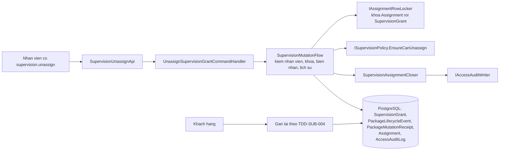
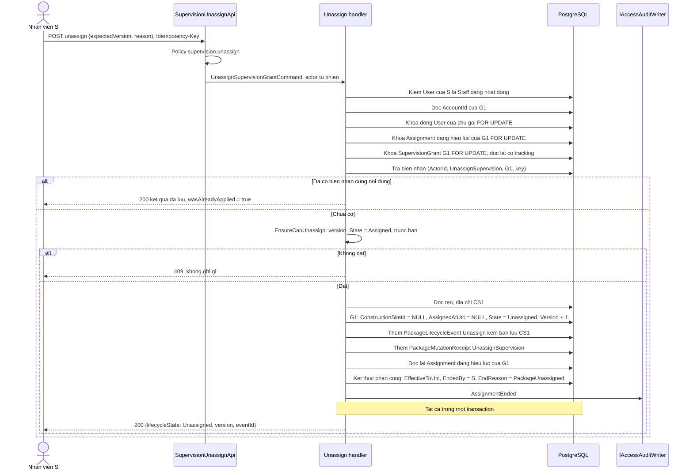
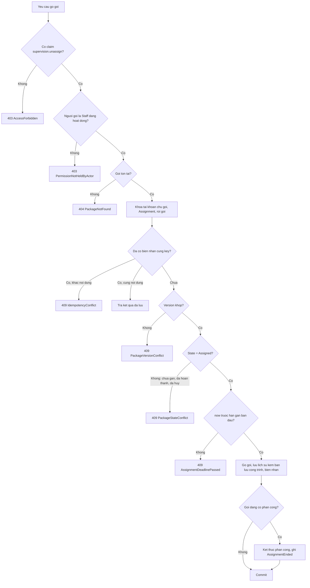
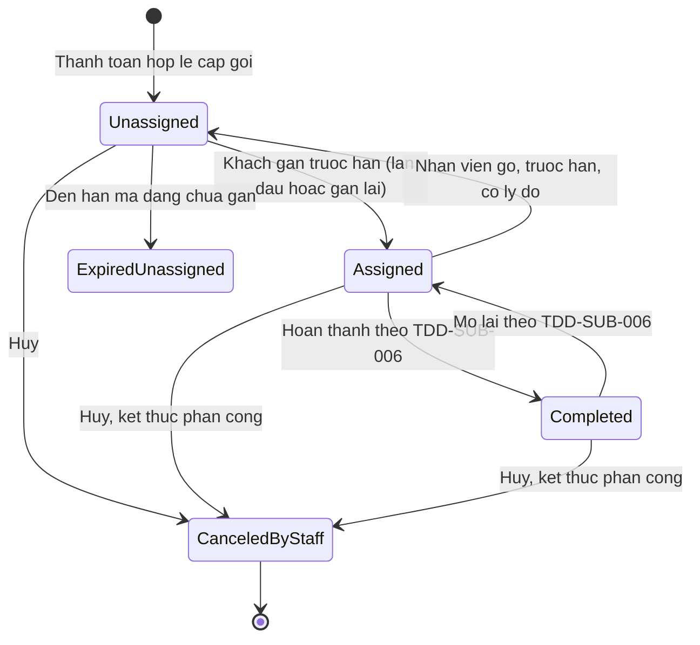
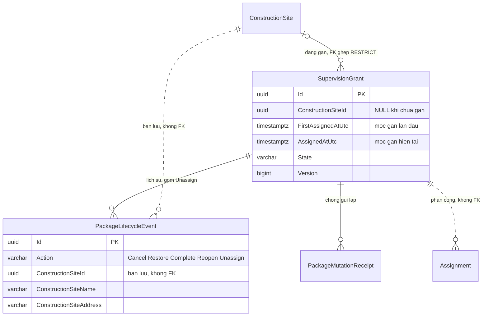

<!-- HƯỚNG DẪN CHO AI KHI ĐIỀN HOẶC CHỈNH SỬA MẪU
- Đọc toàn bộ mẫu, các comment hướng dẫn và tài liệu nguồn được cung cấp trước khi viết. Tuân thủ các quy tắc nghiệp vụ, điều kiện, ngoại lệ và giới hạn đã được xác nhận.
- Không bịa, tự chế hoặc suy đoán thành sự thật: yêu cầu, quy tắc, số liệu, API, schema, mã lỗi, nguồn tham khảo, người phụ trách và kết quả kiểm thử phải có căn cứ. Nội dung ví dụ trong mẫu không phải dữ kiện của dự án.
- Khi thiếu thông tin hoặc các nguồn mâu thuẫn, hỏi người dùng để làm rõ; giữ nguyên placeholder ở phần chưa xác định. Không tự chọn đáp án, lấp chỗ trống hay tuyên bố tài liệu đã hoàn tất.
- Chỉ thay nội dung cần điền hoặc được yêu cầu sửa. Không tự mở rộng phạm vi, sửa nghĩa quy tắc, bỏ điều kiện/ngoại lệ, xoá hay ghi đè nội dung hợp lệ đã có.
- Giữ nguyên tên, cấp và thứ tự heading, nhãn in đậm, tiền tố bullet, cấu trúc danh sách, tên/thứ tự/số cột bảng và cú pháp code fence. Không dịch, đổi tên, gộp hoặc thêm mục ngoài cấu trúc mẫu.
- Chỉ lặp khối luồng, AC hoặc API theo đúng khuôn khi có căn cứ; chỉ bỏ phần tuỳ chọn khi hướng dẫn riêng của mẫu cho phép và đã xác định không áp dụng.
- Mã tham chiếu và section phải trỏ tới tài liệu có thật đã được cung cấp hoặc kiểm chứng. Không giữ mã ví dụ như tham chiếu thật và không tự tạo tài liệu liên quan để hợp thức hoá liên kết.
- Giữ các comment hướng dẫn trong file. Xuất Markdown UTF-8, mỗi file một tài liệu; không bọc toàn bộ file trong code fence, không chèn lời dẫn hay giải thích ngoài mẫu.
- Trước khi bàn giao, đối chiếu nội dung với nguồn, kiểm tra cấu trúc, giá trị cho phép, giới hạn độ dài và tính nhất quán của mã/tham chiếu. Báo rõ phần chưa đủ thông tin; không tuyên bố đã chạy test hoặc import khi chưa thực hiện.
-->

<!-- Thay mã TDD-001 và nội dung ví dụ; giữ nguyên heading và nhãn in đậm.
Sơ đồ dùng mermaid, plantuml hoặc URL. Giữ heading Architecture, Sequence Diagram, Activity Diagram, State Diagram, Data Model.
Ví dụ API phải có heading trùng METHOD /path trong Endpoints. Xoá phần API/sơ đồ không dùng.
Version, Updated At và Change Log do lịch sử phiên bản quản lý, để trống khi nhập mới.
Author/Reviewer là tên hiển thị; gán tài khoản, phê duyệt, giả định và câu hỏi mở trên giao diện sau import.
Thiết kế phải truy vết về Story và Business Rule được cung cấp. Phân biệt thiết kế đề xuất với implementation đã kiểm chứng; không mô tả API/schema/sơ đồ ví dụ như hệ thống thật hoặc tự quyết định nghiệp vụ còn thiếu.
BẮT BUỘC KHI HOÀN THIỆN MẪU: phải có cả Reviewer và Approver, mỗi tên 1–200 ký tự sau khi bỏ khoảng trắng đầu/cuối. Không xoá hai dòng metadata, để trống, dùng tên bịa hoặc giữ placeholder rồi coi là hoàn tất.
Nếu chưa biết người review hoặc người phê duyệt, phải hỏi người dùng và báo tài liệu chưa đủ thông tin; không tự lấy Author/Owner làm người thay thế. Tên trong file không tự gán tài khoản hoặc xác nhận đã duyệt; gán thành viên trên giao diện sau import.
Đây là yêu cầu hoàn thiện mẫu; backend hiện vẫn nhận file cũ thiếu hai trường để tương thích.

VALIDATION CHO FILE NHẬP (đối chiếu ImportSnapshotValidator, MarkdownParser và ImportService):
- Mỗi file .md UTF-8 không rỗng chỉ có một heading cấp 1 chứa mã tài liệu dài 1–100 ký tự. Mã không được trùng trong cùng lần nhập hoặc thuộc loại tài liệu khác đã tồn tại.
- Không dùng tên README.md hoặc sitemap.md vì importer bỏ qua. Giao diện nhận .md/.zip, tối đa 2.000 file, tổng file tải lên 31 MiB; API giới hạn request 32 MiB và tổng nội dung đọc/giải nén 64 MiB.
- Chỉ nhập đè tài liệu cùng loại đang Draft, chưa có phiên bản và chưa lưu trữ. Import thay toàn bộ nội dung bản nháp, vì vậy phải giữ lại nội dung hợp lệ ngoài phần được yêu cầu sửa.
- Không dùng Status trong Markdown hoặc tên Approver để tự xác nhận phê duyệt; import không cấp quyền hay gán tài khoản từ tên. Chạy Kiểm tra file và xử lý lỗi/cảnh báo trước khi nhập.
- Giới hạn độ dài bên dưới tính theo string.Length của .NET (đơn vị UTF-16); không tự cắt ngắn dữ kiện quan trọng để vượt validation, hãy viết lại có căn cứ hoặc hỏi người dùng.
- Feature tối đa 300 ký tự và được dùng làm tiêu đề tài liệu. Status được parser nhận: Draft / In Review / Approved / Deprecated; tài liệu nhập mới vẫn có trạng thái phê duyệt Draft.
- Endpoint: đường dẫn tối đa 500 ký tự; tên/mô tả endpoint được lưu trong Name tối đa 300. HTTP method: GET / POST / PUT / PATCH / DELETE / HEAD / OPTIONS.
- Error Codes: mã tối đa 100 ký tự, không trùng trong tài liệu; giữ dạng - **CODE** (400): mô tả. HTTP status trong Error Codes và Response phải là số nguyên đọc được bằng Int32; không tự đặt status khác hợp đồng API.
- URL sơ đồ tối đa 1.000 ký tự. Mục sơ đồ được sử dụng phải có khối mermaid/plantuml hoặc URL theo mẫu; không để một mục sơ đồ rỗng. Nhãn mục được tách từ bullet như tên External API Fields tối đa 300 ký tự.
- Heading Examples phải khớp METHOD /path ở Endpoints. Giữ các nhãn Request:, Response 200: (thay mã theo contract) và Error Response: để parser tách đúng dữ liệu.
- Tham chiếu dạng DOC-KEY/section: ghi chú: mã đích tối đa 100 ký tự, section tối đa 100, ghi chú tối đa 1.000. Không trùng bộ mã đích + section + loại liên kết trong cùng tài liệu.
ĐỐI CHIẾU FORM TDD (src/features/tdds/validations.ts; form có thể chặt hơn import):
- Điền Feature, Author, Reviewer, Problem và ít nhất một Goal; các Goal/Non-goal/Notes đã thêm không được rỗng. API đã khai báo phải có endpoint và mô tả/mục đích; Fields phải có tên và ý nghĩa; Error Codes phải có mã, HTTP status và điều kiện.
- Form còn kiểm tra Version, Updated At và nội dung Change Log khi khai báo; với file nhập mới, giữ các trường lịch sử này trống theo hợp đồng import, không tự tạo dữ liệu lịch sử.
-->

# TDD-SUB-007

## Document Info

- **Feature**: Nhân viên gỡ gói giám sát khỏi công trình khi khách gán nhầm
- **Author**: Claude
- **Reviewer**: Tân Trần
- **Approver**: Tân Trần
- **Status**: Draft
- **Version**:
- **Updated At**:

## Context & Goals

### Problem

Ngày 25/09/2026, người dùng chốt [STORY-SUB-006](../userstory/STORY-SUB-006.md) và [BR-SUB-026](../businessrule/BR-SUB-026.md). Khi khách gán nhầm công trình, khách gọi tổng đài. Nhân viên có quyền `supervision.unassign` gỡ gói đang ở trạng thái đã gán về chưa gán, bắt buộc có lý do. Gói giữ hạn gán ban đầu, và khách tự gán lại theo [TDD-SUB-004](TDD-SUB-004.md). Vẫn không có thao tác đổi thẳng gói sang công trình khác ([BR-SUB-009](../businessrule/BR-SUB-009.md)).

Cùng ngày, người dùng chốt thêm các thay đổi đi kèm:

- Bỏ thao tác khôi phục gói đã hủy cho cả hai loại gói ([BR-SUB-025](../businessrule/BR-SUB-025.md) đã bỏ); hủy kết thúc phân công của gói giám sát ([BR-SUB-024](../businessrule/BR-SUB-024.md) khoản 7). Thiết kế ở [TDD-SUB-005](TDD-SUB-005.md).
- Khách không sửa, không xóa được công trình đang có gói giữ chỗ ([BR-SITE-002](../businessrule/BR-SITE-002.md)). Thiết kế ở [TDD-SITE-001](TDD-SITE-001.md).
- Mã quyền `supervision.unassign` thay `package.restore` trong danh mục ([BR-RBAC-010](../businessrule/BR-RBAC-010.md)). Thiết kế ở [TDD-RBAC-001](TDD-RBAC-001.md).
- Hai quyết định kỹ thuật: xóa công trình còn gói đã hủy thì đặt `ConstructionSiteId = NULL` cho các gói đó rồi mới xóa công trình, tên và địa chỉ lấy từ bản lưu trong sự kiện hủy; API của khách giữ `firstAssignedAtUtc` và thêm `assignedAtUtc`.

Tài liệu này thiết kế thao tác gỡ gói. Nó cũng là nơi ghi thứ tự đầy đủ của migration gộp cho toàn bộ đợt thay đổi này.

Hiện trạng code đã kiểm tra ngày 25/09/2026 trên `bmt-be` nhánh `develop`, commit `1ffdfbf`:

| Thành phần | Hiện trạng | Ảnh hưởng |
| --- | --- | --- |
| Thao tác gỡ | Chưa có. Route đổi công trình `reassign` đã bỏ ở commit `182e2a8`. | Thêm command, handler, route và policy mới. |
| `SupervisionPolicy.EnsureCanAssign` | Chỉ cho gán khi `State = Unassigned` **và** `FirstAssignedAtUtc IS NULL`. | Gói đã gỡ có `FirstAssignedAtUtc`, nên phải bỏ điều kiện thứ hai (TDD-SUB-004). |
| `CK_SupervisionGrant_AssignedColumns` | Gói `Unassigned` phải có `FirstAssignedAtUtc IS NULL`. | Phải đổi CHECK, nếu không database chặn câu `UPDATE` của thao tác gỡ. |
| `PackageLifecycleEvent` | `Action` nhận `Cancel`, `Restore`, `Complete`, `Reopen`; không có cột nào về công trình. | Thêm `Unassign` và ba cột bản lưu công trình. |
| `Assignment.EndReason` | CHECK chỉ nhận `Transferred`, `Removed`. | Thêm `PackageCanceled`, `PackageUnassigned`. |
| `IAssignmentRowLocker` | Có `LockAsync`, `LockActiveForShareAsync`, `LockSupervisionGrantStateForShareAsync`. | Thêm hai hàm khóa `FOR UPDATE` (Architecture). |
| `PermissionNames` | 9 mã, có `package.restore`. | Bỏ `package.restore`, thêm `supervision.unassign`. |
| `SupervisionMutationFlow` | Luồng chung của hủy, khôi phục, hoàn thành, mở lại gói giám sát; chỉ đổi `State` và `Version`. | Thêm bước khóa và kết thúc phân công, dùng chung cho hủy và gỡ. |

Các thành phần mới trong tài liệu này đã có trong code ở nhánh `feature/supervision-unassign` của `bmt-be` ngày 25/09/2026, chưa merge vào `develop`; bảng trên mô tả `develop` trước khi đổi. Khi triển khai, `SupervisionAssignmentCloser` là lớp tĩnh nội bộ, còn tùy chọn kết thúc phân công của `SupervisionMutationFlow` là record `SupervisionAssignmentClosing` gồm cổng khóa phân công, bộ ghi nhật ký và lý do kết thúc.

### Goals

- Nhân viên có quyền `supervision.unassign` gỡ được gói đang `Assigned` trước hạn gán, có lý do; gói về `Unassigned` và giữ nguyên hạn gán, chủ gói, phiên bản gói đã mua (BR-SUB-026 khoản 1–5).
- Mỗi lần gỡ để lại đúng một dòng lịch sử có người gỡ, thời điểm, lý do, cùng tên và địa chỉ công trình tại lúc gỡ. Dòng này vẫn đọc được sau khi khách sửa hoặc xóa công trình (khoản 7).
- Phân công của gói kết thúc trong cùng transaction với việc gỡ, kể cả khi người quản trị đang giao hoặc chuyển giao gói đó cùng lúc (khoản 6).
- Gửi lại cùng yêu cầu không gỡ lần hai; màn hình cũ không ghi đè thay đổi mới.
- Khách gán lại được theo TDD-SUB-004 và không thấy dấu vết lần gán trước (khoản 7–8).

### Non-goals

- Đổi thẳng gói sang công trình khác; khách tự gỡ; chuyển gói sang khách khác (BR-SUB-026/Except).
- Gỡ gói `Completed` hoặc `CanceledByStaff`; làm mới hoặc kéo dài hạn gán; hoàn tiền.
- Màn hình tra cứu lịch sử gỡ cho người có `commerce.read`: thuộc [TDD-PAY-002](TDD-PAY-002.md).
- Giao lại nhân viên phụ trách sau khi khách gán lại: dùng luồng giao hiện có ở [TDD-RBAC-003](TDD-RBAC-003.md).

## Architecture

**Các kỹ thuật dùng trong luồng gỡ**

| Kỹ thuật | Áp dụng ở đây | Ví dụ và giới hạn |
| --- | --- | --- |
| Phân quyền theo mã quyền | Route gắn policy `supervision.unassign`; quyền đọc từ claim `perm` trong access token theo [TDD-RBAC-001](TDD-RBAC-001.md#architecture). Không đòi phân công, vì `supervision.unassign` không phải quyền gắn phân công (BR-RBAC-010 khoản 4). | Nhân viên N đang phụ trách G1 nhưng chỉ có `supervision.complete` thì nhận 403. Nhân viên S không phụ trách G1 nhưng có `supervision.unassign` thì gỡ được. Thu hồi quyền có độ trễ tới khi token hết hạn, theo BR-RBAC-009. |
| Khóa theo thứ tự cố định | Tài khoản chủ gói `FOR UPDATE` → dòng `Assignment` đang hiệu lực của gói `FOR UPDATE` → dòng `SupervisionGrant` `FOR UPDATE`. | Thứ tự này đúng nguyên tắc 1 của TDD-RBAC-003: luồng nào cần cả phân công lẫn gói thì khóa phân công trước. Chuyển giao cũng khóa phân công trước rồi mới khóa gói, nên hai luồng xếp hàng ngay ở dòng phân công thay vì giữ khóa của nhau. |
| Truy vấn lại sau khi đã khóa gói | Sau khi giữ khóa gói, handler đọc lại dòng phân công đang hiệu lực bằng một câu lệnh mới rồi mới kết thúc nó. | Người quản trị giao G1 cho N (giữ `FOR SHARE` trên G1, chưa có dòng phân công) đúng lúc S gỡ G1. S chờ ở khóa gói. Giao commit xong thì S lấy được khóa; câu đọc lại ở mức `READ COMMITTED` thấy dòng phân công vừa tạo và kết thúc nó. Không có kết cục nào để lại phân công trên gói đã gỡ. |
| Bản lưu công trình trong dòng lịch sử | Dòng `PackageLifecycleEvent` của lần gỡ lưu `ConstructionSiteId`, `ConstructionSiteName`, `ConstructionSiteAddress` tại lúc gỡ. `ConstructionSiteId` không có khóa ngoại. | Khách xóa CS1 sau khi gói rời CS1; dòng lịch sử vẫn đọc được "Nhà phố Quận 7, 12 Nguyễn Thị Thập". Đánh đổi: tên trong lịch sử không theo tên mới nếu khách sửa công trình sau đó. Đây đúng là điều BR-SUB-026 khoản 7 cần: công trình **tại lúc gỡ**. |
| Kiểm phiên bản (optimistic concurrency) | `expectedVersion` phải bằng `SupervisionGrant.Version`; gỡ xong thì tăng `Version`. | Nhân viên S mở G1 ở version 2. Trong lúc đó, người phụ trách hoàn thành G1 và G1 lên version 3. Yêu cầu gỡ theo version 2 nhận 409 `PackageVersionConflict`; S tải lại và thấy G1 đã hoàn thành. |
| Biên nhận chống gửi lặp | `PackageMutationReceipt` với `Operation = UnassignSupervision`, khóa `(ActorId, Operation, TargetId, RequestKey)`; ghi cùng transaction. | Nhân viên bấm gỡ, mạng rớt, bấm lại với cùng `Idempotency-Key`: nhận lại kết quả cũ, không có dòng lịch sử thứ hai. Cùng key nhưng khác lý do thì 409 `IdempotencyConflict`. |
| Hạn gán theo lịch Việt Nam | Dùng `AssignmentDeadlineUtc` đã lưu lúc cấp; so `now < deadline`. | Hạn 01/10/2027 10:00 giờ Việt Nam thì gỡ đúng 10:00 bị từ chối, vì sau khi gỡ khách không gán lại được nữa (BR-SUB-026 khoản 4). |

**Thành phần**

| Thành phần | Trạng thái | Trách nhiệm |
| --- | --- | --- |
| `SupervisionUnassignApi` (Carter module, `presentation/apis/subscription/SupervisionGrantApi.cs`) | Mới | Route `POST /api/v1/admin/supervision-grants/{grantId}/unassign`, policy `supervision.unassign`, bắt header `Idempotency-Key` bằng `RequireIdempotencyKey()` như các route hoàn thành, mở lại. |
| `Command.UnassignSupervisionGrantCommand` và validator (`contract/services/subscription/`) | Mới | `{GrantId, ExpectedVersion, Reason, RequestKey}`. Validator: `ExpectedVersion >= 1`; lý do sau khi trim có 1–2.000 ký tự; key ≤ 100 ký tự. Sai trả 422 `PackageMutationInvalid`. |
| `UnassignSupervisionGrantCommandHandler` (`application/usecases/commands/subscription/`) | Mới | Chạy luồng ở Sequence Diagram. Dùng lại `SupervisionMutationFlow` cho phần kiểm nhân viên, khóa tài khoản, biên nhận và dòng lịch sử. |
| `SupervisionMutationFlow` | Sửa | Nhận thêm tùy chọn "kết thúc phân công": khóa dòng phân công trước khi đọc gói, khóa gói `FOR UPDATE`, sau khi quyết định trạng thái mới thì gọi `SupervisionAssignmentCloser`. Nhận thêm bản lưu công trình để ghi vào dòng lịch sử. Hủy gói giám sát ([TDD-SUB-005](TDD-SUB-005.md)) dùng cùng tùy chọn này. |
| `SupervisionAssignmentCloser` (`application/usecases/commands/subscription/`) | Mới | Đọc lại dòng phân công đang hiệu lực của gói (đã giữ khóa gói), khóa nó nếu là dòng mới, đặt `EffectiveToUtc`, `EndedBy`, `EndReason`, rồi ghi `AccessAuditLog` `AssignmentEnded` qua `IAccessAuditWriter`. Không có phân công thì không làm gì. |
| `ISupervisionPolicy.EnsureCanUnassign(grant, expectedVersion, nowUtc)` | Mới | Hàm thuần: kiểm version, trạng thái `Assigned`, `nowUtc < AssignmentDeadlineUtc`. |
| `IAssignmentRowLocker.LockActiveByResourceForUpdateAsync(resourceType, resourceId)` | Mới | `SELECT "Id" FROM "Assignment" WHERE "ResourceType" = @type AND "ResourceId" = @id AND "EffectiveToUtc" IS NULL FOR UPDATE`; trả `Guid?`. Dùng `UX_Assignment_ActiveResource`. |
| `IAssignmentRowLocker.LockSupervisionGrantForUpdateAsync(grantId)` | Mới | `SELECT "Id" FROM "SupervisionGrant" WHERE "Id" = @id FOR UPDATE`; trả `bool`. |
| `ConstraintViolationPipelineBehavior` | Sửa | Ánh xạ lỗi chờ vòng `40P01` của `UnassignSupervisionGrantCommand` và `CancelPackageCommand` thành 409 `PackageVersionConflict` (xem Notes). |
| `PermissionNames`, `PackageLifecycleActions`, `PackageOperations`, `AssignmentEndReasons` (`contract/constants/`) | Sửa | Thêm `SupervisionUnassign = "supervision.unassign"`, `Unassign`, `UnassignSupervision`, `PackageCanceled`, `PackageUnassigned`; bỏ `PackageRestore`, `RestorePackage`. |



**Notes**:

- Mọi bước ghi nằm trong một transaction do `TransactionPipelineBehavior` mở cho request kết thúc bằng `Command`. Lỗi ở bất kỳ bước nào ném exception để rollback cả gói, dòng lịch sử, biên nhận, phân công và nhật ký. Không dùng message bus: phân công, gói và công trình nằm cùng database, nên kết thúc phân công ngay trong transaction đơn giản và chắc hơn gửi sự kiện.
- Tư cách nhân viên kiểm bằng `PackageMutationFlow.EnsureActorIsActiveStaffAsync` hiện có (`User.AccountKind = 'Staff'` và `Status = 'Active'`). Policy ở route đã kiểm claim `supervision.unassign`. Khách hàng không bao giờ có claim này nên nhận 403 từ policy; route `me` không có thao tác gỡ (STORY-SUB-006/EXC-01, AC-006).
- Kiểm quyền xảy ra trước khi trả kết quả đã lưu: người vừa mất quyền không nhận lại được kết quả cũ, theo cùng nguyên tắc với hủy ở TDD-SUB-005.
- Bản lưu công trình đọc từ dòng `ConstructionSite` mà `grant.ConstructionSiteId` trỏ tới, ngay trước khi đặt cột đó về NULL. Dòng công trình chắc chắn còn, vì gói `Assigned` giữ chỗ và khóa ngoại RESTRICT cùng bước kiểm của handler xóa ([TDD-SITE-001](TDD-SITE-001.md)) không cho xóa công trình đang có gói giữ chỗ. Không cần khóa dòng công trình: khách không sửa được công trình đang có gói giữ chỗ (BR-SITE-002), và handler sửa cũng khóa `FOR UPDATE` rồi mới kiểm, nên sau khi gỡ commit thì khách mới sửa được.
- `TargetLabel` của nhật ký `AssignmentEnded` dùng tên công trình trước khi gỡ, ví dụ "Gói giám sát · Nhà phố Quận 7", để nhật ký đọc được như `AssignmentLookup.GrantLabelAsync` đang làm.
- **Trường hợp biên và lỗi chờ vòng.** Có một khe rất hẹp: giao mới vừa commit dòng phân công A2, rồi một chuyển giao trên A2 bắt đầu (khóa A2 rồi chờ khóa gói) trước khi luồng gỡ khóa được A2. Luồng gỡ giữ khóa gói và chờ A2, luồng chuyển giao giữ A2 và chờ khóa gói. PostgreSQL phát hiện chờ vòng, hủy một transaction với mã `40P01`. Nếu bên bị hủy là luồng gỡ, `ConstraintViolationPipelineBehavior` trả 409 `PackageVersionConflict`: nhân viên tải lại gói (lúc này đã có người phụ trách mới) và gửi lại. Không có dữ liệu sai nào được commit. Chọn cách này thay cho khóa thêm gói trong luồng giao mới, vì khe xảy ra rất hiếm và cách xử lý của client giống hệt khi màn hình đã cũ.
- Khách gán lại gói đã gỡ đi qua luồng gán của TDD-SUB-004 không đổi, trừ điều kiện `FirstAssignedAtUtc IS NULL` đã bỏ. Gói gán lại chưa có phân công, nên tự vào danh sách cần chia lại với trạng thái `NoAssignee` ([TDD-RBAC-003](TDD-RBAC-003.md)).

**Nơi từng Business Rule được thực hiện**

| Quy tắc | Nơi thực hiện |
| --- | --- |
| BR-SUB-026 khoản 1 | Policy `supervision.unassign` ở route; `EnsureActorIsActiveStaffAsync`; không kiểm phân công |
| BR-SUB-026 khoản 2 | Validator lý do (trim, 1–2.000 ký tự); CHECK `CK_PackageLifecycleEvent_Reason`; không có giới hạn số lần hay thời gian kể từ lúc gán |
| BR-SUB-026 khoản 3 | `EnsureCanUnassign`: `State = Assigned`, sai thì 409 `PackageStateConflict` |
| BR-SUB-026 khoản 4 | `EnsureCanUnassign`: `nowUtc < AssignmentDeadlineUtc`, sai thì 409 `AssignmentDeadlinePassed` |
| BR-SUB-026 khoản 5 | Handler chỉ đổi `ConstructionSiteId`, `AssignedAtUtc`, `State`, `Version`; giữ `AccountId`, `RevisionId`, `AssignmentDeadlineUtc`, `FirstAssignedAtUtc`; không tạo đơn, không gọi thanh toán |
| BR-SUB-026 khoản 6, BR-RBAC-013 khoản 9 | Khóa phân công trước gói; `SupervisionAssignmentCloser` kết thúc phân công với `PackageUnassigned` và ghi `AssignmentEnded` |
| BR-SUB-026 khoản 7 | Bản lưu công trình trong `PackageLifecycleEvent`; query của khách ẩn mốc gán và công trình cũ (TDD-SUB-004); lịch sử chỉ đọc qua route `commerce.read` (TDD-PAY-002) |
| BR-SUB-026 khoản 8, BR-SUB-022 | Luồng gán của TDD-SUB-004 với `EnsureCanAssign` chỉ xét `State` và hạn |
| BR-SUB-026/Except, BR-SUB-009 | Không có route đổi thẳng công trình; route `me` không có thao tác gỡ |
| BR-SUB-006 | Gói về `Unassigned` nên ra khỏi `UX_SupervisionGrant_ConstructionSiteHolder`; công trình cũ trống chỗ ngay sau commit |

## Sequence Diagram

Nhân viên S gỡ gói G1 đang gán công trình CS1 và do nhân viên N phụ trách.



## Activity Diagram



Lý do thiếu hoặc chỉ có khoảng trắng bị validator chặn trước khi vào handler, trả 422 `PackageMutationInvalid`.

## State Diagram

Vòng đời gói giám sát sau đợt thay đổi này. `ExpiredUnassigned` là trạng thái tính khi đọc, không lưu.



- `Assigned → Unassigned` là chuyển mới của tài liệu này. Gói giữ `FirstAssignedAtUtc` và hạn gán; `AssignedAtUtc` và `ConstructionSiteId` về NULL.
- `Completed` không gỡ được. Người có `supervision.complete` mở lại gói về `Assigned` thì nhân viên có `supervision.unassign` gỡ được (BR-SUB-026/Notes).
- Gói đã gỡ đến hạn mà chưa gán lại thì có `EffectiveState = ExpiredUnassigned`, giống gói chưa từng gán đã quá hạn (BR-SUB-022 khoản 4).
- `CanceledByStaff` là trạng thái cuối: không còn mũi tên khôi phục ([TDD-SUB-005](TDD-SUB-005.md)).

## Data Model

**Ý nghĩa các bảng trong luồng gỡ**

| Bảng | Một dòng đại diện cho gì? | Luồng gỡ làm gì với bảng này |
| --- | --- | --- |
| SupervisionGrant | Một quyền dùng gói giám sát khách đã mua. Định nghĩa gốc ở [TDD-SUB-004](TDD-SUB-004.md#data-model). | Cập nhật đúng dòng gói: bỏ công trình, bỏ mốc gán hiện tại, về `Unassigned`, tăng version. Thêm cột `AssignedAtUtc` (mô tả dưới đây). |
| PackageLifecycleEvent | Một thay đổi vòng đời gói do nhân viên thực hiện. Định nghĩa gốc ở [TDD-SUB-005](TDD-SUB-005.md#data-model). | Thêm một dòng `Action = Unassign`, kèm bản lưu công trình tại lúc gỡ. |
| PackageMutationReceipt | Kết quả một thao tác, dùng để trả lại khi client gửi lặp. Schema ở TDD-SUB-005. | Thêm một dòng `Operation = UnassignSupervision`. |
| Assignment | Một khoảng thời gian một nhân viên phụ trách một gói. Định nghĩa gốc ở [TDD-RBAC-003](TDD-RBAC-003.md#data-model). | Kết thúc dòng đang hiệu lực của gói, nếu có, với `EndReason = PackageUnassigned`. |
| AccessAuditLog | Một thao tác thay đổi quyền hoặc phân công. Định nghĩa ở [TDD-RBAC-001](TDD-RBAC-001.md#data-model). | Thêm một dòng `AssignmentEnded` khi có phân công bị kết thúc. |
| ConstructionSite | Một công trình của khách ([TDD-SITE-001](TDD-SITE-001.md#data-model)). | Chỉ đọc tên và địa chỉ để lưu vào dòng lịch sử; không ghi. |

**Phần thay đổi schema của đợt này**

| Bảng | Thay đổi | Lý do |
| --- | --- | --- |
| SupervisionGrant | Thêm `AssignedAtUtc timestamptz NULL`: mốc gán hiện tại. Ghi ở mọi lần gán, về NULL khi gỡ, giữ nguyên khi hoàn thành, mở lại, hủy. | `FirstAssignedAtUtc` là mốc gán lần đầu và không đổi sau khi gỡ, nên không dùng làm "ngày gán" của công trình hiện tại được. Người dùng chọn giữ `firstAssignedAtUtc` trong API để không phá client, và thêm `assignedAtUtc`. |
| SupervisionGrant | `CK_SupervisionGrant_AssignedColumns` đổi thành: `(State = 'Unassigned' AND ConstructionSiteId IS NULL AND AssignedAtUtc IS NULL) OR (State IN ('Assigned','Completed') AND ConstructionSiteId IS NOT NULL AND FirstAssignedAtUtc IS NOT NULL AND AssignedAtUtc IS NOT NULL) OR State = 'CanceledByStaff'`. | Bản cũ đòi gói `Unassigned` có `FirstAssignedAtUtc IS NULL`, sẽ chặn thao tác gỡ. Điều kiện mới vẫn bảo đảm gói chưa gán không trỏ công trình nào. |
| SupervisionGrant | Thêm `CK_SupervisionGrant_AssignedWindow`: `AssignedAtUtc IS NULL OR (FirstAssignedAtUtc IS NOT NULL AND AssignedAtUtc >= FirstAssignedAtUtc AND AssignedAtUtc < AssignmentDeadlineUtc)`. | Mọi lần gán, kể cả gán lại, đều phải trước hạn (BR-SUB-022). CHECK chặn một đường ghi lỗi ghi mốc gán sau hạn. |
| PackageLifecycleEvent | `Action` thêm `Unassign`; `CK_PackageLifecycleEvent_SupervisionOnlyActions` thêm `Unassign`. `Restore` vẫn nằm trong CHECK để đọc dòng cũ, không còn đường ghi. | Lịch sử gỡ nằm cùng bảng với hủy, hoàn thành, mở lại, nên đọc lịch sử một gói theo `PackageVersion` trong một bảng. |
| PackageLifecycleEvent | Thêm `ConstructionSiteId uuid NULL` (không khóa ngoại), `ConstructionSiteName varchar(200) NULL`, `ConstructionSiteAddress varchar(500) NULL`, và `CK_PackageLifecycleEvent_SiteSnapshot`: ba cột cùng NULL hoặc cùng có giá trị; có giá trị thì `PackageKind = 'Supervision'` và `Action IN ('Cancel','Unassign')`; `Action = 'Unassign'` bắt buộc có giá trị. | Giữ công trình tại lúc gỡ hoặc hủy, vì sau đó khách có thể sửa hoặc xóa công trình. Không đặt khóa ngoại cho `ConstructionSiteId`, vì khóa ngoại sẽ chặn chính việc xóa công trình mà BR-SITE-002 cho phép. Hủy dùng bản lưu này khi công trình đã bị xóa ([TDD-SUB-005](TDD-SUB-005.md), [TDD-SITE-001](TDD-SITE-001.md)). |
| Assignment | `CK_Assignment_EndReason` thêm `PackageCanceled`, `PackageUnassigned`. | Phân biệt phân công kết thúc vì người quản trị gỡ (`Removed`), chuyển giao (`Transferred`), hay vì gói bị hủy hoặc gỡ. |

`PackageMutationReceipt.Operation` và `AccessAuditLog.Action` không có CHECK, nên giá trị mới `UnassignSupervision` không cần đổi schema.

**Dữ liệu lưu trữ minh họa — gỡ rồi gán lại**

Dữ liệu giả định, không phải dữ liệu production; chỉ trích cột cần giải thích. Tình huống nối tiếp mẫu của [TDD-SUB-004](TDD-SUB-004.md#data-model): G1 của U1 được cấp lúc `2026-09-19T03:00:00Z` (10:00 giờ Việt Nam), hạn gán `2027-09-19T03:00:00Z`, đã gán CS1 ở version 2. U1, G1, CS1, CS2, NV1, S1, A1, L10, M10, M11, AU1 là bí danh UUID. Mọi giờ lưu là UTC. `H10` thay cho `RequestHash` dài 64 ký tự.

| Bước | Bảng | Giá trị lưu | Giải thích |
| --- | --- | --- | --- |
| 0 | ConstructionSite | Id=CS1; OwnerUserId=U1; Name=Nhà phố Quận 7; Address=12 Nguyễn Thị Thập, Quận 7, TP.HCM. Id=CS2; OwnerUserId=U1; Name=Nhà vườn; Address=Củ Chi, TP.HCM | Hai công trình của U1. |
| 0 | SupervisionGrant | Id=G1; AccountId=U1; State=Assigned; ConstructionSiteId=CS1; FirstAssignedAtUtc=2026-10-01T02:00:00Z; AssignedAtUtc=2026-10-01T02:00:00Z; AssignmentDeadlineUtc=2027-09-19T03:00:00Z; Version=2 | Trước khi gỡ. Với dữ liệu cũ, migration điền `AssignedAtUtc` bằng `FirstAssignedAtUtc`. |
| 0 | Assignment | Id=A1; StaffUserId=NV1; ResourceType=SupervisionGrant; ResourceId=G1; EffectiveFromUtc=2026-10-02T01:00:00Z; EffectiveToUtc=NULL | NV1 đang phụ trách G1. |
| 1 | SupervisionGrant | Id=G1; State=Unassigned; ConstructionSiteId=NULL; FirstAssignedAtUtc=2026-10-01T02:00:00Z; AssignedAtUtc=NULL; AssignmentDeadlineUtc=2027-09-19T03:00:00Z; Version=3 | S1 gỡ lúc `2026-11-15T02:00:00Z`. Mốc gán đầu và hạn giữ nguyên. CS1 không còn gói giữ chỗ. |
| 1 | PackageLifecycleEvent | Id=L10; AccountId=U1; PackageKind=Supervision; SupervisionGrantId=G1; Action=Unassign; FromState=Assigned; ToState=Unassigned; ActorId=S1; AtUtc=2026-11-15T02:00:00Z; Reason=Khách gán nhầm công trình; PackageVersion=3; ReceiptId=M10; ConstructionSiteId=CS1; ConstructionSiteName=Nhà phố Quận 7; ConstructionSiteAddress=12 Nguyễn Thị Thập, Quận 7, TP.HCM | Dòng lịch sử của lần gỡ, với bản lưu công trình tại lúc gỡ. |
| 1 | PackageMutationReceipt | Id=M10; ActorId=S1; Operation=UnassignSupervision; TargetId=G1; RequestKey=unassign-g1-1; RequestHash=H10; ResultVersion=3; AtUtc=2026-11-15T02:00:00Z | Dùng khi S1 gửi lại cùng key. |
| 1 | Assignment | Id=A1; EffectiveToUtc=2026-11-15T02:00:00Z; EndedBy=S1; EndReason=PackageUnassigned | Phân công của NV1 kết thúc cùng mốc với lần gỡ. |
| 1 | AccessAuditLog | Id=AU1; ActorUserId=S1; Action=AssignmentEnded; TargetType=Assignment; TargetId=A1; TargetLabel=Gói giám sát · Nhà phố Quận 7; Outcome=Succeeded; BeforeJson={"staffUserId":"NV1","endReason":"PackageUnassigned"} | Nhật ký phân công theo BR-RBAC-012. |
| 2 | SupervisionGrant | Id=G1; State=Assigned; ConstructionSiteId=CS2; FirstAssignedAtUtc=2026-10-01T02:00:00Z; AssignedAtUtc=2026-11-20T02:00:00Z; Version=4 | U1 gán lại vào CS2 theo TDD-SUB-004. `FirstAssignedAtUtc` không đổi; `AssignedAtUtc` là mốc gán mới. |
| 2 | PackageMutationReceipt | Id=M11; ActorId=U1; Operation=Assign; TargetId=G1; ResultVersion=4 | Biên nhận của lần gán lại. Không có dòng `PackageLifecycleEvent` cho việc gán. |
| 3 | ConstructionSite | Dòng CS1 bị xóa | Không còn gói nào trỏ vào CS1, nên U1 xóa được ([TDD-SITE-001](TDD-SITE-001.md)). Dòng L10 vẫn giữ tên và địa chỉ CS1. |

Kết quả đọc, không phải dữ liệu lưu:

- Giữa bước 1 và bước 2, U1 xem G1: `state = Unassigned`, `effectiveState = Unassigned`, `assignmentDeadlineUtc = 2027-09-19T03:00:00Z`; `constructionSiteId`, `constructionSiteName`, `assignedAtUtc`, `firstAssignedAtUtc` đều NULL. U1 không thấy L10.
- Người có `commerce.read` mở lịch sử G1 theo [TDD-PAY-002](TDD-PAY-002.md): thấy L10 với người gỡ S1, lý do, tên và địa chỉ CS1, kể cả sau bước 3.
- Sau bước 2, danh sách cần chia lại có G1 với trạng thái `NoAssignee`.

**Các nhánh bị từ chối** (không ghi dòng nào):

- S1 gửi lại key `unassign-g1-1` với cùng nội dung sau bước 1: nhận lại kết quả của M10 với `wasAlreadyApplied = true`; không có dòng lịch sử thứ hai.
- S1 gỡ G1 lúc `2027-09-19T03:00:00Z` khi G1 đang gán: 409 `AssignmentDeadlinePassed`.
- G1 đang `Completed`: 409 `PackageStateConflict`.
- Giữa bước 1 và bước 2 mà tới `2027-09-19T03:00:00Z` U1 vẫn chưa gán lại: G1 có `effectiveState = ExpiredUnassigned`, yêu cầu gán nhận 409 `AssignmentDeadlinePassed` theo TDD-SUB-004.



**Notes**:

- Vì sao lưu bản sao tên và địa chỉ thay vì chỉ lưu `ConstructionSiteId`: sau khi gỡ, công trình cũ không còn gói giữ chỗ nên khách được sửa hoặc xóa (BR-SITE-002). Nếu chỉ lưu mã, lịch sử sẽ hiện tên mới sau khi khách sửa, hoặc không hiện được gì sau khi khách xóa. Đây là dư thừa có chủ đích: bản lưu là dữ kiện lịch sử tại một thời điểm, không phải bản sao phải đồng bộ với `ConstructionSite`.
- Vì sao không ghi dòng lịch sử cho việc gán: lần gán do chủ gói thực hiện, đã có biên nhận `Assign` và mốc `AssignedAtUtc`. BR chỉ đòi lịch sử của việc gỡ; mỗi dòng gỡ đã chứa công trình cũ, nên chuỗi "gán CS1 → gỡ khỏi CS1 → gán CS2" đọc được từ các dòng gỡ và mốc gán hiện tại.
- Độ dài `ConstructionSiteName` và `ConstructionSiteAddress` bằng giới hạn của `ConstructionSite` (200 và 500), nên bản lưu không bao giờ bị cắt.

**Migration gộp `20260925123300_SupervisionUnassignWithoutRestore` (đã tạo, chưa áp dụng lên database dùng chung)**

Một migration cho toàn bộ thay đổi schema và dữ liệu của đợt này. Database hiện chỉ có dữ liệu dev/test (người dùng xác nhận ngày 25/09/2026); các bảng nhỏ nên không cần `NOT VALID` hay `CREATE INDEX CONCURRENTLY`. Thứ tự trong `Up`:

| Bước | Việc làm | Kiểm tra |
| --- | --- | --- |
| 1. `SupervisionGrant` | Thêm `AssignedAtUtc`; điền `AssignedAtUtc = FirstAssignedAtUtc` cho mọi dòng có `ConstructionSiteId IS NOT NULL` và `FirstAssignedAtUtc IS NOT NULL`; bỏ rồi tạo lại `CK_SupervisionGrant_AssignedColumns`; thêm `CK_SupervisionGrant_AssignedWindow`. Chi tiết ở [TDD-SUB-004](TDD-SUB-004.md#data-model). | Sau bước này không còn dòng `Assigned`/`Completed` nào có `AssignedAtUtc` NULL; tạo CHECK thành công chứng minh điều đó. |
| 2. `PackageLifecycleEvent` | Thêm ba cột bản lưu; điền bản lưu cho các dòng `Cancel` của gói giám sát từ công trình hiện tại của gói (`JOIN "SupervisionGrant"` rồi `JOIN "ConstructionSite"`); cập nhật `CK_PackageLifecycleEvent_Action`, `CK_PackageLifecycleEvent_SupervisionOnlyActions`; thêm `CK_PackageLifecycleEvent_SiteSnapshot`. Định nghĩa gốc ở [TDD-SUB-005](TDD-SUB-005.md#data-model). | Dòng `Cancel` của gói chưa từng gán giữ ba cột NULL. |
| 3. `Assignment` | Cập nhật `CK_Assignment_EndReason`; kết thúc các phân công đang hiệu lực của gói `CanceledByStaff` (dữ liệu tạo trước đợt này, khi hủy còn giữ phân công): `EffectiveToUtc = now()`, `EndedBy = ActorId` của dòng `PackageLifecycleEvent` mà `SupervisionGrant.CancelEventId` trỏ tới, `EndReason = 'PackageCanceled'`. Không ghi `AccessAuditLog`, như lần bỏ `supervision.reassign`. Chi tiết ở [TDD-RBAC-003](TDD-RBAC-003.md#data-model). | Không còn dòng `Assignment` đang hiệu lực trỏ vào gói `CanceledByStaff`. |
| 4. `Permission` | Xóa `RolePermission` có mã `package.restore` (gồm vai trò `admin` và vai trò tự tạo), rồi xóa dòng `Permission` đó; thêm `supervision.unassign` và `RolePermission` cho vai trò `admin`. Chi tiết ở [TDD-RBAC-001](TDD-RBAC-001.md#data-model). | Bảng `Permission` khớp `PermissionNames`: khi khởi động, API từ chối chạy nếu hai bên lệch. |

Triển khai code và migration cùng lúc: code mới đọc cột `AssignedAtUtc` và mã quyền mới; code cũ vẫn chạy được trên schema mới trừ luồng khôi phục (không còn mã quyền). `Down` bỏ cột và CHECK mới, đổi các dòng `Assignment` có `EndReason` là `PackageCanceled` hoặc `PackageUnassigned` về `Removed` rồi dựng lại CHECK cũ, và thêm lại `package.restore` cho `admin`. Trước mọi bước khác, `Down` dừng nếu có gói `Unassigned` mang `FirstAssignedAtUtc` (gói đã gỡ) hoặc có dòng lịch sử `Unassign`, vì schema cũ không biểu diễn được hai trường hợp này. Ở chiều `Up`, trước bước 1, migration dừng nếu có gói `CanceledByStaff` còn phân công đang hiệu lực mà `CancelEventId` NULL, như [TDD-RBAC-003](TDD-RBAC-003.md#data-model) yêu cầu. Phân công đã kết thúc ở bước 3 và bản lưu công trình không lấy lại được khi `Down`.

## Internal API

### Endpoints

- **POST** `/api/v1/admin/supervision-grants/{grantId}/unassign` — Nhân viên gỡ gói giám sát đang gán khỏi công trình. Policy `supervision.unassign`; header `Idempotency-Key` bắt buộc; body `{expectedVersion, reason}`. Trả 200 với `packageId`, `packageKind`, `lifecycleState`, `version`, `eventId` và `wasAlreadyApplied`, cùng dạng `PackageMutated` của hủy, hoàn thành và mở lại.

Không có route gỡ cho khách. Không có route đổi thẳng công trình. Thay đổi của các route đọc gói (`assignedAtUtc`, ẩn mốc gán của gói chưa gán) nằm ở [TDD-SUB-004](TDD-SUB-004.md#internal-api); lịch sử gỡ cho người có `commerce.read` nằm ở [TDD-PAY-002](TDD-PAY-002.md#internal-api).

### Examples

#### POST /api/v1/admin/supervision-grants/{grantId}/unassign

```
Request:
Idempotency-Key: 4f0c9f1e-3b8a-4c1d-9d2e-7a5b6c8d9e01
{"expectedVersion":2,"reason":"Khách gán nhầm công trình"}

Response 200:
{"value":{"packageId":"44444444-4444-4444-4444-444444444444","packageKind":"Supervision","lifecycleState":"Unassigned","version":3,"eventId":"99999999-9999-9999-9999-999999999999","wasAlreadyApplied":false},"isSuccess":true,"isFailure":false,"error":{"code":"","message":""}}

Error Response:
{"title":"Conflict","code":"Conflict","status":409,"detail":"Đã quá hạn gán nên không gỡ được; muốn chấm dứt gói thì dùng thao tác hủy.","messageCode":"AssignmentDeadlinePassed","errors":null}
```

Ví dụ dùng UUID giả định. Trong thân lỗi, `code` là loại lỗi chung; mã nghiệp vụ nằm ở `messageCode`.

### Error Codes

- **Unauthorized** (401): phiên không hợp lệ.
- **AccessForbidden** (403): người gọi không có claim `supervision.unassign`; do policy ở route trả.
- **PermissionNotHeldByActor** (403): người gọi có claim nhưng không phải tài khoản nhân viên đang hoạt động; do `PackageMutationFlow.EnsureActorIsActiveStaffAsync` hiện có trả, như hủy gói.
- **PackageNotFound** (404): không có gói giám sát với mã này.
- **PackageVersionConflict** (409): `expectedVersion` khác `Version` hiện tại; hoặc transaction bị PostgreSQL hủy vì chờ vòng (`40P01`) và client cần tải lại.
- **PackageStateConflict** (409): gói không ở trạng thái `Assigned` (chưa gán, đã hoàn thành hoặc đã hủy).
- **AssignmentDeadlinePassed** (409): thời điểm hiện tại đã đến hoặc qua hạn gán ban đầu.
- **IdempotencyConflict** (409): cùng `Idempotency-Key` nhưng khác nội dung.
- **PackageMutationInvalid** (422): thiếu `expectedVersion`, lý do rỗng hoặc chỉ có khoảng trắng, lý do quá 2.000 ký tự, hoặc key không hợp lệ. Lỗi do validator trả nên mã nằm ở `errors[].messageCode`.

## References

### User Stories

- STORY-SUB-006
- STORY-SUB-006/AC-001
- STORY-SUB-006/AC-002
- STORY-SUB-006/AC-003
- STORY-SUB-006/AC-004
- STORY-SUB-006/AC-005
- STORY-SUB-006/AC-006
- STORY-SUB-006/AC-007
- STORY-SUB-006/AC-008
- STORY-SUB-006/AC-009
- STORY-SUB-006/AC-010
- STORY-SUB-006/AC-011
- STORY-SUB-006/AC-012
- STORY-SUB-004/AC-013
- STORY-RBAC-003/AC-013

### Business Rules

- BR-SUB-026/Then
- BR-SUB-026/Except
- BR-SUB-022/Then
- BR-SUB-009/Except
- BR-SUB-006/Statement
- BR-SUB-024/Then
- BR-RBAC-010/Then
- BR-RBAC-013/Then
- BR-SITE-002/Then
- BR-PAY-005/Then

### Use Cases

- STORY-SUB-006/Main Flow
- STORY-SUB-006/ALT-01
- STORY-SUB-006/ALT-02
- STORY-SUB-006/ALT-03
- STORY-SUB-006/EXC-01
- STORY-SUB-006/EXC-02
- STORY-SUB-006/EXC-03
- STORY-SUB-006/EXC-04
- STORY-SUB-006/EXC-05
- STORY-RBAC-003/ALT-08

### Others

- Tài liệu liên quan: [gán gói và cột `AssignedAtUtc`](TDD-SUB-004.md), [hủy gói, bảng `PackageLifecycleEvent`](TDD-SUB-005.md), [hoàn thành và mở lại](TDD-SUB-006.md), [công trình](TDD-SITE-001.md), [phân công](TDD-RBAC-003.md), [danh mục quyền](TDD-RBAC-001.md), [tra cứu lịch sử gói](TDD-PAY-002.md).
- System Test: ST-PAY-074 đến ST-PAY-084 cho STORY-SUB-006; ST-RBAC-063 cho kết thúc phân công khi gỡ.
- Đặc tả Unit Test: UT-PAY-082 đến UT-PAY-086 (`EnsureCanUnassign` về trạng thái, hạn, version; validator lệnh gỡ), UT-PAY-087 đến UT-PAY-093 và UT-PAY-095 (handler gỡ: dữ liệu ghi và bản lưu công trình, kết thúc phân công và nhật ký, gói chưa có phân công, gửi lặp, người gọi và gói không hợp lệ, thứ tự khóa, đọc lại phân công sau khi khóa gói, gỡ lần thứ hai), UT-PAY-094 (ánh xạ `40P01`). Mã test ở `test/bmt-be.application.tests/usecases/subscription/SupervisionUnassignTests.cs` và `test/bmt-be.application.tests/behaviors/ConstraintViolationPipelineBehaviorTests.cs`. Integration test trên PostgreSQL thật ở `test/bmt-be.integration.tests/SupervisionUnassignConstraintTests.cs` kiểm CHECK mới, việc gỡ chờ một yêu cầu giao đang giữ khóa gói rồi kết thúc phân công vừa tạo, và dữ liệu của migration. Chưa có integration test cho trường hợp chờ vòng `40P01`. Kết quả chạy ngày 25/09/2026 trên nhánh đó: unit test 465/465 (năm project test) và integration test 170/170 trên PostgreSQL 15 (Testcontainers) đạt; chưa chạy System Test và chưa áp dụng migration lên môi trường dev dùng chung hay production.
- Không gọi dịch vụ bên ngoài nên không có External API trong TDD này.

## Change Log
